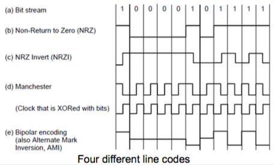
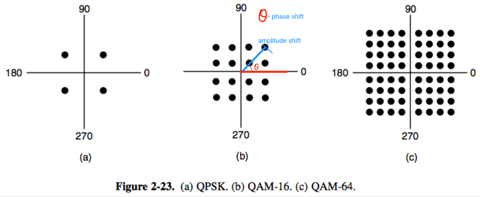
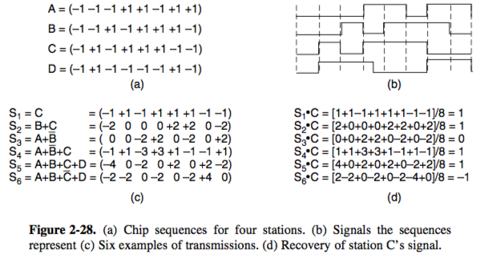

+++
title = "Physical: Modulation & multiplexing"
+++

# Physical: Modulation & multiplexing
modulation schemes — send bits as signals
multiplexing — share channel among users

Baseband transmission (directly convert bits to signal):

- send symbols representing bits
- symbol rate — rate at which signal changes (also “baud rate”)
- bit rate — symbol rate times bits per symbol
- NRZ (non-return-to-zero): +1V=“1”, -1V=“0”
- others:

- to decode symbols, signals need enough transitions
- problem is, after enough zeros you can’t tell when the next symbol starts
- Manchester encoding — add in clock signal by XORing with data signal
    - high-to-low transition is 1
    - low-to-high is a 0 (just the clock)
- NRZI — transition means 1, no transition means 0
    - long runs of 1 is no problem, 0 still is
    - 4B/5B — every 4 bits mapped to 5-bit pattern using fixed table
    - scrambling — XOR with pseudorandom data, XOR again to decrypt

Passband transmission (regulate amplitude/frequency/phase of carrier signal to mean bits)

- Amplitude Shift Keying — two different amplitudes mean 0 or 1
- Frequency SK — two different tones mean 0 and 1
- Phase SK — wave is shifted 0 or 180 degrees to mean 0 or 1
- Quadrature Phase SK — shifts of 45/135/225/315 degrees to transmit two bits at once (four different levels)
- combine to represent more bits:
    - Quadrature Amplitude Modulation (QAM-16): phase (angle with X axis on constellation diagram) and amplitude (distance from origin on constellation diagram) is modulated, can transmit 4 bits
    - QAM-64 — more combinations
- constellation diagrams:

Multiplexing

- FDM (Frequency Division Multiplexing) — place channels on specific frequency bands
    - WiFi and Bluetooth change frequencies — "frequency hopping"
- TDM (Time Division Multiplexing) — shares channel over time, users take turns on a fixed schedule (round-robin style)
- CDMA (Code Division Multiple Access) — narrow band signal is spread out over wider frequency band
    - each bit time divided into *m* short intervals (‘chips’), typically 64 or 128
    - each station is assigned *m*-bit code (‘chip sequence’)
    - to transmit 1 bit, a station sends its chip sequence
    - to transmit 0 bit, a station transmits negation of chip sequence.
    - if more stations transmit at the same time, bits add linearly
    - to recover, compute normalised inner product (station chip sequences must be known in advance)

