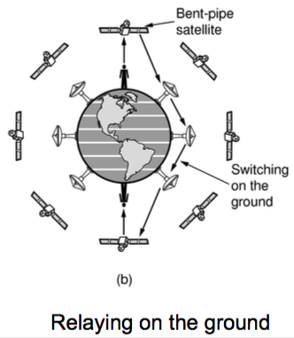
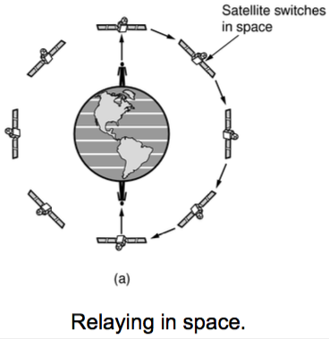

+++
title = "Physical: Transmission Media"
+++

# Physical: Transmission Media
- A van full of tapes
- Wires
    - Twisted pair
        - used in LAN, telephones
        - twists reduce radiation (and interference)
        - shielded (STP) or unshielded (UTP, like Cat 3/5/5e/6/6A/7)
        - connectors: RJ11 (4 wires), RJ45 (8 wires, modern buildings)
        - link types
            - simplex — only one fixed direction at all times
            - half-duplex — both directions, but not at the same time, senders take turns
            - full-duplex — both directions at once (so use different twisted pairs for each direction)
    - coaxial
        - better shielding, more bandwidth, longer distances, higher rates
        - copper core surrounded by insulation and covering
    - power lines
        - e.g. household electrical wiring
        - convenient to use, bad for data transmission
    - cheap and easy, but short-distance with moderate bandwidth and low security
- Fibers
    - utilise total internal reflection in a thin strand of glass (silica fiber)
    - high rates and long distances, enormous bandwidth in THz with little loss
    - types
        - single-mode — narrow, 10 µm core where light can’t even bounce. used with lasers for long distances
        - multi-mode — light can bounce in 50 µm core, used with LEDs
    - an example is TAT-14 TransAtlantic, with two main and two backup fiber pairs on the ocean floor (3 Tbps capacity)
    - very secure and fast, but less convenient and more expensive
- Wireless
    - compared to wires, deployment is easy and inexpensive, with natural support for broadcasting
    - however, transmissions interfere and data rates vary with signal strength
    - Electromagnetic spectrum — carefully divided and regulated, except for WiFi ISM bands
    - radio waves
        - λf = c in vacuum (freq f, wavelength λ)
        - radio/light travels at around 1 foot/nsec
        - penetrate buildings, propagate long distances
            - Very Low Frequency, LF, MF bands — waves follow curvature of earth
            - HF band — waves bounce off ionosphere
    - microwaves
        - high bandwidth, used in WiFi and 3G/satellites
        - strength varies with mobility due to multipath fading (delayed waves arriving out of phase with direct waves & cancelling out)
    - light transmission
        - line-of-sight can be used for links
        - highly directional, lots of bandwidth
        - use LEDs/cameras and lasers/photodetectors
- Satellites
    - Geostationary (GEO)
        - 36,000 km, delay ~250msec up/down
        - does not need tracking
        - VSAT can use it to communicate through a hub
    - Low (LEO)
        - good for coverage, e.g. Iridium’s 66 satellite network for comms routing
        - can relay to each other, or on ground using a bent pipe

