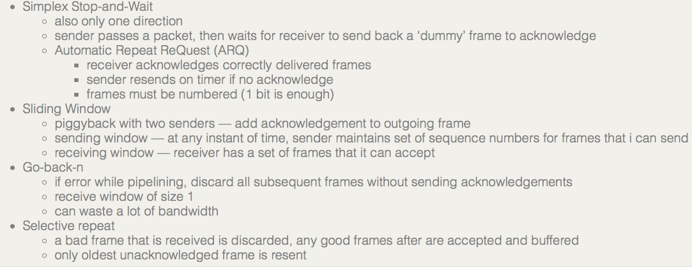
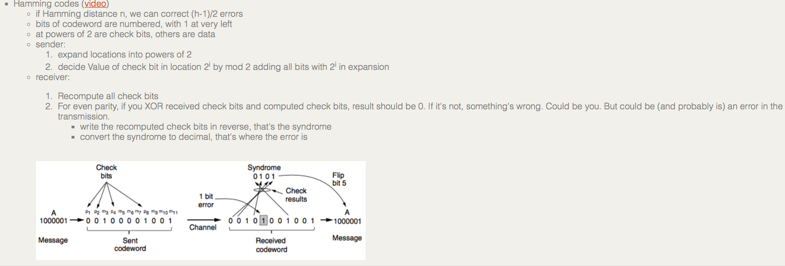
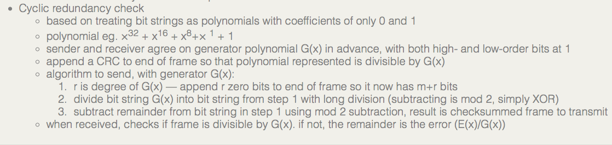
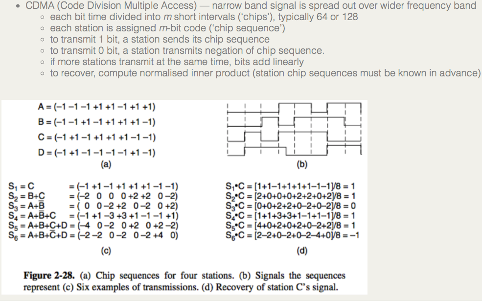
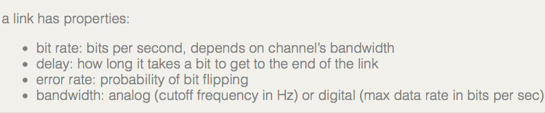

+++
title = "Shit I don't remember and need to remember"
+++

# Shit I don't remember and need to remember
Layers:
Physical — digital bits as analog signals
Data link — frames of digital bits over one link
Network — packets of frames over multiple links
Transport — end-to-end packet delivery
Application — what the user needs

to compute hamming distance, xor the two bit strings and count the number of ones.

CDMA — code division multiple access, in physical layer with that chip sequence bullshit

CSMA — carrier sense multiple access, in mac protocol
difference in CSMA types (MAC protocol)

- 1-persistent — always listens to channel, sends as soon as idle
- nonpersistent — senses channel, if not idle waits a random period of time and tries again. does not always listen.
- p-persistent — some probability fuckshit

-
