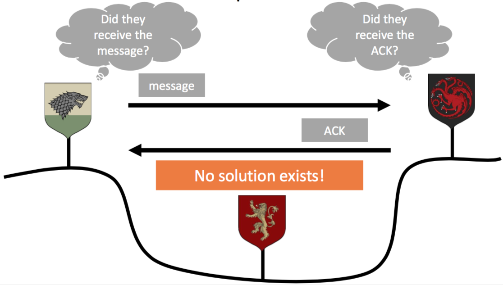
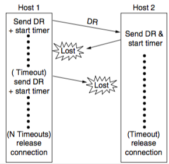
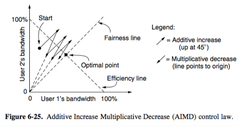

+++
title = "Transport: elements of transport protocols"
+++

# Transport: elements of transport protocols
**Elements of transport protocols**
Addressing

- NSAP (network service access point) — IP address

- TSAP (transport service access point) — port

- some services are always on the same ports (e.g. mail server on TCP 25, ssh on TCP 22)

- portmapper process

    - finds TSAP port for a specified service name, using its database

    - a new service registers itself with the portmapper

    - kind of like directory assistance phone operator

- initial connection protocol

    - each machine that offers services has a process server (inetd on UNIX)

    - this acts a proxy for less used servers

    - listens to set of ports at same time, waiting for a conn request

Connection establishment

- using sequence numbers for packets

    - label packets with sequence numbers that will not be reused within T seconds

    - packet hop limit used to remove old packets

    - time-of-day clock used to choose sequence number

- three-way handshake

    - one peer checks with other if connection request is current

    - e.g. host 1 chooses sequence number x and sends it in CONNECTION REQUEST to host 2, host 2 replies with ACK containing its own sequence number y, host 1 acknowledges host 2’s sequence number in first data segment it sends

Connection release

- asymmetric release — one host gtfo, other host is left hanging. can lead to data loss.

- symmetric release — participants agree to end connection

    - two-army problem — one white army vs two blue armies. one white beats one blue, but two blue beat white if attack at same time. can they coordinate attack using messengers? No.

- one way to semi-solve this is by timers and only allowing a certain number of timeouts, but y’know…it’s not great

Flow control

- slow down sender if receiver can’t handle the data rate

- received packets are buffered at the receiver

- buffer management is done separately

- available buffer space is receiver window size

Crash recovery

- recovery from layer N crash can only be done by layer N+1 (higher abstraction)

- but only if layer N+1 has info that lets it reconstruct previous state

- e.g. if there’s a problem on the transport layer, the transport layer’s lazy ass leaves it to the application layer to fix its problems

Congestion control

- needed to slow down sender if network can’t handle the data rate

- bandwidth allocation

    - max-min fairness

        - maximises minimum bandwidth, then uses excess where possible

        - bandwidth given to one flow can’t be increased without decreasing bandwidth to another flow

    - amount of bandwidth needed for a connection varies, so need to converge to ideal point

    - sharing bandwidth between users

    - dynamic adjustments with AIMD — convergence:

- problem is, TCP data loss means congestion, and wireless loses data commonly. so wireless must mask data loss
