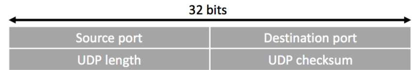
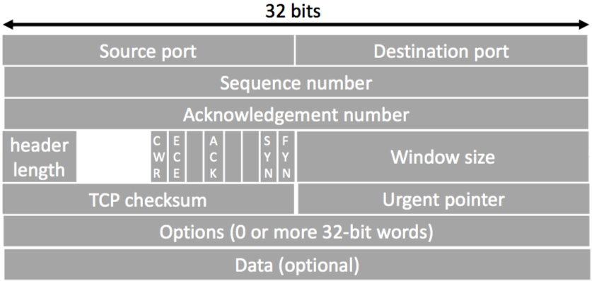
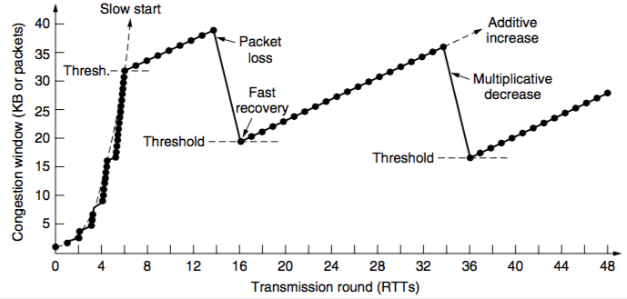

+++
title = "Transport: internet transport protocols"
+++

# Transport: internet transport protocols
**Internet transport protocols**
UDP (User Datagram Protocol)

- very thin layer on top of IP

- provides: ports

- does not provide: flow/congestion control, retransmissions

- header format:

TCP (Transmission Control Protocol)

- provides reliable end-to-end byte stream (so applications can’t tell how many segments or packets were sent)

- header format:

- every data byte has its own sequence number
- window size — how much data receiver can handle, with small values leading to huge overhead
- congestion control
    - congestion window is on sender, specifying how many segments can be transmitted.
    - increase congestion window whenever ACKs arrive, until they don’t.
    - then set slow start threshold to half of congestion window and start again.
    - when threshold is crossed, switch to additive increase
- fast retransmission — three duplicate acks imply lost packet, whose identity can be infered from ack number (it’s the next packet in sequence). this packet is retransmitted right away
- in TCP Reno:

