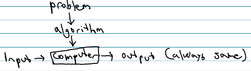

+++
title = 'Algorithms'
+++
# Algorithms
## What is an algorithm?

An effective method, finite n of steps or instructions, to solve a problem or accomplish a task

always works

## Solution strategies

- Guess and check
    - “try something"
- Try all possibilities
    - suitable with small possibilities
- Divide the problem into steps
    - reduces complexity
    - simplifies the problem
- Use formulas/equations
    - better overview
- Discover a structure or pattern
    - sometimes it’s necessary to extend the problem
- Make a model
    - simpler problem or situation
    - e.g. diagram or picture
- Brute force
    - relies on computing power, uses computer
    - example: bubble sort, linear search
- Divide and conquer
    - three steps:

        1. Divide problem of size *n* into number of subproblems of same type and about same size

        2. Conquer: recursively solve sub-problems
        3. Combine: appropriately combine solutions

    - examples: binary search, merge sort, quick sort
