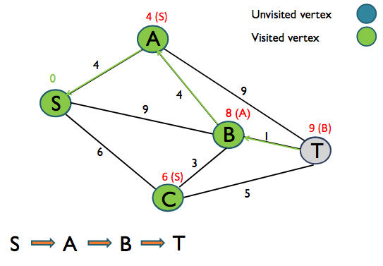
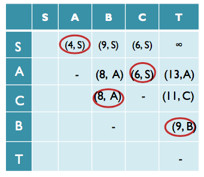
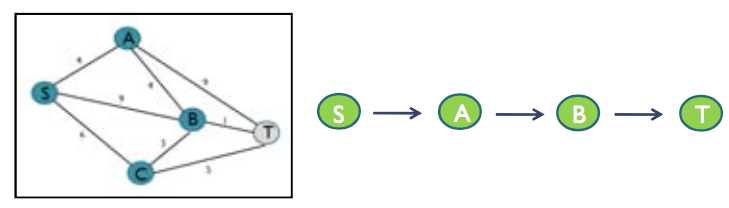

+++
title = "Dijkstra's algorithm"
+++
# Dijkstra's algorithm
What is it?

Solves the single-source shortest path problem — find shortest path from one designated node to every other node.

Only works with non-negative edge weights.

Steps:
1. Take the starting node
2. Compute the distances to every other connected node (just follow the edges from the starting node)
3. Take the smallest edge, and follow it to a new node
4. Use the edges from the new node to update the table, and possibly create new/smaller paths to other nodes
5. Take the new smallest edge to a node that was not visited yet
6. Repeat from step 4

**Methods:**

| **Graphical** | **Tabular** |
| --- | --- |
|  |  |
