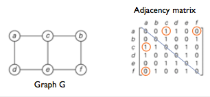

+++
title = 'Graphs'
+++
# Graphs
## What is a graph?

a set of vertices (nodes) and a set of edges (arc/arrows) connecting pairs of vertices

consists of a collection *V* of vertices and collection *E* of edges, for which we write *G = (V, E)*

each edge e ∈ E is said to join two vertices (end points)
if *e* joins *u*, v ∈ *V*, we write *e = (u, v)*

*V* — finite set of vertices
*E* — set of edges (pairs of vertices)

*V = {a, b, c, d, e, f}*

*E = {(a,c), (a,d), (b,c), (b,f), (c,e), (d,e), (e,f)}*

[Types of graphs](./types-of-graphs)

## Completeness

A graph is complete if you have *n* vertices and *n-1 *edges on each vertex. Must be simple and undirected.

## Edges properties

- connects two vertices
- an edge connecting vertices *i *and *j* is written as *ij*
- sometimes has a direction (*i —> j*)
- weights assigned by means of numbers (e.g. distance between two vertices)

## Adjacency Matrix representation
Notation: A[i,j]

Symmetric: A[i,j] = A[j,i]

when a graph is undirected, the adjacency matrix is always symmetric

