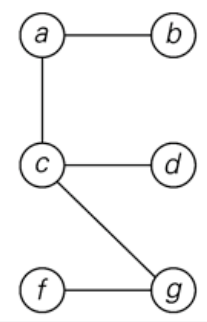

+++
title = 'Paths'
+++
# Paths
**Trees**

Simple, undirected, connected, acyclic graphs. Any two vertices are connected by exactly one path. Must have *n-1* edges if *n *vertices.

**Eulerian path**

A path that visits *every edge* exactly once. It is a cycle if it starts and ends on the same vertex.

**Hamiltonian graph**

A path in a graph that visits *each vertex* exactly once. It is a cycle if it starts and ends on the same vertex.
