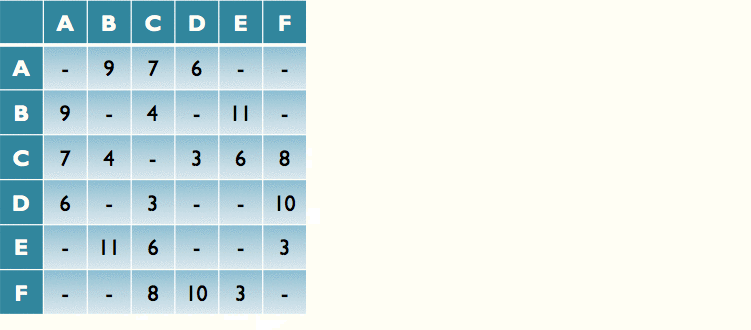

+++
title = "Prim's algorithm"
+++
# Prim's algorithm
## What is it?

Finds *minimum spanning tree* for a connected weighted undirected graph. Faster in dense graphs with more edges than vertices.

Spanning tree: connected acyclic subgraph that contains all vertices of the graph

weight of tree: sum of weights on all the tree’s edges
minimum spanning tree: spanning tree of smallest weight

**Steps:**
1. Select any vertex to be first of T

2. Consider which edge connects vertices in T to vertices outside T. Pick any one with min weight. Add edge and vertex to T.

3. Repeat step 2 until T has every vertex of graph.

