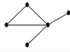
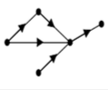
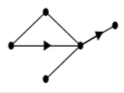
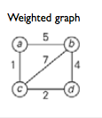
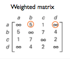
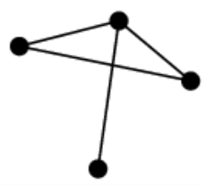
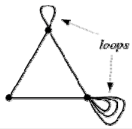
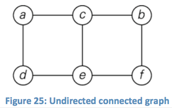
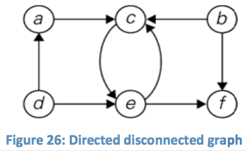

+++
title = 'Types of graphs'
+++
# Types of graphs
## Symmetricity

| **Undirected (symmetric)** | **Directed/digraph (asymmetric)** | **Mixed** |
| --- | --- | --- |
|  |  |  |

## Weighted graph

## Simplicity

| **Simple** | **Multigraph** |
| --- | --- |
| Undirected, unweighted graph that has no loops and no more than one edge between any two different vertices  | Multiple edges connecting the same two vertices within a simple graph  |

## Connectedness

A graph may also have a connected component

| **Connected** | **Disconnected** |
| --- | --- |
| If there is for any two given vertices a path between them  | If not all pairs of vertices have a path between them  |
