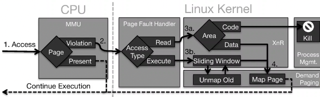

+++
title = "Lecture 12: advanced exploitation"
+++
# Lecture 12: advanced exploitation
Attacks so far have these steps:
1. vulnerability: overflow, format, UAF, uninitialized read, type confusion
    - can be exploited
    - defense so far: e.g. stack canary preventing contiguous stack overflow
2. control code pointer
    - runs shellcode or starts ROP
    - defense so far: e.g. W⊕X fully prevents, ASLR or CFI (control flow integrity) maybe prevents?
3. arbitrary execution

## Exploit mitigations
Examples:
- Buffer overflow:
    - address sanitizer:
        - detects buffer overflow and use-after-free
        - shadow memory (mapping of virt addr space that holds metadata) tracks alloc status, add check before memory access
        - red zones between allocations (few bytes that shouldn't be written)
        - deallocated memory in quarantine (marked as unusable and placed in queue)
        - integrated in gcc and llvm
        - drawbacks: incomplete, 73% overhead impact on performance, can still jump over red zone in overflow
    - delta pointers:
        - fast buffer overflow detection, cannot detect e.g. underflow but performance is much better
        - tagged pointers use some pointer bits for metadata
        - checks are implicit using MMU
- Format string: static analysis finds non-literal format strings by default, but false positives are possible
- Uninitialized read: safeinit
    - automatically initialize to zero: every local variable (compiler), every heap allocation (allocator)
    - optimisations: initialize close to first usage, initialize only one byte for strings, rely on OS for zeroing large heap allocations, dead store elimination (don't do assignment that will always be overwritten)
    - good performance
- Use-after-free:
    - address sanitizer
    - dangsan:
        - prevents use after free by invalidating dangling pointers (so must keep list of pointers to each object)
        - instrumentation: keep track of pointer on pointer assignment, set most significant bit of remaining pointers on free
        - complications:
            - which object does pointer point to?
                - use shadow memory like address sanitizer
            - what if multiple threads copy pointers to same object?
                - avoid locks, observe that most workload is write
                - solution: per-thread append-only log
        - 41% overhead, good scalability
    - type-after-type:
        - allow dangling pointers, but only to same type
        - don't need to track all pointers, just types
        - separate heap and stack for each type:
            - never reuse memory used for one type for another
            - dangling pointer keeps pointing to same type
        - problem is with type inference (no type specified for malloc), so try to guess from context with static analysis and fall back to fake per-allocation type
        - if there are allocation wrappers, inline the wrappers into the caller (replace function call with body of function)
        - 4.3% runtime overhead, 17.4% memory overhead
- Type confusion: typesan
    - requires knowing runtime type of object on static_cast
    - use shadow memory:
        - translate each pointer to set of allowable casts
        - this set is determined at compile type
    - 13.2% overhead

All approaches have similarities:
- detect undefined behavior (based on C standard)
- built into compiler (well, depends on the compiler, e.g. clang vs gcc)
- static analysis: can we prove properties (e.g. never undefined behavior)
    - incomplete because halting problem
- dynamic instrumentation: add runtime checks for undefined behavior
    - performance hit, only use where you can't do static analysis
    - ensures crash before undefined behavior happens

## ASLR-related attacks and defences
Threat model:
- program secure if satisfies security requirements under threat model
- typical assumptions:
    - humans mess stuff up so can't avoid bugs
    - comprehensive mitigations not used because of overhead/compatibility
    - enough code available for full set of ROP gadgets
    - exploitations eventually leads to arbitrary read/write
    - arbitrary code execution leads to privilege escalation
- so, attacker can do arbitrary read/write, must prevent execution of ROP chain

ASLR:
- moves base of each code section to random address
- can't do ROP chain because unknown addresses
- but leaking single address reveals all addresses in section
- even arbitrary read breaks it, can read with relative offset like buffer overflow

Fine-Grained ASLR
- randomise relative addresses
    - shuffle around functions, or parts of them
    - rewrite functions (change registers, replace instructions, add random NOPs)
- JIT-ROP breaks it
    - attacker can
        - leak at least one code pointer
        - then leak data given absolute address
        - then interact with vulnerable code after leak
    - use code pointers to read code revealing more pointers, then identify gadgets in code, the "compile" ROP payload on the fly

XnR:
- JIT-ROP relies on reading code, so prevent code from being read
- problems is any code that's marked executable is also readable
- XnR marks all code pages not-present, so trying to read/execute them results in page fault, whose handler then determines whether to allow it
- to prevent more code becoming readable, unmap first page when number of present code pages > security parameter *n*

- Blind JIT-ROP breaks it
    - instead of reading gadgets, construct them
    - possible even if W⊕X enabled
    - e.g. JS code compiled to predictable gadgets

Information hiding:
- Code Pointer Integrity (CPI)
    - full memory safety is expensive, so only protect most sensitive data
    - protect: code pointers, pointers to sensitive data, arrays/structs containing sensitive data
    - type-based static analysis identifies sensitive variables
    - store sensitive variables in safe region, which uses comprehensive memory safety to access it
    - randomize safe region base
    - pointers to safe region never stored outside safe region (accessed via segment register)
- Code Pointer Separation (CPS)
    - like CPI, but only code pointers stored in safe region
    - faster, but not as safe
- can be broken by using allocation oracles
    - ephemeral: temporarily alloc buffer of attacker-chosen size
    - permanent: permanently alloc buffer of attacker-chosen size
    - assumption is that attacker can see if allocation worked.
    - find size of largest hole:
        1. try allocation size *n* on ephemeral oracle
            - if works: hole ≥ *n* bytes
            - otherwise: hole < *n* bytes
        2. do binary search
    - find size of other holes
        1. Use persistent alloc to fill largest hole
        2. Repeat binary search for next-smaller hole

## Control flow integrity (CFI)
We don't want attacker to run Turing complete program, but a more restrictive set.
Allow only legitimate branches and calls (i.e. those that follow the control flow graph).
Give valid targets a label, check that program doesn't branch anywhere else (fine-grained CFI).
May be combined with shadow stack that can be verified.

Problems:
- requires precise control flow graph, so need source code or debug info
- performance overhead

Maybe do loose/coarse-grained CFI, which uses only few labels: common label for all call sites, common label for all entry points.

This eliminates 98% of gadgets, but can still do:
- entry point gadgets
- call site gadgets
- can link gadgets

Context-sensitive CFI:
- can call/jump/ret X target Y given the current call stack?
- implementation: PathArmor
- but data guides code through control flow graph, so manipulating data changes the control flow
    - data oriented programming: find gadget dispatcher ⇒ identify/classify gadgets ⇒ convert workload into gadget operation sequence ⇒ build sequence of buffers to trigger operations ⇒ send buffers to target machine
    - of course, can't do e.g. system calls if not reachable through regular control flow