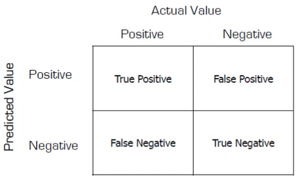

+++
title = "Lecture 14: Intrusion Detection Systems (IDS)"
+++
# Lecture 14: Intrusion Detection Systems (IDS)

## Intrusion Detection Systems (IDS)
- analysis of actions performed by users and apps to identify evidence of maliciousness
- stream of events generated by event sources (traffic dumps, system calls, kernel messages, logs)
- typically streams go to analysis engine, which can dispatch actions for protection and add stuff to databases
- approaches:
    - misuse detection: relies on models of wrong behavior, identifies matching entries in event stream
        - pros: not many false alarms, givs explanation, attack modesl are easy to understand, more resilient and usually faster
        - cons: needs constant updating, vulnerable to over-stimulation, detects only known attack types
    - anomaly detection: have a model of "normal behavior", identifies anomalous entries in event stream
        - pros: detects previously unknown attacks, doesn't need updating
        - cons: hard to configure, assumes anomalous == malicious, many false alarms, easy to evade, usually slow and resource-intensive
- event sources: OS audit records, network packets, app logs, intrusion detection alerts
- timeliness: real-time or non-real-time (offline/periodic)
- response type: passive (logs, alerts) or active (reconfigures e.g. firewalls)
- state-dependency: stateful or stateless analysis

Confusion matrix:
- "hit": detecting an actual attack (true positive)
- "miss": not detecting an actual attack (false negative)
- "false alarm": detecting a non-attack(false positive)

Metrics:
- Accuracy: (true_positives+true_negatives)/total
- Precision: true_positives/(true_positives+false_positives)
- Recall: true_positives/(true_positives+false_negatives)
- F-measure: 2×(precision×recall)/(precision+recall)

ROC curves
- ROC (receiver operating characteristic): curve expressing performance of classifier
- plots true positive rate vs false positive rate
- false positive rate: false_positives/(false_positives+true_negatives)
- true positive rate: true_positives/(true_positives+false_negatives)
- ideally, area under the curve should be 1.

The false positive rate dominates the effectiveness of an IDS (look at Bayes' Theorem calculation of P(intrusion|alert)).

IDS output should have truth file: meta-information about even stream describing attacks and relationships between each attack and events in stream

## Host vs Network IDS
Host IDS:
- monitors internals of computing system for unusual activities, file changes, signature patterns
- honeypots: special machines that are there to be attacked and are used to analyze the attacker's activities
- taint analysis (e.g. Argos): mark some bytes as tainted with propagation using shadow memory, raise alarm when tainted bytes are loaded into program counter

Network IDS:
- based on analysis of network traffic
- sniffing traffic:
    - pros: access to events from multiple host at single point, no performance effect on hosts.
    - cons: vulnerable to evasion techniques, limited by switched architectures and encryption
    - vulnerable to:
        - susceptible to DOS attacks
        - insertion: an IDS may accept packet that end-system rejects, so victim forms proper payload but IDS misses it
        - evasion: end-system may accept packet that IDS rejects
- OS-level network tap:
    - pros: can analyze encrypted traffic after decryption, IDS view == host view, less traffic
    - cons: affects performance of host, must be deployed on each host, can't access info related to other hosts.
- desynchronising viewpoints
    - IP:
        - IP TTL field may not be large enough for number of hops to destination
        - packet may be too large for downstream link without fragmenting
        - destination may drop source-routed packets
        - processing of fragmentation may be different
    - TCP:
        - destination may not accept packets with certain options
        - destination may silently drop packets with old timestamps (protection against wrapped sequence numbers, PAWS)
        - destination may not check sequence numbers on RST
        - destination may resolve conflicting segments differently
        - reassembly may be different
- a potential solution: "normalizer" at network access point to process suspicious packets ('scrubbing')

Evaluating IDS:
- effectiveness: how many detected
- precision: how many false positives
- performance: how much traffic can be processed
- descriptiveness
