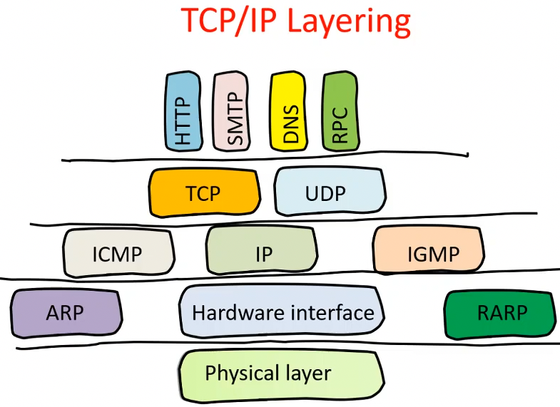
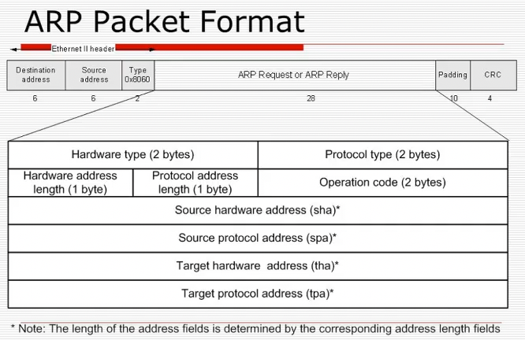
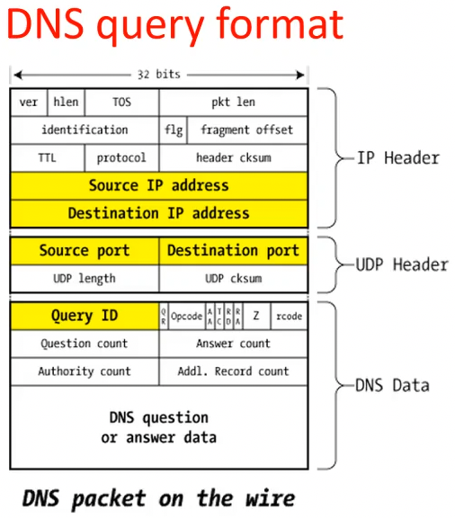
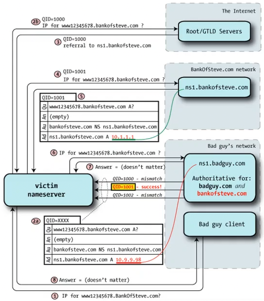

+++
title = "Lecture 2: Network security 1"
+++

# Lecture 2: Network security 1

Recap: computer networks has several layers

## Local Area Network attacks
The attacker is present directly on the local network.

### Sniffing
Attacker sets network interface to promiscuous mode
=> can access all traffic on the segment.

Why?
- Many protocols (FTP, POP, HTTP, IMAP) send auth info in plaintext
- You can collect personal data

Tools
- dsniff, filesnarf, mailsnarf...: passively monitor network for interesting data
- arpspoof, dnsspoof, macof: help sniff
- sshmitm, webmitm: man-in-the-middle attacks against redirected SSH and HTTPS

Detecting sniffers:
- typically passive and in promiscuous
- can be detected directly by ifconfig, cpm, ifstatus
    - but kernel-level rootkits can hide them
- suspicious DNS lookups: try to resolve names associated with IP address, you can trap them by generating connection from fake IP not on local network and see if someone resolves it
- latency: since promiscuous mode processes every packet, measure response time of the host
- unusual behavior (e.g. specific to kernels)

If we want to sniff: TCPDump (analyses traffic on network segment, can use expressions to filter packets)
- expressions: `<qualifier> <id>`
    - `<qualifier>`:
        - type: defines the entity kind (host, net, port)
        - dir: direction of traffic (src, dst, src and dst)
        - proto: specifices protocol (ether, ip, arp, rarp)
    - operators can be used (logical, relational, binary)
    - can access packet data

But switched ethernet doesn't allow direct sniffing...
solutions:
- MAC flooding:
    - switches have table with MAC address/port mappings
    - flooding the switch with invalid MAC addresses may overflow table memory and revert its behavior from "switch" to "hub"
- MAC duplicating/cloning:
    - reconfigure your host to have same MAC address as machine whose traffic you want to sniff

## Spoofing
ARP spoofing with forwarding
- ARP == address resolution protocol
    1. ARP `who-has <ip>` packet sent to broadcast, contains sender's MAC address and IP address
    2. Person with address `<ip>` replies with `arp reply` and their MAC address
- attacks:
    - ARP doesn't provide authentication
    - if you're faster than queried host, you can provide false IP/link-level address mapping
    - fake ARP queries can be used to store wrong mappings in host cache
    - since ARP is stateless, you send fake replies even if there wasn't a request
    - man-in-the-middle attack:
        - attacker creates two alias interfaces with IP addresses of A and B
        - disable attacker's ARP functions (`ifconfig -arp`)
        - set attacker's ARP caches to correct values (`arp -s host mac_addr`)
        - attacker sets IP forwarding between two interfaces
        - => traffic flows A<->B but through attacker's machine

    You can use tools for these attacks, or you can create your own packets (made easier with libnet).
    

IP spoofing (local network)
- host impersonates another by sending datagram with address of other host as source address
- attacker sniffs network looking for replies from attacked host

Spoofing remotely
- blind IP spoofing:
    - host sends IP datagram with address of some other host as source address
    - host replies to legitimate host
    - usually attacker doesn't have access to reply

UDP spoofing
- DNS:
    - DNS maps name to IP address. can be recursive (via root↔TLD↔authoritative servers) or iterated (local DNS communicates with root/TLD/authoritative server in turn)
        
    - attacks:
        - simple: e.g. if authentication is based on DNS name, the DNS server can reply with a fake trusted name under the control of the attacker. countermeasure: double lookup, for both IP address and name, and compare results.
        - advanced: poisoning. every DNS query has a random ID; the reply ID has to match.
            - birthday attack: in group of 23 people, probability of 2 having same birthday is 50%. so use the same for DNS &mdash; send n queries and n replies for every request, with different query ids.
            - Kaminsky's trick: the attacker can own the entire domain. request random name within target domain to avoid cache, send stream of forged DNS responses to victim with glue records (designating nameservers) pointing to the attacker's IP addresses

            

## Hijacking
Steps:
- attacker waits for client request
- races against legitimate host to produce reply

