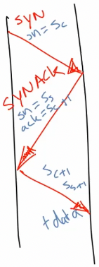
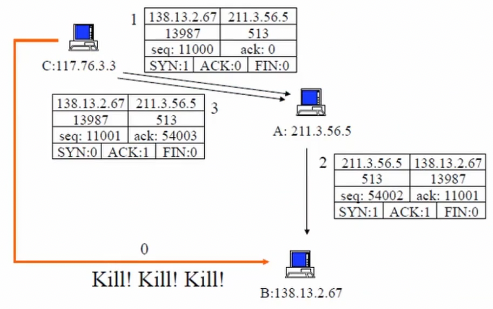
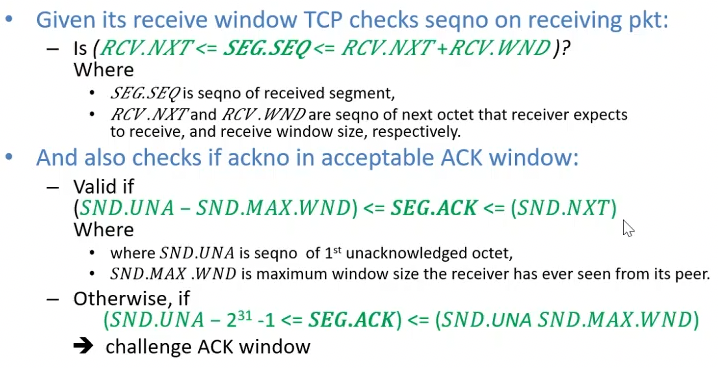
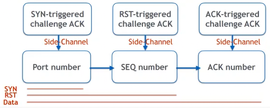
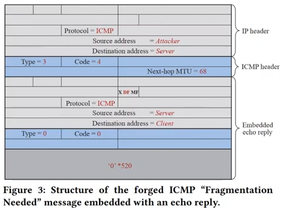
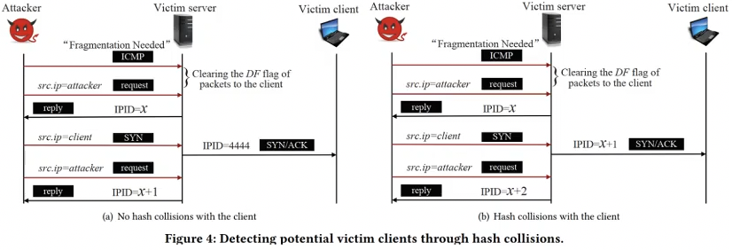

+++
title = "Lecture 3: TCP"
+++

# Lecture 3: TCP

TCP seq/ack numbers:
- sequence: specify position of segment data in communication stream (i.e. if number is 13423, means payload contains data from byte 13423 to byte <length>)
- acknowledgment: specify position of next byte expected from comms partner

TCP windows:
- used for flow control
- segment only accepted if sequence number is inside window that starts with current ack number (ack number < seq number < ack number + window size)
- window size changes dynamically to adjust amount of info sent by sender

TCP flags: used to manage establishment and shutdown of connection
- SYN: request for sync of syn/ack numbers (to set up connection)
- ACK: states ack number is valid
- FIN: request to shutdown one stream
- RST: request to reset virtual circuit

## Connection setup (3-way handshake)
1. Server listening on port receives connection request from client
    - segment is marked with SYN flag
    - segment contains random initial seq number s𝑐
2. server answers with segment marked with SYN and ACK flags, containing
    - initial random seq number s𝑠
    - s𝑐+1 as acknowledgment number
3. client sends segment with
    - ACK flag set
    - sequence number s𝑐+1 and acknowledgment num s𝑠+1

What's the initial sequence number?
- TCP standard (RFC 793) specifies that seq number increments every 4 μs
- BSD used number incremented b 64k every half second and every time a connection is established

## Connection shutdown
FIN:
1. One partner sends segment with FIN flag
2. Other partner answers with ACK segment
3. No more data will be sent from partner that sent FIN, only acks received data.
4. Connection closed when acking partner shuts down stream.

RST: just send a packet with the RST flag.

## Spoofing
attack to impersonate another host when establishing TCP connection

Node A trusts node B (e.g. whitelist login from a specific IP).
So, node C wants to impersonate node B wrt A when opening TCP connection.

1. C kills B (denial of service, crashing...) so that B doesn't send RST segments
2. C sends TCP SYN to A in spoofed IP packet, using B's address as source IP and s𝑐 as seq number.
3. A replies with SYN/ACK segment to B with s𝑠 as seq number; B ignores the segment because it's too gone
4. C doesn't receive the segment, but has to send ACK with s𝑠+1 as acknowledgment number
    - C eavesdrops SYN/ACK segment
    - or C guesses the right number

## Hijacking
### Joncheray-style
Takes control of existing TCP connection.
Attacker uses spoofed TCP segments to
- insert data in streams
- reset existing connection (denial of service)

The correct seq/ack numbers must be used:
- can eavesdrop client-server traffic
- can guess right seq/ack numbers

1. Assume attacker can sniff traffic (see all packets between C and S)
2. Attacker waits until connection is quiet (all transmitted data have been acknowledged by both endpoints)
3. Attacker sends injected data with correct ack𝑐, seq𝑐
4. ACK storm ensues:
    - receiver of injected data sends ack to apparent sender
    - apparent sender replies with ack with "expected" seq number
    - receiver considers it out-of-sync, sends ack with "expected" seq number
5. ACK storm continues until a message is lost. Any subsequent attempt to communicate will lead to ACK storm.
    - we can use ARP poisoning to send ACKS to non-existing hardware address
    - send RST packets to both parties
    - ACK storms can be blocked by attacker using ACK packets with right numbers
6. If packets are desynchronised so much that they're out-of-window, they are automatically dropped by the parties. But attacker can relay and modify the data.

You can also get desynchronisation by:
- waiting for SYN/ACK from S to C
- then sending RST to S and open new connection immediately with same port etc. (but different client seq number)
- S sends SYN/ACK with A acknowledges, and S now in established state

### New attacks - off-path
#### Challenge ACK rate limit
TCP side channel vulnerability in Linux 3.6+, because RFC 5961 changed the SYN receiving scheme and Linux implemented it to the letter.
A challenge ACK packet is sent in an established connection in these cases:
- SYN packet with correct <srcIP, dstIP, srcPort, dstPort> (any seq num)
- RST packet with correct <srcIP, dstIP, srcPort, dstPort> (in-window seq num)
- Data packet with correct <srcIP, dstIP, srcPort, dstPort> (in-window seq num, old ack num that's in challenge window)
<!-- data is more complicated, might need to take notes on this:  -->

Vulnerability: recommended to rate limit the challenge ACK packets, Linux did this
- `sysctl_tcp_challenge_ack_limit`: global limit (default 100) of all challenge ACK per sec, across all connections
- fixed in Linux 4.7. can fix by adding random noise to the channel (rate limit) or eliminate it

Given any two hosts on the internet, a blind attacker can infer:
- existence of communication
- sequence number
- ACK number

Can be used towards attacks of
- TCP connection termination
- Malicious data injection

Threat model:
- arbitrary pair client & server
- blind off-path attacker (no eavesdropping)
- assumption: attacker can send spoofed packets with victim's IP address

Attack:
1. Send spoofed packets with guessed values (like source port) to trigger challenge ACKs.
    - If the guess is right, the legit client gets a challenge ACK, and we get one less challenge ACK.
    - If it's wrong, we get all challenge ACKS back.
2. Repeat step 1 for either:
    - SEQ number: spoofed RST packet and 100 legit RST packets
    - ACK number: spoofed Data packet and 100 legit RST packets

Time cost is additive, can be done in one minute.
Optimise using binary search for ports: send spoofed packet for all ports in first half range, narrow down search space by half and go to next round.

ACK throttling time synchronisation is important:
- challenge ACK count resets each second
- so all spoofed and legit packets must be in same 1-second interval at server

Synchronisation method:
- split 1 second into 200 time slots
- send 200 RST packets in one second, one in each slot
- receive max 200 challenge acks back (100 in first second, 100 in second second)
- adjust until you get exactly 100 challenge acks back

#### IP identifier (IPID)
Still uses challenge acks.
Instead of shared limit on challenge acks, use IPID as shared counter.

Linux > 4.18, two ways to select IPID counter: per socket, or hash-based (shared)

Attack:
1. detect victim clients:
    - force server's IPID assignment from per-socket to hash-based
        - DF flag in packet can be cleared with ICMP packet
        - pretend to be a router, send forged ICMP "fragmentation needed" message to victim server
        - embed ICMP echo reply data in the forged message
        - server will clear DF flag of next packets sent to client whose IP address is in embedded echo reply
        
    - through hash collisions, detect victims with same IPID counter as attacker.
        - one of 2048 hash counter is selected based on source IP, dest IP, protocol number, and random value
        - if hash(TCP packets sent to victim) == hash(packets sent to attacker), server uses same IPID counter
        
        - hash-based IPID counter doesn't increase linearly, the increment is a random value based on system ticks, so that must be restricted
2. detect TCP connections and source port:
    - continuously send ICMP echo requests, observe IPID values of server's reply
    - then send SYN/ACK with guessed source IP/port.
        - if correct: challenge ack and jump in counter
        - if incorrect: RST packet to real client with IPID 0, so no jump in counter
3. infer seq and ack numbers:
    1. Infer acceptable seq numbers (in server's receive window)
        - continuously send ICMP request packets to server, observe IPID values of replies
        - send spoofed RST packet with guessed seq number
            - if correct: challenge ACK, so increase in counter (IPID)
            - if incorrect: not in server window, so discarded and no counter increase
    2. Locate challenge ack window
        - when receiving data packet, 3 options:
            - ACK number in challenge ACK window: challenge ACK
            - ACK number in acceptable ACK range
            - invalid ACK number
        - continuously send ICMP request packets to server, observe IPID values of replies
        - send spoofed ACK packet with guessed ACK number to server
            - if ACK in challenge ACK window, challenge ACK packet sent & jump in counter
            - otherwise, no jump
    3. Detect lower boundary of server's receive window
        - forge multiple ACKs with constant ACK number that's in challenge ACK window, and seq number set to <acceptable_sequence_number-i>
        - at start, server will send challenge ACKS one per 500ms
        - once <acceptable_sequence_number-i> reaches lower boundary, server starts sending duplicate ACKs without rate limit
    4. Detect acceptable ack numbers
        - send multiple probing ACKs and observe IPID counter
        - forged probing ACK packets have seq num seq_acceptable, ack num is set to <ack_challenge-i>
        - challenge ACKS triggered until <ack_challenge-i> reaches lower bound of challenge ACK window
        - acceptable ack range inferred by adding 2*2³⁰ to detected boundary
