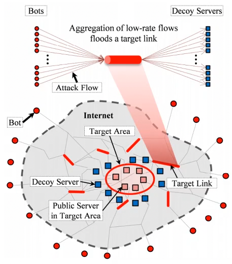
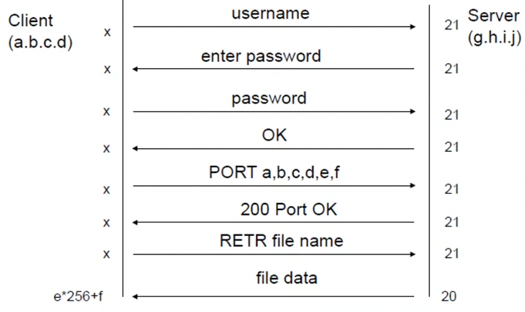
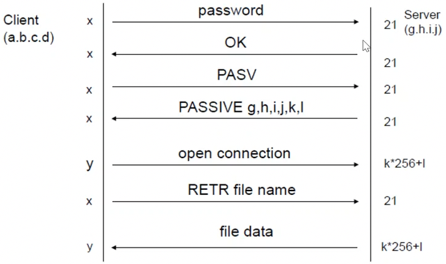

+++
title = "Lecture 4: DOS"
+++

# Lecture 4: DOS
## IP fragmentation
When datagram encapsulated in lower-level protocols, it might need to be split into smaller portions.
Specifically if datagram is bigger than data link layer maximum transmission unit (MTU)
Fragmentation can be done at source host, or at intermediate step in delivery.
If datagram has "do not fragment" flag set, RCMP error is sent back to origin
Uses the fields: length (headers+data), fragflag (fragmented or not), offset (in multiples of 8)

Attack: The Ping of Death
- offset of last segment is where total size of reassembled datagram is bigger than max allowed size
- kernel static buffer overflowed, causing a kernel panic

## SYN flooding
Nicknamed "Neptune"
Attacker starts handshake with SYN-marked segment
Victim replies with SYN-ACK
Attacker stays silent
The host can keep max number of TCP connections in half-open, after that can't accept any more

Current solutions: filtering, increasing length of half-open queue, reduce SYN-received timeout, drop some connections, or use SYN cookies

SYN cookies:
- algorithm used to determine initial sequence number of server
    - top 5 bits: t mod 32, where t is 32-bit time counter increasing every 64 seconds
    - next 3 bits: encoding of max segment size (MSS) chosen by server in response to client's MSS
    - next 24 bits: keyed hash of counter t, source/dest IP addresses and ports
- when server receives ack, it checks that secret function works for recent value of t, then rebuilds SYN queue entry using encoded MSS info
- drawbacks:
    - server sequence num grows faster
    - MSS value limited by encoding procedure (only 8 possible values)
    - no data included in initial SYN

## Modern attacks
Low-volume attacks
- Exploit fact that server must maintain resources associated with each open TCP connection
- Algorithmic complexity attacks: use low-volume streams of requests consuming lots of resources (worst-case of algorithms)

Massive attacks
- DDOS botnets: DirtJumper for HTTP, Yoddos for TCP/UDP/HTTP/etc, Mirai botnet of IoT devices
- Amplification: small request leads to huge reply; SMURF (spoof IP address of victim, send broadcast echo request), today Distributed Reflective DOS (e.g. NTP monlist command reports list of last 600 hosts that contacted the server, Memcrashed)

Stealthier method: attack sites that share same bottleneck link as victim, only tiny amount of data for a small amount of time from many bot machines. you congest all of the paths towards the target servers.

## Scanning
We want to know available services at remote side.
May want to fingerprint OS, app, etc.

UDP port scan:
- used to find available UDP services
- zero-length UDP packet sent to each port
    - if ICMP error "port unreachable", services assumed to be unavailable
    - if no reply, open or filtered

TCP port scan:
- used to find available TCP services
- most services statically associated with port numbers
- attacker tries to open TCP connection to all ports, if handshake successful then available

TCP SYN scanning ("half-open" scanning)
- attacker sends SYN packet
- if server answers with SYN/ACK, the port is open
- attacker sends RST packet instead of final ACK

TCP FIN scan
- attacker sends FIN-marked packet (normally to terminate connection)
- most TCP/IP implementations:
    - if port closed, RST sent back
    - if port open, FIN packet ignored

Idle scanning
- use relay victim host to "relay" scan, but the relay must be relatively idle to avoid noise
- attacker sends spoofed TCP SYN packets to target
- packets appear to come from relay (victim)
- target replies to relay
    - if target replies with SYN/ACK packet, victim sends out RST (open port)
    - if target replies with RST, victim will not send out any packet (closed port)
- attacker checks IP datagram ID of victim before and after each port probe
    - if increased: port on target open
    - if not increased: port on target closed

## FTP
Based on TCP, provides file transfer service, listens on port 21.
Control stream used for commands, data stream for data transfer.
Client tells server to connect to its local port using PORT command, server opens connection from port 20 to that port.
Connection closed when transfer completes.

<table class="invis">
    <tr>
        <th>FTP</th>
        <th>Passive FTP</th>
    </tr>
    <tr>
        <td></td>
        <td></td>
    </tr>
</table>

Problems:
- Writable FTP home: anonymous user can write config files in home directory
- PASV connection theft: attacker connects to port opened by server before legit client, client commands lead to file transfers from attacker
- FTP bounce: PORT command used by client to tell server address and port for data connection, address doesn't have to be same as client so you can open connection to third host
