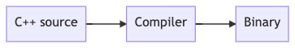

+++
title = 'Basic architecture & making a program'
+++
# Basic architecture & making a program
## Von Neumann Architecture
Early computer design.

CPU: ALU, CU with instruction register and program counter

The CN sees memory contents in bits, 1 or 0. That's called a binary program.

How to make binary program?
- Opt. 1: program bit by bit
- Opt. 2: compile to binary.
    - C++ is a compiled language.

	

- Opt. 3: interpreter that converts & executes a HLL, line-by-line

	
