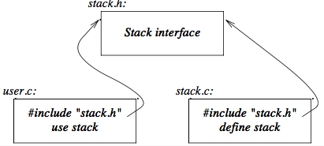

+++
title = 'Modular programming'
+++
# Modular programming
"Decide which modules you want; partition the program so that data is hidden within modules.”

## Namespaces
for example, the definition for a stack. the problems to solve:

1. Provide a user interface (functions  *push* and *pop*)
2. Ensure that the representation of the stack can only be accessed through these methods
3. Ensure that the stack is initialized before its first use

for a stack, interface could be declared and used like this:

```cpp
namespace Stack {
    void push(char);
    char pop();
}
void f() {
    Stack::push(‘c’);
    if (Stack::pop() != ‘c’) error(“impossible”);
}
```

## Separate compilation
define the interface in `stack.h`:

```cpp
namespace Stack {
    void push(char);
    char pop();
}
```

include the header file and implement the interface:

```cpp
#include “stack.h”
namespace Stack {
    const int max_size=200;
    char v[max_size];
    int top=0;
}

void Stack::push(char c) { /* check for overflow and push c */ }
char Stack::pop() { /* check for underflow and pop */ }
```

graphically, it looks like this:



## Exception handling
in interface, define the exception (`stack.h`):

```cpp
namespace Stack {
    ...
    class Overflow { };
}
```

in implementation, throw the exception when needed (`stack.c`):

```cpp
#include “stack.h"
namespace Stack {
    …
    void Stack::push(char c) {
        if(top==max_size) throw Overflow();
        // push c
    }
}
```

use the exception capabilities in code (`user.c`):

```cpp
#include “stack.h”
void f() {
    …
    try {
        while (true) Stack::push(‘c’);
    }
    catch (Stack::Overflow) {
        // take appropriate action
    }
}
```
