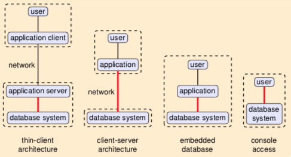
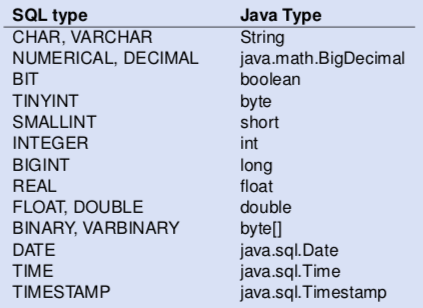

+++
title = "Database Application Programming"
+++

# Database Application Programming

Various ways of using database tech:



how to access database from apps:

-   static embedded queries:
    -   preprocessor-based, static SQL
    -   e.g. SQLJ, Embedded SQL (C/C+)
-   dynamic:
    -   SQL queries are constructed at runtime
    -   e.g. JDBC, Python DATABASE-API, ODBC, etc.
-   object relational mappings (ORM), etc.:
    -   hide navigational access behind objects
    -   e.g. JPA/Hibernate, Ruby on Rails, ADO.NET/LinQ

## Dynamic

### JDBC

provides APIs like `getInt(string)`, `getString(string)` to fetch cols
by name. can run `executeQuery(sql query)` to run SQL statements.

matches approx. SQL types to Java types, not always precise (String vs
VARCHAR(20))



to improve performance of JDBC apps:

-   connection pooling: keep database connection open, reduces latency
-   prepared statements:
    -   SQL calls that are repeated often
    -   allows driver to optimise queries (precompiled by DBMS)
    -   created with `Connection.prepareStatement()`
    -   allows parameters
    -   e.g.: `SELECT * FROM products WHERE id = ?`
-   store procedures to reduce roundtrips
    -   written in DATABASE-specific language, not portable
    -   accessed with `Connection.prepareCall()`
-   use driver that\'s bulk-transfer optimised
    -   for large result sets
    -   driver can send multiple tuples in a single network packet

### SQL injection

Exploit SQL statement construction to run your own commands.

Wrong:

```java
stat.executeQuery("SELECT balance FROM accounts " + "WHERE name = '" + userName + "'" + " AND passwd = '" + userPassword + "'");
```

So if you fill `'; SELECT * FROM accounts`, it will show all accounts.
You can also then update, drop, and do anything you want.

Solution: don\'t use string concatenation, use prepared statements.

```java
stat = conn.prepareStatement("SELECT balance FROM accounts " + "WHERE name = ? " + " AND passwd = ?");
stat.setString(1, userName);
stat.setString(2, userPassword);
stat.executeQuery();
```

### Impedance mismatch

database query language does not match app programming language.

static API (SQLJ):

-   mismatch between SQL and Java types (`isNull`)
-   SQL checked for correctness at development time
-   inflexible (preprocessor needed)

dynamic API (JDBC):

-   mismatch between SQL and Java types (`isNull`)
-   powerful, flexible, but error-prone
-   SQL query given as strings may be incorrect, no error checking at
    dev time and col names/types are unknown at compile time
-   risk of SQL injection

an object relational mapping is one attempt to improve even more.

### Object Relational Mapping

maps rows in tables to objects:

-   table ≈ class
-   row ≈ object
-   foreign key navigation ≈ pointers/references

mapping from objects to database (automatic/designed). run-time library
handles interaction with database.


but you might end up being inefficient and doing a huge amount of stuff
in Java that you could just do in SQL and have the DBMS optimise it for
you.

JPA/Hibernate HQL queries:

-   a way to access members, e.g. `employee.department.name`
-   query may return objects
-   more efficient, under the hood it\'s translated to joins

Important aspects of ORM toolkits:

-   mapping specification: map relational data onto objects
-   query language (e.g. HQL): adds object oriented features to SQL,
    typically queries as strings
-   persistence: transaction semantics, languages offer start of
    transactions/commit/abort
-   fetch strategies: danger of implementing queries in Java, object
    caching

Challenges of ORM:

-   can introduce additional level of complexity, and be difficult to
    debug
-   performance analysis is problematic:
    -   database queries are under the hood
    -   sometimes you end up with very complex SQL queries
    -   it\'s difficult to understand what caused the complexity

#### ADO.NET entity framework

-   different apps can have different views on the data
-   views are fully client side. avoid polluting database schema with
    per-app views, no added database-side maintenance
-   powerful, broad set of updatable views, updatability can be
    statically verified
-   Entity Data Model (EDM):
    -   data representation on client side
    -   entity type: structured record with key
    -   entity: instance of Entity Type
    -   entity types can inherit from other entity types

#### LinQ

Language Integrated Query. you can query data structures using SQL-like
syntax

advantages:

-   queries are first-class citizens (not strings)
-   full type-checking and error checking for queries
-   allows to query all collection structures (lists, sets, etc.)

disadvantages:

-   not portable, only C\# and VB

so you can do like

```sql
int[] my array = new int[] { 5, 3, 2, 6, 4, 2, 5 };
var oddNumbers = from i in myarray where i \% 2 == 1 select i;
```

the LinQ runtime translates that to an SQL query, and converts returned
rows to objects. provides change tracking, concurrency control, object
identity.

under the hood, the LinQ query is actually chained function calls with
lambda expressions.
