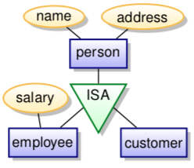

+++
title = "Database design: Conceptual models"
+++

# Database design: Conceptual models

Three phases:

-   conceptual:
    -   what do we store
    -   how are the elements related to each other
    -   what are the constraints
    -   models: Entity/Relationship, UML
-   logical:
    -   transform conceptual schema into the schema supported by the
        database
    -   models: relational model
-   physical:
    -   design indices, table distribution, buffer sizes, etc.
    -   try to maximise performance of the final system

## Conceptual models: Entity-Relationship & UML

static, models the structure and not operations. no methods or
functions.

-   rectangles represent entity sets
-   ellipses represent attributes
    -   double line - multivalued attributes
    -   dashed line - derived attributes
-   diamonds are relationship sets
-   lines link attributes and relationship sets to entity sets
-   underline indicates primary key attributes

### Entity sets

entity is an abstract object (person, company, event..)

entitties have attributes (names, addresses, \...)

entity set is is a collection of similar entities (those sharing the
same attributes).

represented by a set of attributes - descriptive properties possessed by
all entities. the domain is set of permitted values for each attribute.

attribute types:

-   simple and composite (e.g. street is composed of street name and
    number)
-   number of values:
    -   single-valued: e.g. age of a person
    -   multivalued: e.g. person can have multiple phone numbers
-   derived attributes:
    -   can be computed from other attributes
    -   e.g. age computed from date of birth

#### Weak entity sets

a weak entity set doesn\'t have a primary key. its existence depends on
existence of an identifying entity set.

there has to be a total, one-to-may relationship set from identifying to
weak entity set, shown by double diamond.

discriminator: a partial key, distinguishing weak entity only in
combination with identifying entity. denoted by dashed underline.

primary key of weak entity set is combination of discriminator and
primary key of identifying entity set.

### Relationship sets

a relationship is association among several entities (a tuple (e₁, e₂,
\...) of entities)

a relationship set is a set of relationship of same kind. i.e. a set of
tuples (e₁, e₂, \...) where e₁ ∈ E₁, e₂ ∈ E₂, etc. Can have attributes.

example in UML with a relationship set *plays-in* and role indicators:

cardinality limits express number of entities to which another entity
can be associated via relationship set:

-   0\...1 means zero or one
-   1\...1 means precisely one
-   0\...\* means any number
-   1\...\* means at least one

if cardinalities are not given, the default is many-to-many.

total participation: every entity in the entity set participates in at
least one relationship in the relationship set

partial participation: entities may not participate in any relationship
in the set

degree of a relationship set is number of entity sets participating in
the relationship.

### Is-a (inheritance)

lower-level entity sets are subgroups of the higher-level entity sets
(e.g. an employee \'is a\' person)

lower-level entity sets inherit all attributes and relationships of the
higher-level entity sets

you can go top-down and find subgroups (specialisation) or bottom-up and
combine entity sets (generalisation)

constraints:

-   membership: value-based, assigns entity to subclass based on
    attribute values
-   disjointness: an entity can belong to at most one subclass (default
    is overlapping, where it can belong to multiple)
-   completeness: total specialisation, each superclass entity must
    belong to a subclass

### Aggregation

treat relationship set as an abstract entity. allows relations between
relations.

### Summary

 

## UML vs ER

attributes are shown within box of entity set, not as separate ellipses.

binary relationships are a line connecting entity sets, with name of
relationship next to line.

if relationship set has attributes, name of relationship set is written
in box along with attributes of relation; box is connected with dashed
line to the relation line.

non-binary relationship sets are drawn with a diamond.

important differences:

-   keys:
    -   ER supports keys with underlining
    -   UML has no standard for keys
-   aggregation:
    -   ER: treating relationship set as entity
    -   UML: part-whole relation (non-exclusive composition)
-   weak entities:
    -   ER: entities without own key
    -   UML: composition is similar, but says nothing about keys
