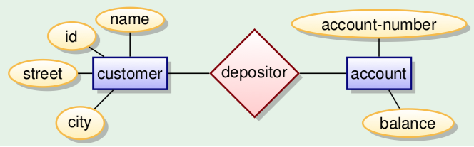

+++
title = "Introduction"
+++

# Introduction

database: collection of data with

-   logical structure
-   specific semantics
-   specific group of users

Why not in files? There\'s no query language, a weak logical structure,
no efficient access, almost no protection from data loss, no parallel
access control.

ANSI SPARC architecture stores data in three levels:

1.  View level: application programs hide details of data types. Hide
    information for privacy/security
2.  Logical level (\'conceptual schema\'): describes data and relations
    among data
3.  Physical level: how data is stored, in disk pages, index structures,
    whatever else.

## Relational databases

view and logical levels are data representations in relations/tables

a row is a tuple record. the order of the elements of the tuples
doesn\'t matter.

a database instance is a \'snapshot\' of a database at a certain point
in time.

the database schema is the structure of the database - the relations and
constraints.

constraints:

-   primary key (would be underlined) uniquely identifies a row in a
    table (`customer(id, name, street, city)`)
-   a foreign key that points to a record in a different table
    (`account(depository → customer, accountnr)`)
-   data types, constrained data types
-   columns constraints (e.g. unique, nullability, counter)
-   check constraints (logical expression for a domain)

create an entity relationship model in UML:



then translate that into relations

## Database management system

database management system (DBMS) allows:

-   create, modify database
-   query data using query language (retrieve)
-   support persistent storage of large amounts of data
-   allow durability and recovery
-   control access to data by users in parallel, without unexpected
    interactions among users (isolation) or partial actions (atomicity)

multiple users, concurrent access. transactions have ACID properties:

-   Atomicity: transaction executes fully or not at all (commit/abort)
-   Consistency: database remains in a consistent state where all
    integrity constraints hold
-   Isolation: multiple users can modify database at same time but will
    not see each other\'s partial actions
-   Durability: when a transaction is successfully committed, modified
    data is persistent regardless of disk crashes

DBMS have data independence and duplication avoidance.

-   Logical independence: logical schema doesn\'t depend on views
-   Physical independence: changing physical schema doesn\'t break the
    logical schema

## SQL: Structured Query Language

SQL is declarative data manipulation language. The user says which
conditions the retrieved data has to fulfill.

It\'s more concise than imperative languages, thus easier to maintain
and cheaper to develop programs in it.

Users usually don\'t have to think about efficiency, the DBMS will
manage that.

Creating a table with constraints:

```sql
CREATE TABLE solved (
    id INT AUTO_INCREMENT,
    name VARCHAR(40) NOT NULL,
    homework NUMERIC(2) NOT NULL,
    points NUMERIC(2) NOT NULL CHECK (points <= 10),
    PRIMARY KEY (id)
);
```

Creating a view:

```sql
CREATE VIEW solved_homework AS
    SELECT id, name, homework FROM solved;
```
