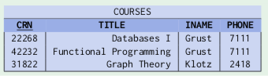
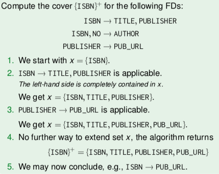
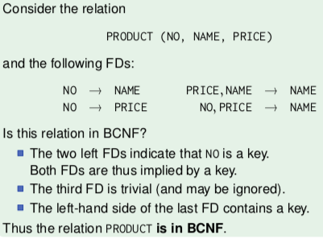

+++
title = "Relational normal forms"
template = "page-math.html"
+++

# Relational normal forms

## Functional dependencies

Functional dependencies are a generalization of keys. This theory
defines when a relation is in normal form.

functional dependency: if two rows agree on a value in one column, they
must also agree on the other column e.g. here, functional dependency is
`INAME → PHONE`, because phone number only depends on the instructor
intuitively:

This is read as \"`INAME` (functionally, uniquely) determines `PHONE`\".

### What is a functional dependency?

-   like partial key, because it uniquely determines some attributes but
    not all
-   a constraint
-   A determinant is a \'minimal\' functional dependency.
-   goal of database normalization is to turn functional dependencies
    into keys

Keys are functional dependencies.

During database design, only unquestionable conditions should be used as
functional dependencies.

It\'s usually bad database design if schema\'s relations violate normal
form. If it\'s violated, data is stored redundantly and information
about different concepts is intermixed.

### Working with functional dependencies

The database designer is not interested in all functional dependencies,
but only in a representative functional dependency set that implies all
others.

Implications of functional dependencies:

-   If A→B and B→C, then A→C
-   A→A always holds
-   Armstrong axioms:
    -   If β ⊆ α, then α → β (reflexivity)
    -   If α → β, then α ∪ γ → β ∪ γ (augmentation)
    -   If α → β and β → γ, then α → γ (transitivity)

Computing the cover: for given set of attributes, see which they imply
through FDs. Extended cover with those, and repeat.

-   Cover of A ({A}+)? FDs A→B,C; B→E
    -   {A}+ ⇒ {A,B,C} ⇒ {A,B,C,E}

Checking whether a → β is implied by a functional dependency set:

1.  computer cover α⁺ of α:
2.  check if β ⊆ α⁺:
    -   set of functional dependencies F implies α → β iff β ⊆ α⁺\_F

example:

### How to determine keys

Determining a minimal key (slides 64-70)

-   given:
    -   R(A,B,C,D)
    -   FDs: A→C; C→B,D
-   start with all attributes: {A,B,C,D}
-   For every attribute, see if we can remove it, which is possible if
    they are implied by an FD which is still in the attribute set.
    -   {A,B,C,D} ⇒ {A,C} (FD2) ⇒ {A} (FD1)
    -   thus {A} is a minimal key
    -   order matters, you can end up with different keys!

determining all minimal keys (slides 71-88)

-   given:
    -   R(A,B,C,D)
    -   FDs: A→C; C→B,D
-   Start with set of candidates: attributes that imply and are not
    implied (not in any right hand side)
    -   { {A} }
-   Find cover of smallest candidate key
    -   {A} ⇒ {A,C} ⇒ {A,B,C,D}
-   If does not contain all attributes, extend candidate with missing
    others and repeat.
-   edge case: if there are no attributes that aren\'t in any right hand
    side, then candidates is empty set { {} } and you extend with every
    attribute like { {A}, {B}, \...}

### Determinants

determinant: non-trivial, minimal functional dependency

{A1, \..., An} is determinant for {B1, \..., Bm} if:

-   functional dependency A1, \..., An → B1, \..., Bm holds; and
-   left-hand side is minimal (if any Ai is removed, then it does not
    hold); and
-   it is non-trivial, i.e. {B1, \..., Bm} not subset of {A1, \..., An}

### Consequences of bad database design

usually if table contains an functional dependency that\'s not implied
by a key, it\'s a sign of bad database design.

leads to:

-   redundant storage of certain facts
    -   wastes storage space
    -   hard to ensure integrity when updating, as all redundant copies
        need to be updated, wasting time
    -   requires additional constraints to guarantee integrity
-   insert, update, deletion anomalies
    -   update: when a single value needs to be changed, multiple tuples
        need to be updated, taking longer and maybe getting out of sync
    -   insertion: when unrelated concepts are stored together in a
        single table
    -   deletion: e.g. when last course of instructor is deleted, their
        phone number is lost

problem is that general FDs are not supported by relational databases.
so you have to transform them into key constraints (database
normalisation).

## Normal forms

Normal form types:

-   Third Normal Form (3NF): standard relational normal form used in
    practice
-   Boyce-Codd Normal Form (BCNF):
    -   a bit more restrictive, easier to define, better for intuition
    -   BCNF requires that all functional dependencies are keys.
    -   ensures that key constraints automatically satisfy all FDs, so
        no more constraints are needed
    -   anomalies (update/insertion/deletion) don\'t occur

Normalisation algorithms can construct good relation schemas from
attributes and functional dependencies. When an ER model is well
designed, resulting derived relational tables will automatically be in
BCNF.

First normal form (1NF):

-   requires all table entries are atomic (not lists, sets, records, or
    relations)
-   all further normal forms assume that tables are in 1NF

### Boyce-Codd Normal Form (BCNF)

-   if all of its FDs are implied by its key constraints
-   in symbols:
    -   for every FD A1,\...,An → B1,\...,Bm of R, we have
    -   either {B1,\...,Bm} ⊆ {A1,\...,An} (the FD is trivial)
    -   or {A1,\...,An} contains a key of R
-   in short, if for every non-trivial functional dependency, left-hand
    side contains a key

> 

#### Splitting relations

If table R is not in BCNF, we can split it into two tables. You split
based on violating FD.

Table decomposition:

-   if FD A1,\...,An → B1,\...,Bm violates BCNF:
    1.  create new relation S(A1,\...,An,B1,\...,Bm)
    2.  and remove B1,\...,Bm from original relation R

Splitting has to be
[]{#Relational normal forms-Normal forms-Boyce-Codd Normal Form (BCNF)-Splitting relations-lossless}**lossless**
so that you can reconstruct original relation by a join.

Decomposition theorem: split is guaranteed to be lossless if
intersection of attributes of new tables is a key of at least one of
them.

It\'s always possible to transform relation into BCNF by lossless
splitting. The resulting schema can always represent all previously
possible states, but it may be more general and allow states that do not
exist in the old schema.

With computable columns, splitting the relation is not the right
solution - instead, define a view with the computed column.

A good decomposition should guarantee preservation of FDs:

-   and FD can refer only to attributes of a single relation
-   when splitting relation into two, there might be FDs that can\'t be
    expressed anymore (not preserved)

#### Synthesis

Determining canonical (minimal) set of FDs:

-   given:
    -   R(A,B,C,D,E)
    -   FDs: D→A; E→A,D; C,D→A; A,E→C; B→A,D,E
-   Rewrite every FD as singular:
    -   D→A, E→A, E→D, C,D→A, A,E→C, B→A, B→D, B→E
-   Minimise left hand side of every FD (aka is every FD minimal?)
    -   drop C from C,D→A because D→A
    -   drop A from A,E→C because E→A
    -   so: D→A, E→A, E→D, D→A, E→C, B→A, B→D, B→E
-   Remove implied FDs (and trivial/duplicate) using lhs attributes (aka
    if we can determine rhs without the FD itself)
    -   D→A, E→D, E→C, B→E

BCNF synthesis (relation R, set of FDs for R):

1.  Determine canonical set of FDs
    -   e.g. D→A, E→D, E→C, B→E
2.  Maximise rhs of FDs
    -   {D}+ - D = {A}
    -   \\({E}\_{-E}\^+\\) = {D,C,A}
    -   \\({B}\_{-B}\^+\\) = {E,D,C,A} ({B} is the minimal key in this
        case)
3.  Split on violating FDs. For each FD, remove the rhs from relations
    and add a new relation, with the lhs of that FD being the key.

### Third normal form (3NF)

-   relation is in 3NF if for every non-trivial functional dependency:
    -   left-hand side contains a key
    -   or right-hand side is attribute of minimal key

retains all FDs, so more popular than BCNF. If we leave table in 3NF, we
have non-key constraints - the FDs that are not implied by keys.

#### Synthesis

Produces lossless decomposition of relation into 3NF that preserves FDs.

1.  Determine canonical set of FDs
    -   e.g. D→A, E→D, E→C, B→E
2.  Merge FDs with same lhs and create relations from them
    -   R1(<u>D</u>, A)
    -   R2(<u>E</u>,C,D)
    -   R3(<u>B</u>,E)
3.  Check if any of relations has key of original relation. If not,
    create a new relation with attributes of the minimal key.
    -   In this case, R(A,<u>B</u>,C,D,E); R3 has <u>B</u>, so don\'t
        need to do anything.
4.  For all pairs of created relations: are they contained in another
    relation? If yes, remove.

## MVD & 4NF

### Multivalued dependencies (MVDs)

Constraints that give a necessary and sufficient condition for lossless
decomposition. They lead to fourth normal form (4NF).

Multivalued dependency `NAME ⤅ PROG_LANG` means that set of vales in in
column PROG_LANG associated with every NAME is independent of all other
columns. i.e. there\'s an embedded function from NAME to sets of
PROG_LANG

The MVD holds if, whenever two tuples agree on NAME, one can exchange
their PROG_LANG values and the resulting tuples are in the same table.

MVDs always come in pairs. For relation R(A1,\...,An, B1,\...,Bm,
C1,\...,Ck) these multivalued dependencies are equivalent:

-   A1,\...,An ⤅ B1,\...,Bm
-   A1,\...,An ⤅ C1,\...,Ck

Every FD is also a MVD.

### Fourth Normal Form (4NF)

A relation is in in 4NF if every MVD A1,\...,An ⤅ B1,\...,Bm is either
trivial, or implied by a key.

If a relation is in 4NF, it\'s also automatically in BCNF.

## Normal forms & ER design

If a \'good\' ER schema is transformed into the relational model, the
result will satisfy all normal forms (4NF, BCNF, 3NF). If a normal form
is violated, there\'s a flaw in the input ER schema.

In the ER model, the entity has to be split in case of a violation.

Violations of BCNF can also be due to wrong placement of an attribute.

If an attribute of a ternary relationship only depends on two of the
entities, it\'s a BCNF violation.

Why normalize?

-   Avoid redundancy
-   Store separate facts separately
-   Transform general integrity constraints into keys (DBMS constraints)

## Denormalization

The process of adding redundant columns to the database to improve
performance.

This leads to the reintroduction of (some) anomalies, but you avoid huge
amounts of joins.
