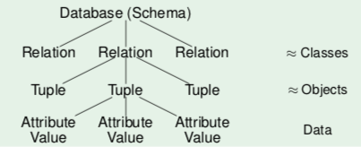

+++
title = "The relational model"
+++

# The relational model

## Concepts: schema, state



### Data types

all table entries are data values that conform to some selection of data
types.

example data types:

-   strings:
    -   `VARCHAR(n)` strings up to n characters, use this if you know a
        certain maximum length
    -   `TEXT` variable length up to 2 GB (but does not always take up 2
        GB)
-   numbers:
    -   `INT` integer
    -   `NUMERIC(n)` decimal number with n digits
-   date and time
-   binary data, like a `BLOB` (binary large object)

domain `val(D)` of a type D is the set of possible values for that type

with SQL, we can create our own application-specific domains (new data
types). examples:

-   `CREATE DOMAIN EXNUM AS NUMERIC(2)`
-   `CREATE DOMAIN EXNUM AS NUMERIC(2) CHECK(VALUE > 0)`

### Relation schema

relation schema s (schema of single relation) defines:

-   finite sequence A₁..An of distinct attribute names
-   for each attribute Ai a data type (domain) Di

written as: s = { A₁ : D₁, \..., An : Dn }

SQL notation:

```sql
CREATE TABLE exercises
    (CAT    CHAR(1),
     ENO    NUMERIC(2),
     TOPIC  VARCHAR(40),
     MAXPT  NUMERIC(2))
```

a relational database schema S defines:

-   finite set of relation names {R₁, \..., Rm}
-   for every relation R a relation schema sch(R)
-   a set of C integrity constraints

so S = ({R₁, \..., Rm}, sch, C)

### Tuples

used to formalize table rows. so e.g. in table exercises:
`(’H’, 1, ’Rel.Alg.’, 10)`

### Database states

let a database schema ({R₁, \..., Rm}, schema, C) be given.

a database state I for this database schema defines for every relation
name Ri to a finite set of tuples I(Ri) w.r.t the relation schema
Schema(Ri)

## Null values

relational model allows missing attribute values.

these are represented by `NULL`. not the same as 0 or an empty string.

used to model scenarios like:

-   a value exists IRL but is not known
-   no value exists
-   attribute is not applicable
-   any value will do

without null values, you\'d have to split a relation into specific
relations, like `student_with_email` and `student_without_email`. or the
users would have to make up a fake value, which would not be uniform and
you\'d have no idea how to query.

problems:

-   no clear semantics, since null values can be used in many scenarios
-   SQL has three-valued logic (true, false, unknown), so if you want to
    check for null, you have to say `WHERE A IS NULL`

so declaring many attributes as NOT NULL simplifies the program, but
only do that if you\'re sure that there\'s always a value.

## Constraints

the database should be an image of the relevant subset of the real
world. plain definition of tables often allows too many database states.

Integrity constraints (IC): conditions which every database state has to
satisfy, restricting the set of possible database states.

In `CREATE TABLE`, possible constraints:

-   `NOT NULL`: no value in this column can be null
-   `Keys`: each key value can only appear once
-   `Foreign keys`: values in a column must appear as key values in
    another table
-   `CHECK`: column values have to satisfy a given predicate

Why specify constraints:

-   some protection against data input errors
-   document knowledge about database states
-   enforce law/company standards
-   protect against inconsistency
-   simplify queries in programs

## Keys

key of relation R is attribute A that uniquely identifies tuples in R.
this refers to all possible database states, not just the current one.

key constraint is satisfied in database state iff all tuples have
different values for A.

once something is declared as a key, the DBMS refuses insertion of
tuples with duplicate key values.. this refers to all possible database
states, not just the current one.

keys can consist of several attributes, then they are composite keys. if
columns A,B form a composite key, there cannot be two tuples t ≠ u which
agree in both attributes. keys should never change.

a key constraint becomes weaker (less restrictive) if attributes are
added to it.

a key is minimal if no attribute can be removed without destroying the
key constraint.

a relation may have more than one minimal key. one is the primary key,
which cannot be null. other keys are alternate/secondary.

choosing a primary key: single simple attribute, never updated

### Foreign keys

use key attributes to uniquely reference a tuple, like a pointer.
denoted with arrows:

```sql
RESULTS (SID → STUDENTS,
        (CAT, ENO) → EXERCISES,
        POINTS)
        STUDENTS (SID,FIRST,LAST,EMAIL)
        EXERCISES (CAT,ENO,TOPIC,MAXPT)
```

to refer from relation R to tuples of S, add primary key attributes of S
to attributes of R. only stable if the logical \'address\' of a tuple
does not change.

implements a one-to-many relationship.

an existence guarantee is needed.

foreign key constraints in SQL:

```sql
CREATE TABLE RESULTS (
    ...
    FOREIGN KEY (SID) REFERENCES STUDENTS(SID)
)
```

this ensures that every referenced row exists, which ensures referential
integrity of the database.

these operations violate the constraints:

-   insertion into table with foreign key without matching referenced
    tuple. DBMS rejects update.
-   deletion from table if the tuple is referenced via foreign key.
    either DBMS rejects, both are deleted (cascade), or foreign key is
    set to null.

only keys may be referenced. a table with composite key must be
referenced by composite key that has same number of attributes.
