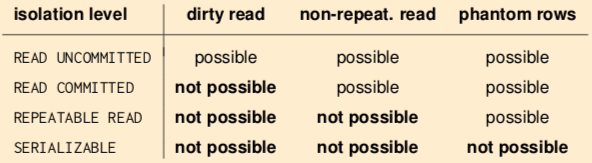

+++
title = "Transactions"
+++

# Transactions

transaction: a sequence of actions we want to perform on a database

should be atomic: either run fully, or not at all. this avoids
concurrency problems like:

-   losing effects of one transaction due to uncontrolled overwrite by
    another (\'lost update anomaly\')
-   transaction reads partial result of another transaction
    (\'inconsistent read anomaly\')
-   transaction reads changes made by another transaction before they
    are rolled back (\'dirty read anomaly\')
-   transaction reads value which is afterwards changed by another
    transaction (\'unrepeatable read anomaly\')

For this, we need to get some ACID:

-   Atomicity: transaction executes fully or not at all (commit or
    abort)
-   Consistency: transactions always leave database in consistent state,
    where all defined integrity constraints hold
-   Isolation: multiple users can modify database at the same time
    without seeing partial actions
-   Durability: when transaction is committed successfully, the data is
    persistent, regardless of crashes

transaction: a list of actions

-   reads - R(O)
-   writes - W(O)
-   end with Commit or Abort
-   e.g.: T₁: R(V)\< R(Y), W(V), W(C), Commit

## Schedules

scheduler decides execution order of concurrent database access

schedule is list of actions from set of transactions (\'plan on how to
execute transactions\'). order in which 2 actions of transaction T
appear in schedule must be same as order in T.

## Serializability

serial schedule: if actions of different transactions are executed one
after another (e.g. all of T2, then all of T1)

serializable schedule: if its effect on database is same as that of some
serial schedule

actions in schedule conflict if they

-   are from different transactions
-   and involve same data item
-   and one action is write

conflicts may cause schedule to not be serializable

conflict types:

-   write read (WR) - T₁ writes Y, then T₂ reads Y
-   read write (RW) - T₁ reads Y, then T₂ writes Y
-   write write (WW) - T₁ writes Y, then T₂ writes Y

we can swap actions of different transactions if actions are
non-conflicting.

conflict equivalent schedules: if they can be transformed into each
other by swapping non-conflicting, adjacent transactions.

conflict-serializable: if conflict equivalent to some serial schedule

check it with a precedence graph:

-   graph has node for each transaction
-   edge from T₁ to T₂ if conflicting action between T₁ and T₂ (with T₁
    first)
-   conflict-serializable iff no cycle in the graph
-   if no cycles, serial schedule is a topological sort of precedence
    graph

## Runtime serializability strategies

serializability during runtime: system doesn\'t know which transactions
will run, and which items they\'ll access

strategies:

-   Pessimistic: lock-based, timestamp based
-   Optimistic: read-set/write-set tracking, validation before commit
-   Multi-version techniques: eliminate concurrency control overhead for
    read-only queries

### Pessimistic: lock-based, two phase locking

transactions must lock objects before using them

types:

-   shared lock (S-lock): acquired on Y before *reading* Y, many
    transactions can hold a shared lock on Y
-   exclusive lock (X-lock): acquired on Y before *writing* Y.
    transaction can hold exclusive lock on Y if no other transaction
    holds a lock on Y.

2 phase locking protocol:

-   each transaction must get:
    -   S-lock on object before reading it
    -   X-lock on object before writing it
-   transaction can\'t get new locks once it releases any lock
-   any schedule that conforms to 2PL is conflict-serializable

#### Deadlock handling

2 PL has the risk of deadlocks where both transactions wait for each
other indefinitely. need to detect deadlock.

detection with Wait-for-Graphs

-   system maintains wait-for-graph, where nodes are transactions and
    edges A→B mean A is waiting for B to release lock
-   system periodically checks for graph cycles
-   if cycle detected, you abort a transaction
-   selecting the victim is a challenge:
    -   if you abort a young one, there will be starvation
    -   if you abort an old one, you\'ll be throwing away what you
        invested in it
    -   phrasing, dude.

detection with timeout

-   let transactions block on a lock request for a limited time
-   after timeout, assume deadlock and abort T

#### Cascading rollbacks

cascadeless schedule

-   delay reads, only read value produced by already committed
    transactions
-   so if a value is required, wait for the commit
-   no dirty reads, so abort doesn\'t cascade

recoverable schedule:

-   delay commit - if T2 reads value written by T1, commit of T2 has to
    wait until after commit of T1

schedules should always be recoverable. all cascadeless schedules are
recoverable.

#### Strict 2 phase locking

same as 2PL, but a transaction releases all locks only when it\'s
completed (commit/rollback). it\'s cascadeless, but still has deadlocks.

#### Preclaiming 2 phase locking

all needed locks are declared at start of transaction. therefore, no
deadlocks. however, not applicable in multi-query transactions (where
queries might depend on results of previous queries)

#### Granularity of locking

there\'s a tradeoff. the more specific your locking is (database, vs
table, vs row level), the higher concurrency you have, and the higher
overhead

multi-granularity locking - decide granularity of locks held for each
transaction depending on characteristics of transaction

intention locks (do not conflict with each other):

-   intention share (IS)
-   intention exclusive (IX)

an intention lock on coarser level of granularity means there is S/X
lock on finer level of granularity.

before a granule *g can* be locked in S/X mode, the transaction has to
obtain an IS/IX lock on all coarser granularities containing *g*

after all intention locks are granted, transaction can lock *g* in the
announced mode

levels of granularity: database → table → row

#### Optimising performance

for each query in log:

-   analyse average time and variance for this type of query
    -   if long delays or frequently aborts, might be contention
-   read only or updating query?
    -   compute read-sets, write-sets
    -   will it require row/table locks? shared/exclusive?

How do read- and write-sets of queries intersect? What is chance of
conflicts?

When you understand the query workload, you can:

-   rewrite queries for smaller read- and write-sets
-   change scheduling of queries to reduce contention
-   use different isolation level for queries

#### Isolation levels

some degree of inconsistency may be acceptable to get increased
concurrency & performance

SQL-92 levels:

-   `read uncommitted`: only write locks acquired, any row read can be
    concurrently changed by other transactions
-   `read committed`: read locks held for as long as application cursor
    sits on a current row, write locks as usual
-   `repeatable read`: strict 2PL, a transaction may read phantom rows
    if it runs an aggregation query twice
-   `serializable`: strict 2PL, multi-granularity locking. no phantom
    rows.

phantom row problem: T1 locks all rows, but T2 inserts new row that
isn\'t locked.

solutions:

-   multi-granularity locking (locking the table)
-   declarative locking - key-range or predicate locking

many applications don\'t need full serializability, selecting a weaker
but acceptable isolation level is part of database tuning.

### Optimistic concurrency control

hope for the best, only check that no conflicts happened when
committing. this saves locking overhead.

three phases:

1.  Read phase: execute transaction, but don\'t write data to disk.
    collect updates in transaction\'s private workspace
2.  Validation phase: when transaction wants to commit, DBMS test
    whether execution correct, and abort if needed.
3.  Write phase: transfer data from private workspace into database.

Phases 2, 3 have to be in non-interruptible critical section (val-write
phase).

#### Validation

typically implemented by maintaining:

-   read set RS(Tk) - attributes read by Tk
-   write set Ws(Tk) - attributes written by Tk

Backward-oriented optimistic concurrency control (BOCC)

-   on commit, compare Tk against all *committed* transactions Ti
-   succeeds if
    -   Ti committed before Tk started
    -   or Rs(Tk) ∩ WS(Ti) = Ø

Forward-oriented optimistic concurrency control (FOCC)

-   on commit, compare Tk against all *running* transactions Ti
-   succeeds if
    -   Ws(Tk) ∩ RS(Ti) = Ø

#### Multiversion concurrency control

with old object versions around, read-only transactions never need to be
blocked

-   might see outdated but consistent version of data
-   like everything in query happened the moment it started

issues:

-   versioning requires space and management overhead
-   update transactions still need concurrency control

snapshot isolation:

-   each transaction sees consistent snapshot of database corresponding
    to state at moment it started
-   read-only transactions don\'t have to lock anything
-   transactions conflict if write to same object
    -   pessimistic concurrency control - only writes are locked
    -   optimistic concurrency control - only write-sets interesting
-   does not guarantee serializability
-   avoids dirty read, unrepeatable read, phantom rows
-   introduces write skew, with complex assertions involving multiple
    tuples
