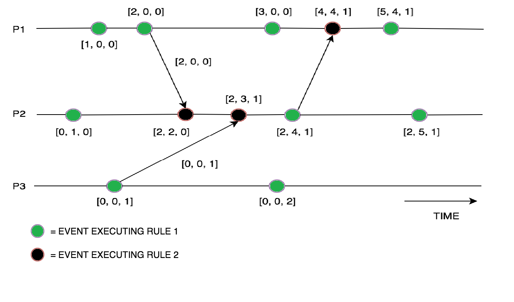

+++
title = 'Introduction'
+++

# Intro
## Distributed vs uniprocessor
- Lack of knowledge on global state: process has no up-to-date knowledge on states of other processes
- lack of global time frame
- nondeterminism

## Communication in distributed system
Main paradigms:
- message passing
- shared memory

Asynchronous communication: sending and receiving are independent events (synchronous is the opposite)

Communication protocol detects and corrects errors during message passing

Assumptions we make:
- strongly connected network (every node/process can reach any other node)
- each process knows only its neighbors (only local knowledge)
- message passing for communication
- asynchronous communication
- channels can be non-FIFO (messages can overtake each other)
- channels don't lose, duplicate, or mess up messages
- delay of messages in channels is arbitrary, but not infinite
- stable network and processes don't crash
- processes have unique IDs

Directed vs bidirectional channels
- directed: one way
- bidirectional: messages can go both ways

complexity measures:
- message complexity: total num messages exchanged
- bit complexity: total num bits exchanged
- time complexity: amount of time consumed (assume even processing takes no time, message received max one time unit after it's sent)
- space complexity: amount of memory needed for the processes
- we consider worst- and average-case complexity

Big O notation
- complexity measures show how resource consumption grows _in relation to input size_
- an algorithm with worst-case message complexity (n²) for input size n takes max in order of n² messages
- "in the order of": give or take some constant
- f = O(g) if for some C > 0, f(n) ≤ C·g(n) for all n ∈ ℕ
- f = Θ(g) if f = O(g) and g = O(f) (both upper and lower bound)

Transition systems
- global state of distributed system is a "configuration"
- configuration evolves in discrete steps called "transitions"
- transition system:
     - TODO: he's going too fast

Execution: sequence γ₀ γ₁ γ₂... of configurations that
- either is infinite,
- or ends in terminal configuration such that
    - γ₀ ∈ L and
    - γⱼ → γⱼ₊₁ for j = 0,1,2,...
- configuration is reachable if there is a sequence of transitions from an initial state to it

States and events
- configuration of distributed system: states at its processes & messages in its channels
- transition associated to event (or two events if synchronous) at one (or two) of its processes
- events: internal, send, receive
- initiator process: if its first even is internal or send
    - algorithm is centralised if only one initiator
    - decentralized if more than one

Assertion:
- predicate on configurations of an algorithm
- safety property is always true in each configuration ("something bad will never happen")
- liveness property is true in some configuration of each execution ("something good will eventually happen")

Invariants:
- assertion P on configurations is invariant if:
    - holds for all initial states
    - if holds in states on both sides of transitions
- each invariant is a safety property

Causal order
- in configuration of async system, applicable events at different processes are independent
- causal order (≺ symbol) on occurrences of evens in execution is smallest transitive relation st
    - in english, if a happens before b, then a ≺ b
    - full definition:
        - if events a,b at same process, and a occurs before b, then a ≺ b
        - if a send and b corresponding receive, then a ≺ b
    - _irreflexive!_ (you clearly can't have a before b _and_ b before a)

Computations
- if neither a ⪯ b nor b ⪯ a, then a and b are concurrent
- permutation of concurrent events in execution doesn't affect result of execution
- these permutations form a computation

## Clocks
Lamport's clock
- logical clock C maps occurrences of events in computation to a partially ordered set, such that a ≺ b ⇒ C(a) < C(b)
- Lamport's clock LC assigns to each event a the length of k of longest causality chain a₁ ≺ ... ≺ aₓ = a
- LC can be computed at runtime:
    - one list of clock values per process, length of the list is same as number of messages
    - each message increases the clock value by 1
    - on a receive, wait until the corresponding send is done, and then the receive has the incremented clock value

Vector clock
- given processes p₀...pₓ₋₁
- each process has a list of vectors (k₀..kₓ₋₁) that are clock values corresponding to processes (e.g. k₀ is first process, k₁ is second process, etc.)
- a message increments the process' clock value by 1
- a receive message also takes the maximum of the other clock values in the process' vector and the values in the vector of the process with the corresponding send message

## Snapshots
snapshot of execution of distributed algorithm should return configuration of execution in the same computation

distinguish: basic messages of underlying distributed algorithm, control messages of snapshot algorithm

snapshot of basic execution contains
- local snapshot of basic state of each process
- channel state of basic messages in transit for each channel

meaningful snapshot: if configuration of execution in same computation as actual execution
- for each message m, sender, p, receiver q, must agree whether m is pre- or post-snapshot

### Chandy-Lamport algorithm
decentralised.
assumes directed network with FIFO channels.

1. Some node takes a snapshot, starts recording on channels, then sends out marker messages across all channels before any other mesages
2. When a node receives the marker control message:
    - if this is the first one it received:
        - take a snapshot (record its own state)
        - mark the corresponding channel as empty
        - start recording on all other channels
        - send out marker messages on _all_ channels, before any other messages
    - else:
        - stop recording the corresponding channel
        - set that channel's state to all messages received since the snapshot

[This is a very good explanation](http://composition.al/blog/2019/04/26/an-example-run-of-the-chandy-lamport-snapshot-algorithm/)

Complexity:
- message: Θ(E) (with E number of channels)
- worst-case time: (D) (with D the diameter)

### Lai-Yang algorithm
allows that channels are non-FIFO

- initiators take local snapshot of their state
- when process takes local snapshot, appends 'true' to each outgoing basic message
- if process that hasn't yet taken snapshot receives message with 'true', or control message, for the first time, it takes local snapshot before reception of the message
- channel state is basic messages without 'true' that receives after its local snapshot
- processes count how many basic messages without 'true' they sent/received for each channel
- when p takes a snapshot, p sends a control message to q, telling q how many basic messages without 'true' were sent to pq
- for multiple snapshots, each snapshot has sequence number and basic message carries sequence number of last snapshot at sender instead of 'true'
