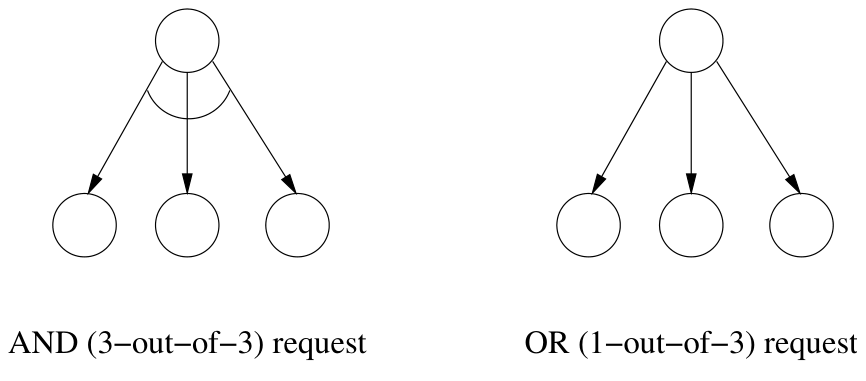

+++
title = 'Trees & deadlock'
+++

# Wave algorithms
decide event: special internal event

In wave algorithm, each computation (wave) satisfies:
- termination: it's finite
- decision: contains one or more decide events
- dependence: for each decide event e and process p, f is before e for event f at p

## Traversal algorithms for spanning trees
Centralised wave algorithms.

Initiator sends around token:
- in each computation, token first visits all processes
- token returns to initiator who performs decide event

Build spanning tree:
- initiator is root
- each noninitiator has as parent the neighbor from which it first received token

## Spanning trees
### Tarry's algorithm
Undirected network.

restrictions:
- process never forwards token through same channel twice
- noninitiator only forwards token to its parent when there's no other option
- to get depth-first search: when process receives token, it immediately sends back through same channel, if allowed by other restrictions
- to prevent transmission through frond edge: visited processes are included in token, token isn't forward to processes in this list (unless back to parent)
    - but gives you message complexity 2·N - 2 (for N processes) and time complexity ≤ 2·N - 2 time units
    - each tree edge carries 2 tokens

token travels through each channel both ways, end up at initiator

the parent-child relation is reversal of solid arrows.
- tree edges are solid
- frond edges (not part of spanning tree) are dashed

complexity:
- message: 2·E messages
- time: ≤ 2·E time units

### Awebuch's algorithm
- process holding token for first time informs its neighbours, except parent and process to which it forwards
- token only forwarded when all neighbours acknowledged reception
- token only forward to processes not yet visited (except when back to parent)

complexity:
- message: ≤ 4·E messages
    - frond edge carries 2 info and 2 ack
    - tree edge carries 2 tokens and maybe 1 info/ack pair
- time: ≤ 4·N - 2 time units
    - tree edge carries 2 tokens
    - each process waits at most 2 time units for acks to return

### Cidn's algorithm
Awerbuch's but without acks.
- token forwarded without delay
- each process records to which process it forwarded the token last
- if p receives token from process to which it didn't last forward, then p marks the corresponding edge as frond and dismisses the token
- if q receives info message from p to which it last forwarded, then q marks corresponding edge as frond and continues forwarding

complexity:
- message: ≤ 4·E messages
    - each channel carries max 2 info messages and 2 tokens
- time: ≤ 2·N - 2 time units
    - tree edge carries 2 tokens
    - at least once per time unit, token forwarded through tree edge

## Tree algorithms
Decentralised wave algorithm for undirected acyclic networks.

Local algorithm at process p
- p waits until received messages from all neighbours except one, who becomes its parent
- sends message to that parent
- if p receives message from its parent, it decides and sends decision to its neighbours except parent
- if p receives decision from parent, it passes on to its other neighbors

Always two neighboring processes decide.

## Echo algorithm
Centralised wave algorithm for undirected networks.
- initiator sends message to all neighbours
- when noninitiator receives message for first time, make sender its parent and sends message to all neighbors except parent
- when noninitiator has received message from al neighbors, sends message to its parent
- when initiator received message from all neighbors, it decides

Complexity:
- message: 2·E

To determine largest process ID in network:
- each process runs echo algorithm tagged by its ID
- processes only participate in largest wave they've seen so far
- the one that decides is TODO

# Deadlocks
Deadlock if cycle of processes waiting until
- communication deadlock: another process on cycle sends some input
- resource deadlock: resources held by other processes on cycle are released

Both captured by N-out-of-M model: process can wait for N grants out of M requests.

## Wait-for graph
- Non blocked process can issue request to M other processes and becomes blocked until N of them granted.
- Then it becomes unblocked and cancels remaining M-N requests
- Only non-blocked processes can grant request

Directed wait-for graph capturing these dependencies:
- edge p→q if p sent request to q not yet canceled by p or granted by q

During execution of basic algorithm, snapshot is taken of graph.
Static analysis may reveal deadlocks
- non-blocked nodes can grant requests
- when request granted, corresponding edge removed
- when N-out-of-M request received N grants, requester becomes unblocked (remaining M-N outgoing edges canceled)
- when no more grants possible, nodes remaining blocked are deadlocked in this snapshot

## Bracha-Toueg deadlock detection algorithm
Given undirected network and basic algorithm
- process suspecting it's deadlocked initiates Lai-Yang snapshot
- each node takes local snapshot of
    - requests it sent or received not yet granted/canceled
    - grant and cancel messages in edges
- each node computes
    - out: nodes it sent a request to (not granted)
    - in: nodes it received a request from (not canceled)
- every node u keeps track of number of grants u requires to become unblocked
    - when u receives grant message, decrements counter
    - if counter becomes zero, sends grant messages to all nodes in 'in' set
- if after termination of deadlock detection run, counter > 0 at initiator, then it's deadlocked in basic algorithm

Initially notified = false and free = false at all nodes
- initiator starts deadlock detection run by executing Notify:
    1. notified(node) = true
    2. for all w ∈ out_set(node) send notify to w
    3. if requests(node) == 0 then Grant(node)
    4. for all w ∈ out_set(node) await done from w
- grant:
    1. free(node) = true
    2. for all w ∈ in_set(node) send grant to w
    3. for all w ∈ in_set(node) await ack from w
- let u receive notify:
    - if notified(u) == false, then u executes Notify(u)
    - u sends back done
- let u receive grant:
    - if requests(u) > 0, then decrement requests(u)
        - if requests(u) becomes 0, then execute Grant(u)
    - u send back ack
- when initiator received done from all nodes in its out set, checks value of its free field
    - if still false, initiator concludes it's deadlocked
