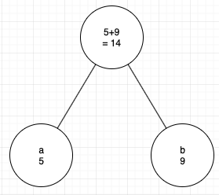
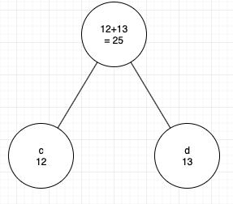
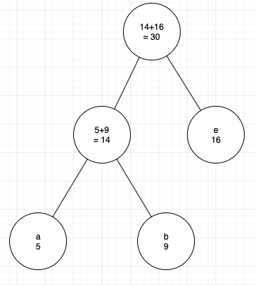
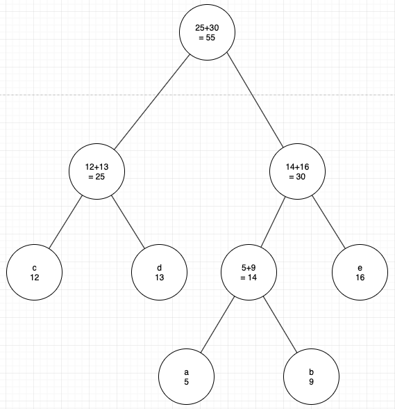
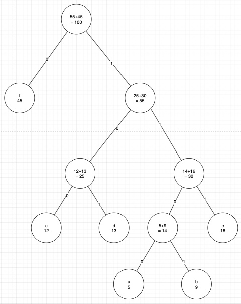

+++
title = "Huffman codes"
+++

# Huffman codes

lossless encoding of characters, the ones that occur more frequently have a shorter encoding

e.g. encode “mississippi”

to generate a tree:
1. Build a table of values with frequencies:

    <table>
    <tr><td> m   </td><td> i   </td><td> s   </td><td> p   </td></tr>
    <tr><td> 1   </td><td> 4   </td><td> 4   </td><td> 2   </td></tr>
    </table>

1. Repeat until tree is complete: take two smallest nodes from list, create a new node that is sum of two smallest, add the two smallest as children (right > left), then add the parent node back into the list.

        
      

1. Assign weights to left-right branches — left is 0, right is 1.

    

1. Traverse tree to generate a code for each character:

    <table>
    <th>letter</th><th>code</th>
    <tr><td> a   </td><td> 1100 </td></tr>
    <tr><td> b   </td><td> 1101 </td></tr>
    <tr><td> c   </td><td> 100 </td></tr>
    <tr><td> d   </td><td> 101 </td></tr>
    <tr><td> e   </td><td> 111 </td></tr>
    <tr><td> f   </td><td> 0   </td></tr>
    </table>

## Complexity
with a min-heap-based min-priority queue, in O(nlogn)
