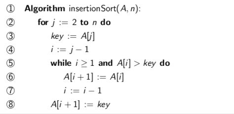

+++
title = "Insertion sort"
template = "page-math.html"
+++

# Insertion sort

like sorting a hand of cards
sequence is a sorted part followed by an unsorted part

algorithm:

- initially: sorted is only 1 element
- loop: while non-sorted has elements
    - insert first element of unsorted part in correct position of sorted part

pseudocode:

analysis:

| **line** | **description** | **constant** |
| --- | --- | --- |
| 1   | nothing |     |
| 2   | n operations | constant1 n |
| 3   | n-1 operations | constant2 (n-1) |
| 4   | n-1 operations | constant3 (n-1) |
| 5   | worst case if A[i] > key always true for fixed j we do the test j times: $\sum_{j=2}^{n}=\frac{n(n+1)}{2}-1$ | $\text{constant}_4(\frac{1}{2}(n(n+1))-1)$ |
| 6   | same, j-1 times assignment | $\text{constant}_5(\frac{1}{2}(n-1)n)$ |
| 7   | same, j-1 times assignment | $\text{constant}_6(\frac{1}{2}(n-1)n)$ |
| 8   | n-1 operations | $\text{constant}_7 (n-1)$ |

sum all the constants, results in T(n) of form $an^2+bn+c$.

We have an² ≤ T(n), so T is in ϴ(n²).
therefore the algorithm is quadratic time complexity.
