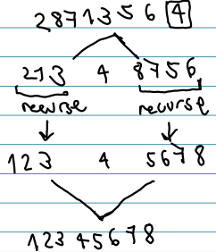

+++
title = "Quicksort"
+++

# Quicksort

algorithm:

- divide input array into two parts:
    - up to index q, keys ≤ pivot
    - starting at index q+1, keys ≥ pivot
- sort recursively both sub-arrays
- combine two sub-arrays into one sorted array

partitioning (in O(n))

- while list contains more than 1 element:
    - take x from list (pivot)
    - index i is last key of small-ones-so-far
    - index j is first key to be compared to pivot
        - if j finds key smaller than pivot, swap that key with i+1

Worst-case time: ϴ(n²)
Best-case time: ϴ(nlogn)
Average-case: ϴ(nlogn)
