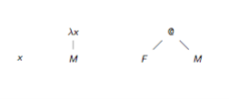
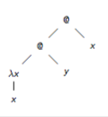

+++
title = "Lambda terms"
+++

# Lambda terms
## abstraction
𝜆.M is function mapping of x to M
𝜆x.square x is function mapping of x to square x

## application
F M is application of function F to argument M

## terms as trees

## parentheses
application is associative to the left
`(M N P) —> ((M N) P)`

outermost parentheses are omitted
`M N P —> (M N P)`

lambda extends to the right as far as possible
`𝜆x.M N —> 𝜆x.(M N)`

combining lambdas is possible
`𝜆xy.M —> 𝜆x.𝜆y.M`

start with most nested lambda
`(𝜆x.𝜆y.M) —> 𝜆x.(𝜆y.M))`

## currying
reduces function with several arguments to functions with single arguments

f: x => x+x —> 𝜆x.x+x
g: (x,y) => x+y —> 𝜆x.𝜆y.x+y

## free/bound variables
x is bound by the first 𝜆x above it in the term tree (underlined)

- 𝜆x.<u>x</u>
- 𝜆x.<u>x x</u>
- (𝜆x.<u>x</u>)x
- 𝜆x.y <u>x</u>

variables that aren’t bound are free (such as y in the last example)

## substitution
M[x := N] means: result of replacing all free *x* in M by N

- x[x := N] = N
- a[x := N] = a
- (P Q)[x := N] = (P[x := N]) (Q[x := N])
- (𝜆x.P)[x := N] = 𝜆x.P
- (𝜆y.P)[x := N] = 𝜆y.(P[y := N]) if x ≠ y

## alpha conversion
renaming bound variables (in case of possible name clashes)
- 𝜆x.x = 𝜆y.y
- (𝜆x.y)[y := x] = 𝜆z.x

P = αQ only if Q can be obtained from P by finitely many changes of bound variables in context

## beta-reduction (dynamic):
(𝜆x.x)y —> By
(𝜆x.x)y —> By
(𝜆x.xz)y —> Byz
(𝜆x.z)y —> Bz

In general: (𝜆x.M)N —> BM[x := N]
