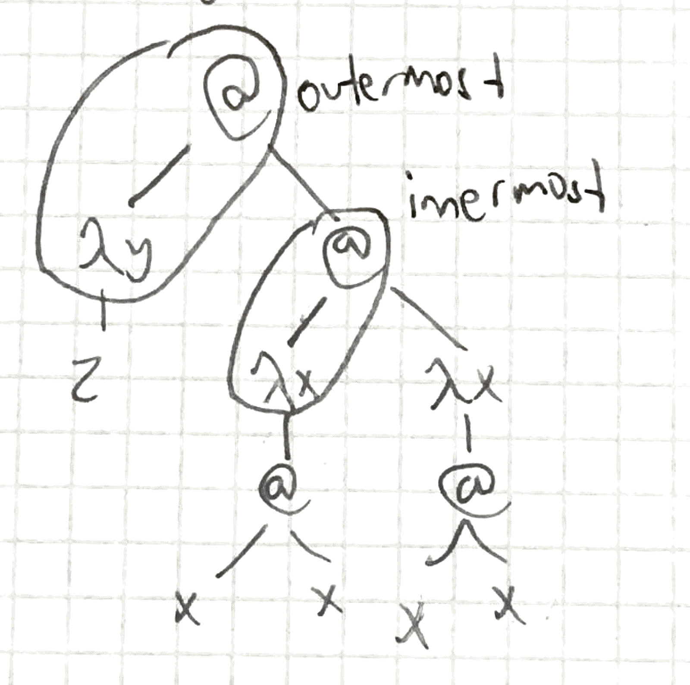

+++
title = "Strategies"
+++

# Strategies
**strategy:** how to reduce a term

**normalising strategy:** gives a reduction sequence to a normal form. leftmost outermost.

e.g. given: (λy.z)(Ω)

- Outermost: not contained in another redex
- Innermost: does not contain another redex
- Leftmost: the one most on the left obviously

## Call by need
reduce in every step the leftmost outermost redex. if it finds a loop, no normal form.

e.g. in above: (λy.z)(Ω) ➝ β z

another e.g.: (λx.fxx)((λx.x) 3) ➝ β f ((λx.x) 3) ((λx.x) 3) ➝ β f 3 3

pros:
- normalising
- all steps contribute to normal form
cons:
- redexes may be copied
- difficult to implement

## Call by value
Reduce in every step the leftmost innermost redex.

e.g. in above: (λy.z)(Ω) ➝ β (λ.z)(Ω) ➝ β (λy.z)(Ω) ➝ β …

e.g.: (λx.fxx) ((λx.x)3) ➝ β (λx.fxx) 3 ➝ β f 3 3

pros:
- redexes not copied
- easy to implement
cons:
- not normalising
- reduction to normal form may reduce redexes that don’t contribute to normal form

### Rightmost-outermost: not normalizing!
Rightmost outermost is not normalising. For example, take the term ((λx.x)(λx.y))(Ω).

Leftmost outermost:

<pre>
((λx.x)(λx.y))(Ω)   => (λx.y)(Ω)    [reduces the λx.x]
                    => y
</pre>

Rightmost outermost:

<pre>
((λx.x)(λx.y))(Ω)   => ((λx.x)(λx.y))(Ω)
                    =  ((λx.x)(λx.y))((λx.xx)(λx.xx))   [reduces the application in Ω]
                    => ((λx.x)(λx.y))(Ω)
                    => ((λx.x)(λx.y))(Ω)
                    => etc.
</pre>

It's easier to see this if you draw the tree. An application with an application on the left side can't be a redex. The leftmost outermost redex is the λx.x, whereas the rightmost outermost strategy reduces the application inside the Ω.

Leftmost outermost gives a result, while rightmost outermost goes into a loop. Therefore, rightmost outermost is not a normalizing strategy.
