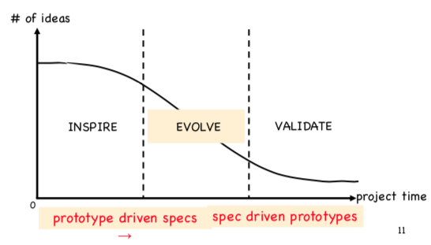

+++
title = 'Prototypes'
+++

## Prototypes
Prototype: representation of design before final version exists.
Can be low fidelity to high fidelity media.

options for prototypes: sketches, diagrams, frameworks, hand made models, graphics, virtual models, role play, video, etc.

why?
to evoke reactions from stakeholders (find out what to add/change), to test feasibility, choose between alternatives, etc.
it's faster than changing the real thing.

Waterfall model
* long lifecycle, step by step
* does not work

Iterative prototyping
* more like an agile method
* each iteration is short (2-6 weeks)
* do minimum necessary
* after every iteration you get feedback
* system grows incrementally

quality is a function of num of iterations & refinements before production.
fail early and often.

3 stages of prototyping:

### Designing the prototype
choose what to prototype for, identify measurable design goals

Describe the user's journey:
* Who is the user?
* How do they discover the app/site?
    * let's assume for our project that they were recommended our app
* How do they use it?
* How do they benefit from it?

Aim to show why the app/site will work.

Prototyping:
* Low fi (early stage)
    * Use whatever works (paper and pen, photo, video, whatever)
    * Paper prototypes: when you have many ideas, parts are unclear, basically if you're gonna throw away stuff
* Medium fi
    * Don't add filler text
    * Wireframing: idea needs more detail than on paper, colors, clients need to see major design options
    * Mockups with wood, play doh, whatever. Just fake the design
    * Wizard of Oz: some aspects of interface are implemented, operation needs processing that's actually done by a human for now
* High fi
    * Screen mockups (illustrator, photoshop, whatever)
    * Clickthroughs (slideshow type stuff)
    * Web tools (like Bootstrap)
    * Web prototypes
        * plain HTML/CSS
        * use when systems is intended to run on the web
    * Small screen prototypes
        * JS (all phones have a browser, JS has a lot of functionality)
        * can add events, interactions, etc.
        * you can use mobile emulators on desktop
        * but it's hard to prototype touch gestures (JS works decently)

