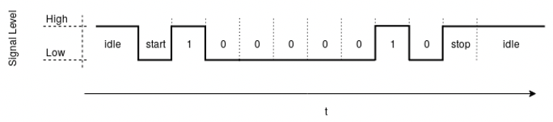
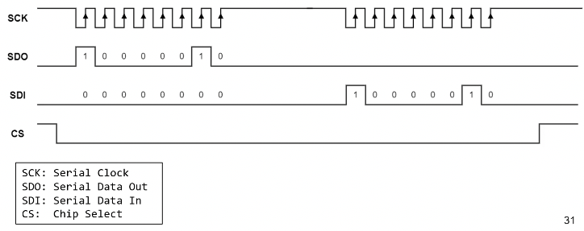
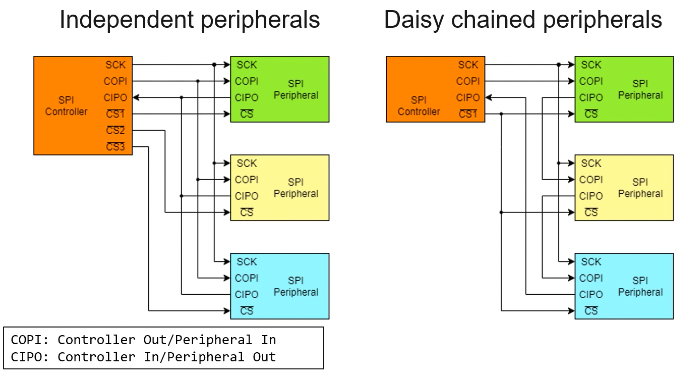
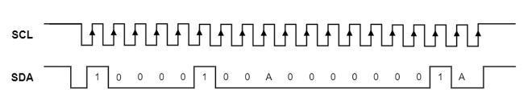

+++
title = 'Embedded systems'
+++
# Embedded systems
Pervade nearly every aspect of modern life, and their state of security often lags behind.

Embedded system: special-purpose computing system, running software tightly coupled to hardware, as part of a larger system

May have: no/specialized user interfaces, low power consumption and computational power, interfaces to physical world, non-customizable software, non-Avon Neumann architecture

## Core components
### Memory
Non-volatile: data persists even if power is removed. holds code, static data, config. Examples are NAND/NOR flash.

Volatile: holds runtime data (stack, heap) and code (copied from NV memory). Examples are DRAM and SRAM (info stored in transistor logic, no refresh needed)

### Peripherals
Input/output devices, typically interfaced via memory-mapped IO (MMIO)

On-chip: shares chip with processing unit, directly interfaces. Example is a timer.

Off-chip: physical separation from processing unit, connected via bus. Example is WiFi chipset.

### Processing unit
Generally have workload specific instruction set architecture.

Variants:
- microcontroller: IC containing also memory and peripherals
- system-on-chip: IC containing full computing system
- digital signal processor: microprocessor specialized for digital signal processing
- coprocessor: microprocessor supporting main processor for specialized tasks

## Inspection tools
Multimeter: measures voltage, current, resistance. Can be used to see if two pieces of metal on circuit are connected to each other.

Logic analyzer: like a debugger, lets you measure and visualize digital signals. May even provide a decoder.

Oscilloscope: measures and visualizes analog signals over time

## Protocols & interfaces
### Universal asynchronous receiver/transmitter (UART)
Used for serial comms between two components

Separate receive (RX) and transmit (TX) lines.

Configurable data format and transmission speeds, agreed beforehand.

- When idling, typically sends high signal.
- On start, change signal from high to low
- Data bits sent, 0 is low and 1 high
- Stop means sending high again.

Options and common choices:
- baud rate (bits per second): 2400..115200
- data bits in word (between start and stop): 5..8
- parity bit (to check for transmission errors): none, even, odd
- stop bit (how many high bits for stop): 1, 1.5, 2
- bit order: LSB first, MSB first

Discovering UART ports:
1. Consult datasheet if possible
2. Locate promising headers
3. Identify grounded pins: continuity test
4. Identify TX pin: if data transmission enabled, fluctuating voltage observable
5. Identify RX pin: may require connection to all possible RX pins

### Serial peripheral interface (SPI)
Synchronous serial bus protocol, connects two or more components on a bus.

Controller/peripheral architecture, with four lines:
- 2 for data
- 1 for clock
- 1 for chip select

Multi-peripheral configurations:
- independent: each peripheral has connection to SPI controller, controller has several chip select pins
- daisy chained: one chip select line, CIPO (controller in peripheral out) of one peripheral goes to the COPI (controller out peripheral in) of the next one

Discovering SPI flashes:
- typical device on SPI bus is flash memory, e.g. where BIOS is stored
- most often visible by eye, likely has manufacturer and part ID on chip
- open source tooling for SPI flash dumping available, e.g. [https://trmm.net/SPI_flash](https://trmm.net/SPI_flash)

### Inter-integrated circuit (I2C)
Synchronous serial bus protocol, connects two or more components on a bus.

Multi-controller/multi-target architecture, with two lines:
- serial data (SDA)
- serial clock (SCL)

Uses messages:
- start condition (S):
  - signalizes begin of message
  - SDA pulled low while SCL high
    - from here, SDA only allowed to change when SCL low
- Address (7 or 10 bits)
  - determines target to communicate with
- Read/write bit (RW):
  - 1: read from target
  - 0: write to target
- ACK/NACK bit (A):
  - transmitter releases SDA
  - receiver pulls line low
  - transmitter reads stable low → ACK. if not, NACK.
- Data (8 bits):
  - actual payload
  - for each frame, acknowledgment sent/received
  - can be arbitrary amount of frames
- Stop condition (P)
  - end of message
  - SDA pulled high while SCL high

Multi-target architectures:
- single controller: uses address to see if it should respond with ACK
- multi-controller: each controller checks if lines are free

Discovering I2C bus:
1. If available, consult datasheet, look for part IDs on components
2. Find likely I2C pins, use multimeter to test connection between components
3. Attach logic analyzer/oscilloscope, check for characteristic I2C comms

### Joint test action group (JTAG)
Standardized debugging interface, present on almost every prototyping board, and sometimes on production.

Defines:
- stateful protocol
- presence of instruction register and data registers

JTAG test access port (TAP)
- at least 4 lines:
  - TDI: test data in
  - TDO: test data out
  - TCK: test clock
  - TMS: test mode select
  - TRST: target reset
- devices arranged in a chain

JTAG state machine
- driven by TMS signal
- two primitive operations: scan DR, scan IR
- data registers:
  - boundary scan register (BSR): main data register
  - BYPASS: used to bypass JTAG logic of specific device
  - IDCODE: has device-specific information
- used data register is dependent on current instruction

Discovering JTAG ports:
- consult datasheet
- locate promising headers
- try bypass scan:
  1. guess pin configuration
  2. continuously send 1s on assumed TDI
  3. send BYPASS instruction to TAP
  4. wait to receive 1s on assumed TDO
  5. if not successful, repeated with other pin configuration
- automated discovery tools (special boards) exist, such as JTAGulator, JTAGenum, Glasgow
