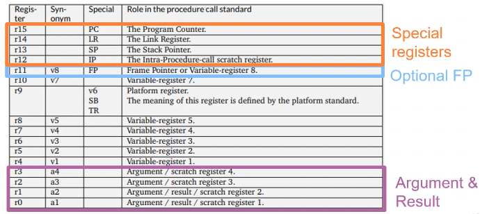
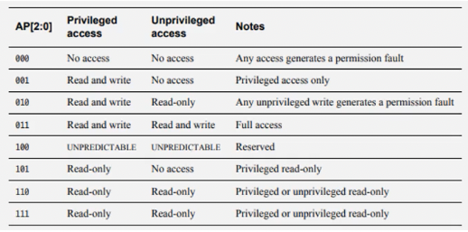
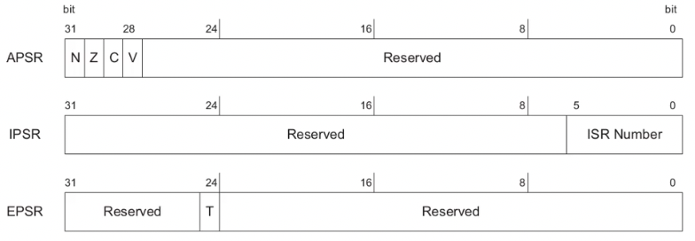

+++
title = 'Exploitation for embedded systems'
+++
# Exploitation for embedded systems
Typical embedded systems vulnerabilities:
- weak access control/authentication
- insecure config
- vulnerable web interfaces
- improper use of cryptography
- programming errors:
  - can easily lead to buffer overflows, memory corruption
  - classic defenses (ASLR, canaries..) may not be present

## ARM architecture
32-bit ("aarch32")
- 32 bit regs and address space
- little/big endian
- 32-bit fixed-width instructions, 16-bit with Thumb instruction set
- Thumb instruction set:
  - 15-bit encoding for improved code density
  - different processor states: "ARM" and "Thumb", switched via `bx` and `blx` instruction

64-bit ("aarch64")
- new instruction set, 64-bit regs and address space, 32-bit instruction length
- user-space compatible with aarch32

Application binary interface: Procedure Call Standard for the ARM Architecture (AAPCS)



ARM Linux system calls:
- arguments in r0-r6
- return value r0
- EABI: system call via `svc #0` instruction with call number in r7
- OABI: system call via `swi NR` instruction
  - (`swi` and `svc` are the same instruction)


## ARMv6-M (Cortex-M0+)
Thumb-2, so classic 32-bit ARM not supported.
Has a built-in interrupt controller.
Optional privileged/unprivileged and MPU (memory protection unit) support, both present on STM32G0B1RET6 (the board we have).

Protected Memory System Architecture (PMSAv6):
- provides memory protection unit (MPU)
  - separates flat address space into regions, smallest size 32 byte
  - implementation-dependent number of regions
  - requires privileged/unprivileged extension
- can be configured via MMIO
- provides access permissions and "execute never" (XN) bit



Nested Vector Interrupt Controller (NVIC)
- interrupts can occur (and be served) while an interrupt is already being handled
- vector set up via VTOR
- up to 32 external interrupts, 6 predefined exceptions

xPSR: combined program status register:
- application program status register (APSR): flags
- interrupt program status register (IPSR): exception number
- execution program status register (EPSR): thumb-bit (always 1)



Assembly:
- arithmetic: `MNEMONIC{s} Rdest, Rsrc1, Rsrc2` (`Rsrc2` can also be `#imm`)
  - S-suffix updates condition flags, optional for ADD/SUB but mandatory for other arithmetic
  - examples:
    - `ADD r0, r1, r2`: `r0 = r1 + r2`
    - `EORS r0, r0, r0`: `r0 = r0 XOR r0`, updating flags
    - `SUBS r3, r4, #8`: `r3 = r4 - 8`, updating flags
- `MOV`: can only mov to register, from register/immediate
  - `MOVT` moves immediate into top halfword
  - `MVN` moves negative (logical ones' complement)
- `PUSH`
  - only registers
  - r0 to r12 and lr
  - example: `PUSH {r0, lr}`
- `POP`
  - only registers
  - r0 to r12 and pc, or r0 to r12 and lr
  - examples: `POP {pc}`, `POP {r0-r6, lr}`
- load/store: `LDR`, `STR`
  - `MNEMONIC Rdst, [Rsrc, #offset]` (`#offset` can also be register)
  - examples:
    - `LDR r0, [pc, #16]`: `r0 = *(pc+16)`
    - `STR r0, [r3, #0]`: `*r3 = r0`
- branches:
  - `B`: branch relative to `pc`, allows `c` suffix for conditional
  - `BX` (branch and exchange): branch via register and exchange instruction set
    - "exchange instruction set" means to switch between THUMB and ARM mode
    - information of mode is stored in LSB of address
      - this works because in ARM, instructions always aligned on 2-byte or 4-byte granularity
    - ARMv6-M is Thumb-2 only, so all addresses need LSB set to 1
  - `BLX` (branch with link and exchange): set `lr` and branch relative to `pc` or via register
  - `BL` (branch with link): sets link register and branches relative to `pc`, like a `call`

## Exploitation techniques
32-byte ARM usually has null bytes, but if you switch to thumb mode, instruction set compression makes null bytes unlikely:

```asm
add r3, pc, #1
bx r3
```

Example shellcode (from [shell-storm](https://shell-storm.org)):

```asm
add r3, pc, #1 // switch to thumb mode
bx r3

mov r0, pc // prepare arguments
adds r0, #8
subs r1, r1, r1 // r1 = 0
subs r2, r2, r2 // r2 = 0

movs r7, #11 // set syscall number
svc 1 // execute syscall

str r7, [r5, #32] // set up data: /bin/sh\0
ldr r1, [r5, #100]
strb r7, [r5, #12]
lsls r0, r5, #1
```

ROP on ARM:
- if XN memory, or no OS with system call abstraction
- strategy: overwrite stack with attacker-controlled data, chain "gadgets" to form meaningful program
- usually fewer gadgets than x86, e.g. `pop {pc}` is much less common than `ret`
- don't forget about Thumb-bit -- faults if set wrongly

Heap exploitation:
- implementations are application/device specific
- usually fewer consistency checks than on desktop
- often need reverse engineering heap implementation
  - might be on vendor-provided toolchain though

Interrupt oriented programming:
- interrupts push SR+PC onto stack, interrupts are nestable, and ROM resides below RAM in memory
- so, stack growing exploit:
  - nest interrupts until RAM exceeded
  - stack grows into ROM
  - unable to write SR+PC, so subsequent return from IRQ will use value from ROM
