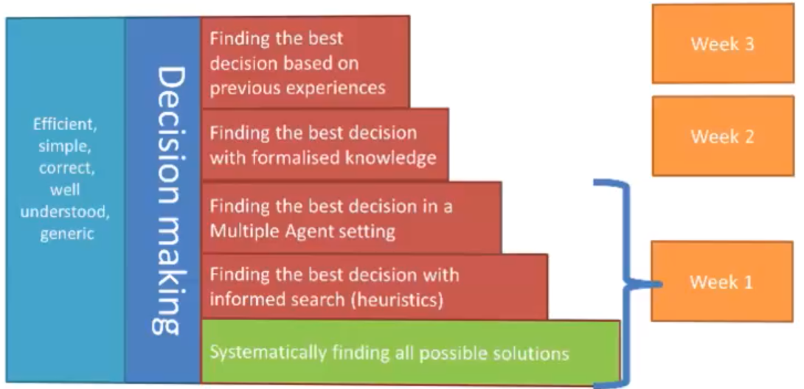

+++
title = "Intelligent Systems"
+++
# Intelligent Systems

core topics:
  * search & heuristics
  * knowledge
  * adaptivity

Table of contents:
  * [Assessment information](assessment-info)
  * [State Space Representations Intro](state-space-repr-intro)
  * [State space search](state-space-search)
    * [Uninformed search strategies](state-space-search#uninformed-search-strategies)
      * [Breadth-first (BF) search](state-space-search#breadth-first-bf-search)
      * [Depth-first (DF) search](state-space-search#depth-first-df-search)
      * [Depth-limited search](state-space-search#depth-limited-search)
      * [Iterative deepening search](state-space-search#iterative-deepening-search)
    * [Informed search (heuristics)](state-space-search#informed-search-heuristics)
      * [A Search](state-space-search#a-search)
      * [A* Search](state-space-search#a-search-1)
    * [Adversarial search](state-space-search#adversarial-seach)
      * [Minimax](state-space-search#minimax)
        * [Setup](state-space-search#setup)
        * [Optimal strategies](setup#optimal-strategies)
        * [Evaluation](state-space-search#evaluation)
      * [Reducing problems of complexity with Minimax](state-space-search#reducing-problems-of-complexity-with-minimax)
        * [Cutting off search:](state-space-search#cutting-off-search)
        * [Alpha-Beta pruning (efficient Minimax)](state-space-search#alpha-beta-pruning-efficient-minimax)
      * [Search with no or partial information](state-space-search#search-with-no-or-partial-information)
        * [Perfect information Monte Carlo sampling (rdeep)](state-space-search#perfect-information-monte-carlo-sampling-rdeep)
      * [Games with chance](state-space-search#games-with-chance)
    * [Summary (Schnapsen)](state-space-search#summary-schnapsen)
    * [Search direction](state-space-search#search-direction)
  * [Rational agents](rational-agents)
    * [Agents](rational-agents#agents)
    * [Rationality](rational-agents#rationality)
    * [Task environments](rational-agents#task-environments)
    * [Agent types](rational-agents#agent-types)
      * [Simple Reflex](rational-agents#simple-reflex)
      * [Reflex & State](rational-agents#reflex-state)
      * [Goal-Based](rational-agents#goal-based)
      * [Learning](rational-agents#learning)
  * [Logical agents](logical-agents)
    * [What is logic](logical-agents#what-is-logic)
    * [Syntax](logical-agents#syntax)
      * [Propositional logic (PL)](logical-agents#propositional-logic-pl)
      * [First order logic (FOL)](logical-agents#first-order-logic-fol)
        * [Basic elements:](logical-agents#basic-elements)
        * [Sentences](logical-agents#sentences)
        * [Quantification](logical-agents#quantification)
          * [Universal quantification](logical-agents#universal-quantification)
          * [Existential quantification](logical-agents#existential-quantification)
          * [Quantifier Duality](logical-agents#quantifier-duality)
        * [Decidability vs undecidability](logical-agents#decidability-vs-undecidability)
        * [Knowledge engineering in FOL](logical-agents#knowledge-engineering-in-fol)
      * [Choice of formalisms](logical-agents#choice-of-formalisms)
      * [Propositionalising FOL](logical-agents#propositionalising-fol)
        * [Reduction to propositional inference](logical-agents#reduction-to-propositional-inference)
        * [Universal instantiation (UI):](logical-agents#universal-instantiation-ui)
        * [Existential instantiation (EI):](logical-agents#existential-instantiation-ei)
        * [Applying in Schnapsen - Strategies (examples)](logical-agents#applying-in-schnapsen-strategies-examples)
          * [Play Jack](logical-agents#play-jack)
          * [Play cheap](logical-agents#play-cheap)
          * [Play trump marriage](logical-agents#play-trump-marriage)
    * [Semantics](logical-agents#semantics)
      * [Interpretations & Models](logical-agents#interpretations-models)
      * [Entailment](logical-agents#entailment)
      * [Truth](logical-agents#truth)
      * [Validity](logical-agents#validity)
      * [Satisfiability](logical-agents#satisfiability)
    * [Calculus (algorithms for inference)](logical-agents#calculus-algorithms-for-inference)
      * [Properties of inference](logical-agents#properties-of-inference)
      * [Proof methods](logical-agents#proof-methods)
        * [Model checking & search](logical-agents#model-checking-search)
          * [Truth Tables for inference](logical-agents#truth-tables-for-inference)
          * [Effective proofs by model checking](logical-agents#effective-proofs-by-model-checking)
          * [Clause Normal Form (CNF)](logical-agents#clause-normal-form-cnf)
          * [DPLL algorithm](logical-agents#dpll-algorithm)
            * [Heuristic search in DPLL](logical-agents#heuristic-search-in-dpll)
          * [Satisfiability modulo theory](logical-agents#satisfiability-modulo-theory)
        * [Rule-based reasoning](logical-agents#rule-based-reasoning)
          * [Inference rules](logical-agents#inference-rules)
          * [Searching for proofs](logical-agents#searching-for-proofs)
          * [Forward and backward chaining](logical-agents#forward-and-backward-chaining)
          * [Resolution](logical-agents#resolution)
  * [Probability and Uncertainty](probability-uncertainty)
    * [Vagueness: Fuzzy Set Theory](probability-uncertainty#vagueness-fuzzy-set-theory)
      * [Fuzzy sets](probability-uncertainty#fuzzy-sets)
      * [Fuzzy relations](probability-uncertainty#fuzzy-relations)
      * [Evaluation](probability-uncertainty#evaluation)
    * [Uncertainties: Probability Theory](probability-uncertainty#uncertainties-probability-theory)
      * [General](probability-uncertainty#general)
      * [Axioms of probability](probability-uncertainty#axioms-of-probability)
      * [Joint probability distributions](probability-uncertainty#joint-probability-distributions)
      * [Bayesian networks](probability-uncertainty#bayesian-networks)
      * [Evaluation of probabilities](probability-uncertainty#evaluation-of-probabilities)
  - [Machine Learning](machine-learning)
    - [Learning problems](machine-learning#learning-problems)
    - [Methodology](machine-learning#methodology)
      - [Data](machine-learning#data)
      - [Experimentation](machine-learning#experimentation)
      - [Evaluation](machine-learning#evaluation)
    - [Machine Learning Steps:](machine-learning#machine-learning-steps)
      - [Choose the features](machine-learning#choose-the-features)
        - [Inductive learning method](machine-learning#inductive-learning-method)
        - [Classifying with naive Bayes](machine-learning#classifying-with-naive-bayes)
        - [Clustering with K-nearest neighbor](machine-learning#clustering-with-k-nearest-neighbor)
        - [Linear classifier](machine-learning#linear-classifier)
        - [Support vector machine](machine-learning#support-vector-machine)
      - [Choose the model (model search)](machine-learning#choose-the-model-model-search)
        - [Regression](machine-learning#regression)
        - [Gradient descent](machine-learning#gradient-descent)
    - [Neural Networks](machine-learning#neural-networks)
      - [Overview](machine-learning#overview)
      - [Training neural networks](machine-learning#training-neural-networks)
      - [Autoencoders: a NN architecture](machine-learning#autoencoders-a-nn-architecture)
      - [Trying it out](machine-learning#trying-it-out)
    - [The promise of depth](machine-learning#the-promise-of-depth)
  * [Ethics of AI](ethics)
    * [Sci-fi ethics (problems down the road)](ethics#sci-fi-ethics-problems-down-the-road)
    * [Today's problems](ethics#today-s-problems)
  * [Philosophy of AI](philosophy)
