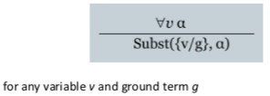
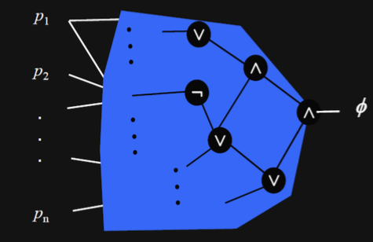

+++
title = "Logical agents"
template = 'page-math.html'
+++
# Logical agents

## What is logic
logic: generic method to deal with partial/imperfect/implicit information

we need:
* syntax to write statement about rules & knowledge of the game (a language)
* semantics to say what legal expressions mean, the meaning of each sentence with respect to interpretations
* calculus for how to determine meaning for legal expressions

knowledge-based/logical agents must be able to:
* represent states & actions
* incorporate new percepts, update internal representation of world
* deduce hidden properties of the world & appropriate actions

online/exploratory search: go to position, evaluate all options, possibly look ahead. have to re-evaluate current position.

## Syntax
### Propositional logic (PL)
assumes world contains facts

uses proposition symbols to state these facts.

pros:
* declarative
* allows partial/disjunctive/negated information
* is compositional
* meaning of statements is context-independent

cons:
* very limited expressive power

### First order logic (FOL)
an extension of propositional logic.

allows variables to range over atomic symbols in the domain.

assumes world contains:
* objects: people, houses, colors, baseball games, etc.
* relations: red, round, prime, brother of, comes between, bigger than, etc.
* functions: father of, best friend, one more than, plus, etc.

#### Basic elements:
- Constants: KingJohn, 2, UCB, ...
- Predicates: Brother, >, ...
- Functions: Sqrt, LeftLegOf, ...
- Variables: x, y, ...
- Connectives: ∧, ∨, ¬, ⇒, ⇔

#### Sentences
```
Atomic sentence = predicate (term_1,..., term_n)
                  or term_1 = term_2
Term = function(term_1,..., term_n)
      or constant
      or variable
```

Complex sentences are made from atomic sentences using connectives.

#### Quantification
##### Universal quantification
∀ <variables> <sentence>

∀x P is true in a model _m_ iff P is true with x being each possible object in the model

(you can roughly translate that to conjunctions)

typically used with ⇒

*CARE:* ∀x ∀y ≠ ∀y ∀x

##### Existential quantification
∃ <variables> <sentence>

∃x P is true in a model _m_ iff P is true with x being some possible object in the model

(you can roughly translate that to disjunction of instantiations of P)

typically used with ∧

watch out, if you use it with ⇒, it works even if the LHS is false!

*CARE*: ∃x ∃y ≠ ∃y ∃x

##### Quantifier Duality
each quantifier can be expressed in terms of the other

e.g. these are the same:
* ∀x Likes(x, IceCream) -- "everyone likes ice cream"
* ¬∃x ¬Likes(x, IceCream) -- "there is nobody who doesn't like ice cream"

#### Decidability vs undecidability
undecidability
* Turing machine can calculate everything that can be calculated
* halting problem: $K := { (i,x) | \text{program i halts when run on input x})$

decidability
* validity of FOL is not decidable (but semi-decidable)
* if a theorem is logically entailed by an axiom, you can prove that it is.
* if not, you can't necessarily prove that it's not (because you can continue with your proof infinitely).

#### Knowledge engineering in FOL
1. Identify the task
2. Assemble relevant knowledge
3. Decide on vocabulary of predicates, functions, and constants
4. Encode general knowledge about the domain (terms that we want to use)
5. Encode description of the specific problem instance
6. Pose queries to the inference procedure and get answers

### Choice of formalisms
first-order logic: represents knowledge

propositional logic: used for reasoning ("propositionalisation")

then use reasoner to check for entailment of propositional logic knowledge base an decision query
* Davis Putnam (DPLL) algorithm
* formulas have to be in clause normal form (CNF)
* calculus is proof by refutation:
* DPLL determines satisfiability of a KB
* entailment of KB |= a by "refutation":
    * KB |= a if KB ∩ {~a} is unsatisfiable
    * assume the opposite and prove it's impossible

### Propositionalising FOL
#### Reduction to propositional inference
every FOL KB can be propositionalised so as to preserve entailment

if a sentence α is entailed by an FOL KB, it is entailed by a _finite_ subset of the propositionalised KB

#### Universal instantiation (UI):
every instantiation of a universally quantified sentence is entailed by it.



example:
```
∀x King(x) ∧ Greedy(x) ⇒ Evil(x)
King(John) ∧ Greedy(John) ⇒ Evil(John)
etc.
```

#### Existential instantiation (EI):


example:
```
∃x Crown(x) ∧ OnHead(x,John)
Crown(C_1) ∧ OnHead(C_1, John)
```

#### Applying in Schnapsen - Strategies (examples)
##### Play Jack

check whether card is a jack:

```
KB |= PlayJack(x) ?
```

represent strategy:

```
∀x PlayJack(x) ⇔ Jack(x)
```

represent game information:

```
KB = {Jack(4), Jack(0), Jack(14), Jack(19)}
```

##### Play cheap
only play Jacks: check whether card is cheap

```
KB |= PlayCheap(x) ?
```

represent strategy:

```
∀x PlayCheap(x) ⇔ Jack(x) ∨ Queen(x) ∨ King(x)
```

represent game information:

```
KB = {Jack(4), Jack(9), Jack(14), Jack(19), Queen(5), ...}
```

##### Play trump marriage
```
TrumpMarriage(x) ⇔ Q(x) & Trump(x) & ∃y: SameColor(x,y) & K(y) & MyCard(y)
SameColor(x,y) ⇔ (C(x) & C(y)) ∨ (D(x) & D(y)) ∨ (H(x) & H(y)) ∨ (S(x) & S(y))
```

## Semantics
### Interpretations & Models
interpretation: assignment of meaning to symbols of formal language

model: interpretation that satisfies defining axioms of knowledge base

_m_ is a model of a sentence _α_ if _α_ holds in _m_.

M(a) is the set of all models of a.

each model specifies true/false for each proposition symbol (∧, ∨, ¬, ⇒, ⇐, ⇔)

### Entailment
the knowledge base (KB) entails _α_: _α_ follows from the information in the knowledge base (KB |= _α_)

KB entails _α_ iff _α_ holds in all worlds where KB is true.

a knowledge base is the rules + observations.

a sentence is:
* entailed by KB iff α holds in all models of KB
* valid if it is true in all models
* satisfiable  if it is true in some model
* unsatisfiable if it is true in no models

two statements are logically equivalent if they are true in same set of models:

α ≡ β iff α |= β and β |= α

### Truth
sentences are true with respect to model and interpretation.

model contains objects and relations among them

interpretation specifies referents for:
* constant symbols -- objects
* predicate symbols -- relations
* function symbols -- functional relations

an atomic sentence $predicate(term_1, ..., term_n)$ is true
iff the objects referred to by $term_1,..., term_n$
are in the relation referred to by $predicate$

### Validity
valid if it is true in all models.

e.g. True, A ∨ ¬A, A ⇒ A, (A ∧ (A e.g. True, A ∨ ⇒ B)) ⇒ B)

### Satisfiability
- satisfiable if it is true in _some_ model
- unsatisfiable if it is true in _no_ models

## Calculus (algorithms for inference)
### Properties of inference
sound: if an algorithm $|-$ only derives entailed sentences.
  i.e. if KB $|-$ α also KB |= α

complete: if an algorithm derives any sentence that is entailed.
  i.e. KB |= α implies KB |- α

a calculus terminates if it finds entailed sentences in finite time.

a logic is _decidable_ if there is _sound and complete_ calculus that _terminates_.

### Proof methods
1. Model checking and search
  * truth table enumeration (exponential in n)
  * improved backtracking (DPLL)
  * heuristics for choosing right order
2. application of inference rules
  * sound generation of new sentences from old
  * proof = sequence of rule applications (actions)

#### Model checking & search
##### Truth Tables for inference
enumerate interpretations and check that where KB is true, α is true.

| $fact_1$ | $fact_2$ | $fact_3$ | $KB$   | $α$    |
|----------|----------|----------|--------|--------|
| false    | false    | false    | false  | true   |
| false    | false    | false    | false  | true   |
| false    | true     | false    | _true_ | _true_ |

algorithm:

```
for (m in truth assignments) {
  if (m makes F true) return "satisfiable"
}
return "unsatisfiable"
```

##### Effective proofs by model checking

Clever search (depth first, redundancy, heuristics)

Two families of efficient algorithms for propositional inference based on model checking
* complete backtracking search algorithms -- DPLL (Davis, Putnam, Logemann, Loveland)
* incomplete local search algorithm (WalkSAT algorithm)

##### Clause Normal Form (CNF)

memo technique: the C in CNF for _conjunction_ normal form

A PL formula is in CNF if it is a conjunction of disjunctions of literals.
  * e.g.: {{a,b}, {~a, c}, {~b, c}}
  * equivalent to (a ∨ b) ∧ (~ a ∨ c) ∧ (~ b ∨ c)

calculating CNF:
1. Remove implications:
  * (p ⇔ q) to ((p ⇒ q) ∧ (q ⇒ p))
  * (p → q) to (¬ p ∨ q)
2. Move negations inward:
  * ¬ (p ∨ q) to (¬ p ∧ ¬ q)
  * ¬ (p ∧ q) to (¬ p ∨ ¬ q)
3. Move conjunctions outward:
  * (r ∨ (p ∧ q)) to ((r ∨ p) ∧ (r ∨ q))
4. Split up conjunctive clauses:
  * ( (p1 ∨ p2) ∧ (q1 ∨ q2) ) to (p1 ∨ p2), (q1 ∨ q2)

##### DPLL algorithm

when you have CNF, you can run the DPLL algorithm. determines if propositional logic sentence in CNF is satisfiable.

returns true if F is satisfiable, false otherwise.

basically assign values until contradiction, then backtrack.

Improving DPLL:
* if a literal in a disjunction clause is true, the clause is true
* if a literal in a disjunction clause is false, the literal can be removed
* if a clause is empty, it is false
* a unit literal has to be true
* a pure literal (only appears non-negated) has to be true

the algorithm:

```
dpll (F, literal) {
  remove clauses containing literal
  shorten clauses containing ¬literal
  if (F contains no clauses)
    return true
  if (F contains empty clause)
    return false
  if (F contains a unit or pure literal)
    return dpll(F, literal)

  choose P in F
  if (dpll(F, ¬P))
    return true

  return dpll(F, P)
}
```

###### Heuristic search in DPLL

used in DPLL to select proposition for branching

idea: identify most constrained variable, likely to create many unit clauses

MOM's heuristic: most occurrences in clauses of minimum length

why is it better than truth table enumeration?
  * early termination: clause is true if any literal is true. sentence is false if any clause is false.
  * pure symbol heuristic: always appears with the same sign in all clauses, has to be true
  * unit clause heuristic: only one literal in the clause, so it must be true

proving entailment KB |= a by refutation:
  1. translate KB into CNF to get cnf(KB)
  2. translate ~a into CNF to get cnf(~a)
  3. add cnf(~a) to cnf(KB)
  4. apply DPLL until either satisfiable (model is found) or unsatisfiable (search exhausted)
  5. if satisfiable, not entailed. otherwise, entailed.

##### Satisfiability modulo theory

Boolean satisfiability (SAT): is there an assignment to the $p_1, p_2, ..., p_n$ variables such that $\phi$ evaluates to 1?



SAT vs SMT:
* SMT (satisfiability modulo theories) extend SAT solving by adding extensions.
* SMT solver can solve SAT problem, but not vice-versa.
* SMT is used in analog circuit verification, RTL, verification, and card games.

SMT theories:
* real or integer arithmetic
* equality and uninterpreted functions
* bit vectors and arrays
* properties:
  * decidable: an effective procedure exists to determine if formula is member of theory T
  * often quantifier-free
* core theory:
  * type boolean
  * constants {TRUE, FALSE}
  * functions {AND, OR, XOR, =>}
* integer theory:
  * type int
  * all numerals are int constants
  * functions {+, -, x, mod, div, abs}
* reals theory:
  * type real
  * functions {+, -, x, /, <, >}

#### Rule-based reasoning
##### Inference rules
inference rule: logical form consisting of function taking premises, analyzing their syntax, and returning one or more conclusions

Modens Ponens: $\frac{\alpha\implies\beta,\;\alpha}{\beta}$

And-elimination: $\frac{\alpha\land\beta}{\alpha}$

logical equivalences used as rules: $\frac{\alpha\iff\beta}{(\alpha\implies\beta)\land(\beta\implies\alpha)}$

all logical equivalence rewriting rules:


##### Searching for proofs
Finding proofs is like finding solutions to search problems.

monotonicity: set of entailed sentences can only increase as info is added to the knowledge base.
* for any sentence α and β,
* if KB |= α, then KB ∧ β |= α

##### Forward and backward chaining
FC is data-driven, automatic, unconscious:
* derive all facts entailed by the KB
* may do lots of work irrelevant to the goal

BC is goal-driven, appropriate for problem-solving
* specific fact entailed by the KB
* complexity of BC can be much less than linear in size of KB

##### Resolution
a rule is sound if its conclusion is evaluated to true whenever the premise is evaluated to true.

can be shown to be sound using truth table:


properties resolution:
* resolution rule is sound
* resolution rule is complete (on its own) for formulas in CNF
* resolution can only decide satisfiability

algorithm (again proof by refutation):
1. Convert KB ∧ ¬ α into CNF
2. Apply resolution rule to resulting clauses
3. Continue until:
  a) no new clauses can be added, hence α does not entail β
  b) two clauses resolve to entail empty clause, hence α entails β

