+++
title = "Machine Learning"
template = 'page-math.html'
+++
# Machine Learning

design of a learning element is affected by:
  * which components of performance element are to be learned
  * what feedback is available to learn these components
  * what representation is used for the components

offline learning: learn based on some data, then apply results to situation

feedback types (get input, make decision, learn based on feedback):
  * supervised learning: correct answers for each example.
    * only positive examples
    * positive and negative examples
  * unsupervised learning: no correct answers given
  * semi-supervised learning: learn which questions to ask (active learning)
  * reinforcement learning: occasional rewards

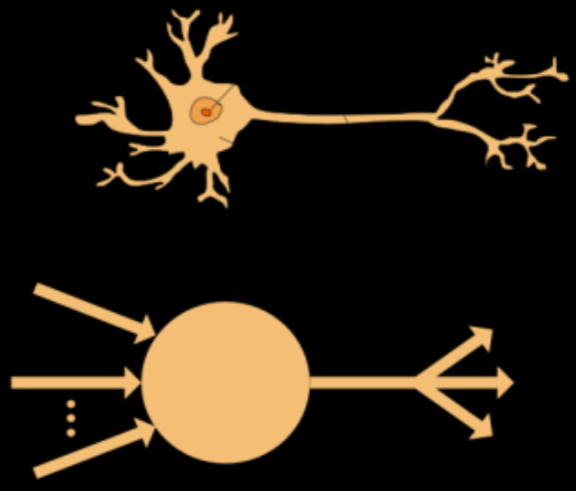

## Learning problems

Classification
  * use: from data to discrete classes.
  * examples: handwriting recognition, spam filtering, facial recognition.

Regression
  * use: predicting a numeric value
  * examples: stock market, weather predictions

Ranking
  * use: comparing items
  * examples: web search

Collaborative filtering
  * use: take some else's information, based on that, give prediction
  * examples: recommendation systems (books, movies/shows)

Clustering
  * use: discovering structure/patterns in data
  * examples: clustering images

## Methodology
### Data
labeled instances (like spam, not spam)
  * training set
  * held out set (e.g. for validation)
  * test set (don't even look at this until you want to test your model)

randomly allocate to data sets.

features: attribute-value pairs characterizing each x

### Experimentation
experimentation cycle:
  1. select hypothesis, tune hyperparameters on held-out/validation set
  2. compute accuracy of test set (never "peek" at test set itself)

### Evaluation
accuracy -- fraction of instances predicted correctly

Cross validation:

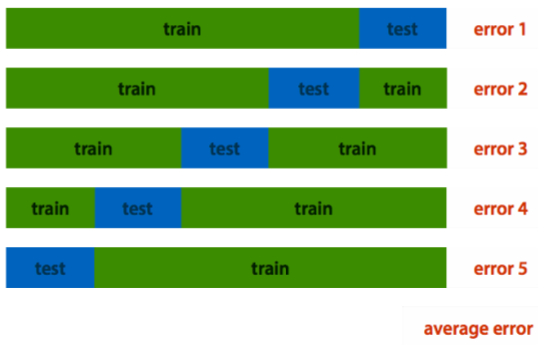

create a confusion matrix (TODO: there's a diagram for this but not in the old slides)

## Machine Learning Steps:
  1. choose the features
  2. choose the model class
  3. choose a search method

### Choose the features
create a feature space: features on x-y axes, points are individual data, classification would be a color scheme.

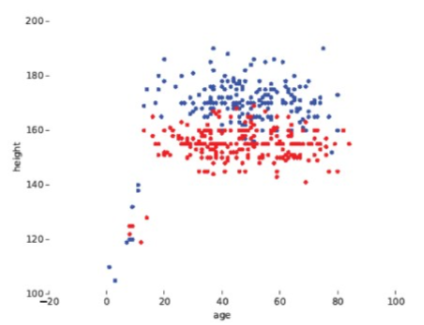

#### Inductive learning method
  * construct/adjust h to agree with f (function predicting value) on training set
  * h is consistent if it agrees with f on all examples
  * for example, curve fitting:

    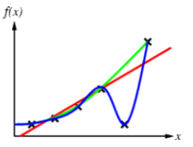

Occam's razor: "one should not increase, beyond what is necessary, the number of entities required to explain anything"
basically, choose the simplest option.

#### Classifying with naive Bayes

Binary classification
* input: email
* output: spam, not spam
* setup:
  * get large collection of example emails, labeled "spam/not spam"
  * someone has to hand-label that
  * want to learn to predict label for new emails in future
* features: attributes used to make label decision
  * words, text patterns (e.g. caps), non-text

calculation for Bayesian classifier: $P(C|F_1,...,F_n)$

using Bayes' theorem:

$P(C|F_1,...F_n)=\frac{P(C)P(F_1,...,F_n|C)}{P(F_1,...,F_n)}$

rewrite the numerator of the equation:

$P(C)P(F_1,...,F_n |C) = P(C)P(F_1 | C)P(F_2 | C, F_1)P(F_3|C, F_1, F_2)P(F_4,...,F_n | C, F_1, F_2, F_3)$

that uses the chaining rule. but it's too computationally expensive.
so naively assume conditional independence:

$P(F_i | C, F_j) = P(F_i | C)$

This simplifies the formula to:

$P(C)P(F_1,...,F_n | C) = P(C) PI(0 to n) P(F_i | C)$

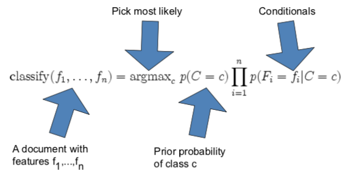

Laplace smoothing helps with really small probabilities.
Naive Bayes often works. sometimes performs well even if the assumptions are badly violated.
classification is about predicting correct class label, _not_ about accurately estimating probabilities

#### Clustering with K-nearest neighbor
k nearest neighbor classification: find k most similar case, copy majority label

e.g. to classify unlabeled document, find most similar document and copy label:

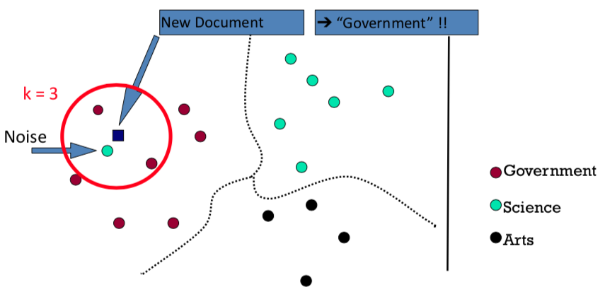

the _k_ helps get rid of noise which would lead to misclassification

#### Linear classifier
linear classifier: come up with a line that divides feature space, use that for prediction.

works for stuff like $x \lor y$, but not if we want $x \oplus y$ or other things that are not linearly separable.

you can build a design matrix of all the different features you want to include. here's an example with 5 different features *age, height, age², age × height, height²) that classifies a person as male/female:

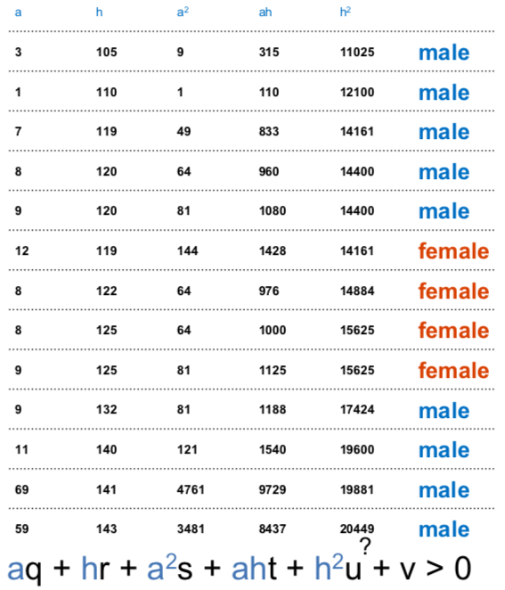

if you go to more dimensions (so more features in a design matrix), you need hyperplanes.

hyperplanes sound fancy af but it's just a line in some higher dimension. for example, this is how you would use a hyperplane in the third dimension to separate points:

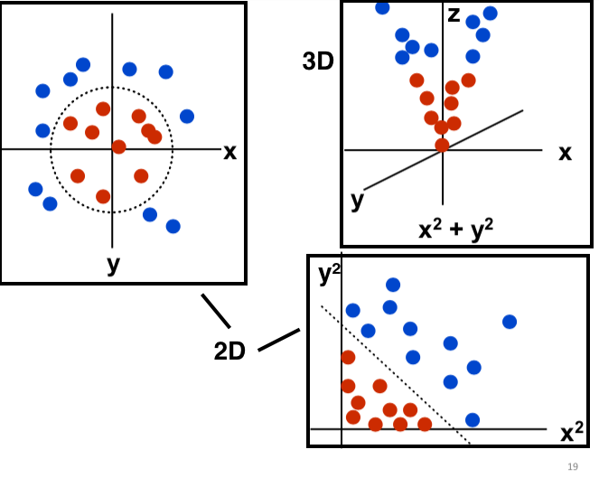

#### Support vector machine
k(x,y): "distance" function between instances x and y

SVMs create a linear separating hyperplane

they can embed that hyperplane into a higher dimensional domain using the kernel trick -- so long as _k_ is a kernel, you don't have to explicitly compute the design matrix (that drastically reduces the computation)

try to achieve a good margin -- a large separation from the line for both classes (so reduce the blur between two classes, make a clear distinction).

watch out for over-fitting -- you might end up with the model being trained extremely specifically to your data.

### Choose the model (model search)

so we have a lot of ways to put a line on a graph. but how do you choose the right one?

#### Regression
train a learner to produce a model (the model is the line/hyperplane). then you give the model a new instance, and it produces a new value based on a function.

assign a value for each of the points in the feature space.

evaluating regression -- what's a good model for a regression?

you use an error function (the difference between predicted and real values, square to avoid negatives):

$error(p) = \sum_i (f_p (x_i) - y_i)^2$

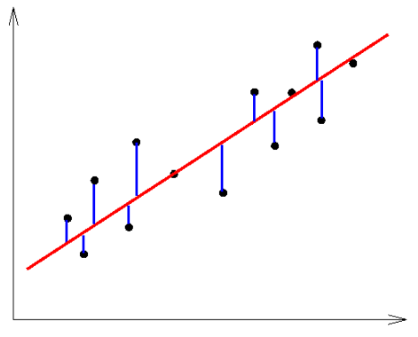

in this example, each of the possible lines is represented by two parameters (s the slope, b the y-intercept), in the left graph. those parameters can be plotted on 2D axes, on the right graph.

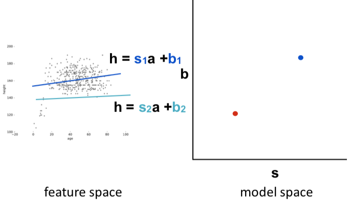

Then you can take those points in the right graph, and plot their respective error rates (from the error function above) on the z axis, so you end up with a 3D graph -- an error surface:

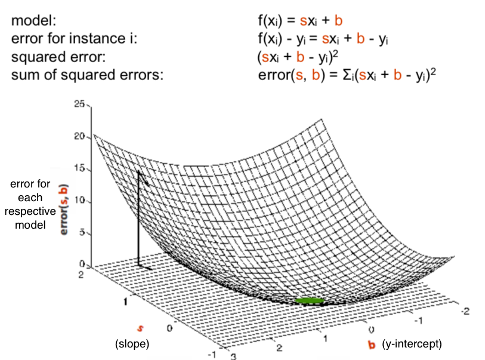

now the point is to find the one with the lowest error (the lowest point in the surface, colored green). and that's what calculus is for, specifically differentiation.

if you've never done calculus, it's not easy to explain, but basically taking the derivative means you're looking for the slope of a certain function at some point in that function. if you set the derivative to zero, you're looking for the point where the slope is zero -- specifically the minimum or maximum of a function.

quick example: if you have a function $y = x^2 + 2$, there's a minimum at x = 0. you may know that by intuition, but you can also take the first derivative ($y' = 2x$), set $y'$ equal to zero, and solve for x -- you'll get the same result. it's trivial with a simple function, but once you get into cubic and quartic functions, you can't really do it by intuition..

so a derivative $f'(x)$ of a function $f(x)$ gives the slope of $f(x)$ at any point in the domain (where $f(x)$ has a value $y$).

the rules for taking derivatives (don't need to memorize these, they will be provided on the exam):

the problems:
  * not all derivatives that we find can be resolved to zero
  * and we also have to consider that this can be in higher dimensions

#### Gradient descent
you use a variant of the hill climbing algorithm

the steps:
  1. pick random parameters s (slope), b (intercept)
  2. repeat:
    1. compute the gradient
    2. move a small step in the opposite direction

but there may be multiple zero points -- local optima. there's no guarantee of convergence.

## Neural Networks
### Overview
the difference between original machine learning and deep learning:

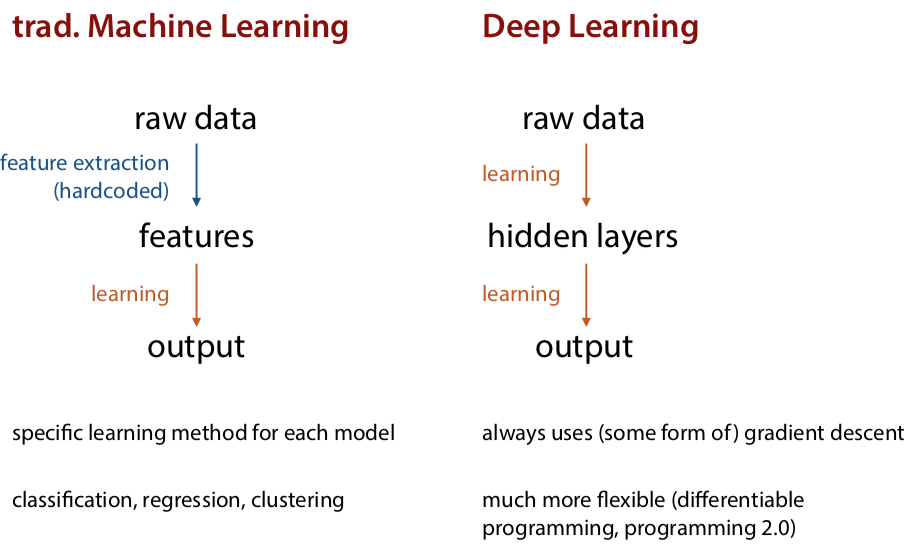

the original perceptron:
  * binary classifier
  * bias node, always set to 1
  * n inputs for each feature, with weights
  * $y=w_1 x_1 + w_2 x_2 + b$

but chaining doesn't make it more interesting, the function collapses to a linear one

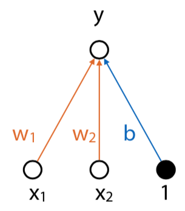

So introduce an activation function instead of using a standard linear calculation. This puts the values in a certain range, and now the diagram looks like this:

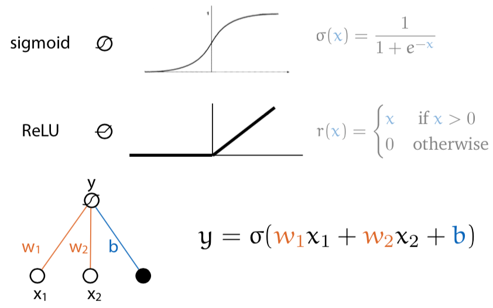

Then you can build a feed-forward network with hidden layers between input and output:

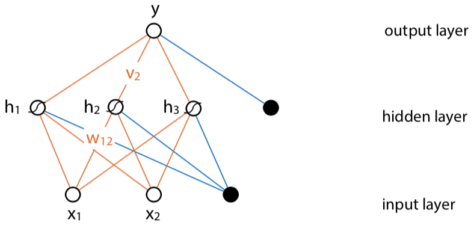

### Training neural networks
Loss function determines how close a given network is to being correct for an input.
If you plot neural networks on x-y, and the amount of loss on z axis, you end up with a loss surface. Then you want to find a point in that surface where the loss is the lowest.

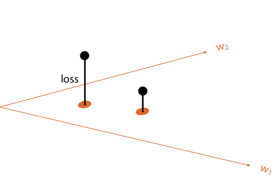
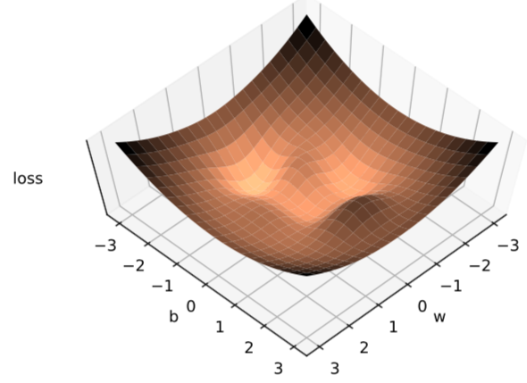

You can find the low point in the error surface with gradient descent (differentiation).

Stochastic gradient descent:
  1. pick random weights w
  2. loop:
    * $w = w - r \triangledown loss (w)$

where r is the learning rate. make sure to pick a good learning rate because if it's too high (like 0.1), it will be inaccurate, while if it's too low, it will take a long time.

so in summary:
  * get examples of input and output
  * get a loss function
  * work out the gradient of loss with respect to the weights
  * use (stochastic) gradient descent to slowly improve the weights

how do you calculate the gradient for complex data?
  * symbolically? too computationally expensive
  * numerically? too unstable, also expensive
  * so settle for a middle ground -- backpropagation

backpropagation: if the system is a composition of modules, the gradient is the product of the gradient of each module with respect to its arguments
  * break computation down into chain of modules
  * work out derivative of each module with respect to its input (_symbolically_)
  * compute the gradient for a given input by multiplying these gradients for the current input

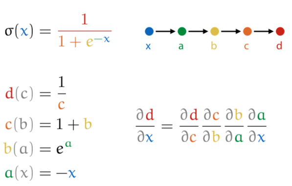

for a given input x, you do a forward pass (calculating the value for each part), then fill in into final calculation.

so like this, with x = 0:

neural networks are just a way of thinking about differentiable computation.

### Autoencoders: a NN architecture
bottleneck architecture:

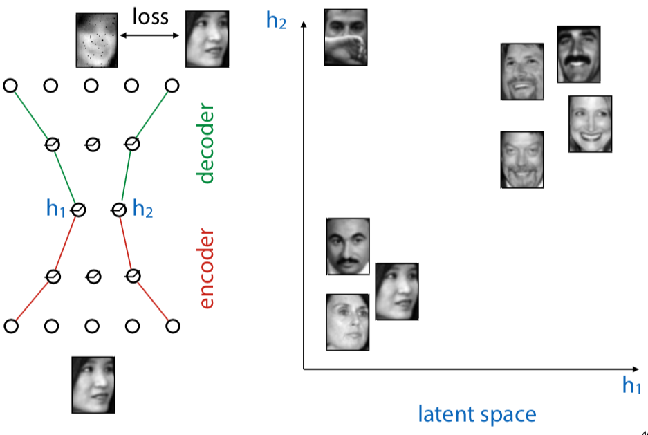

input should be as close as possible to the output. but it must pass through a small representation

autoencoders map data to a _latent representation_

### Trying it out
* code: https://github.com/pbloem/machine-learning/blob/master/code-samples/autoencoder/autoencoder.py
* setup: https://docs.google.com/document/d/1-LXG5Lb76xQy70W2ZdannnYMEXRLt0CsoiaK0gTkmfY/edit?usp=sharing

## The promise of depth
if you have many dimensions, the gradient isn't as easy to detect anymore. there's a huge number of parameters.

solutions:
  * Pretraining (no pre-classification by humans)
    * train the network on itself in hidden layers
    * similar to the autoencoder idea
    * you can then stack the autoencoders (hidden layers)

    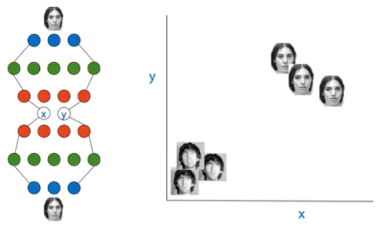

  * Pruning the network
    * convolutional neural network: combine multiple input nodes into one node of a hidden layer
