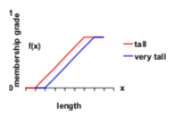
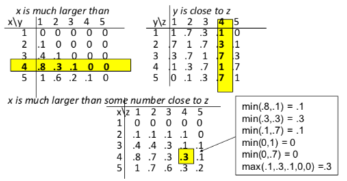
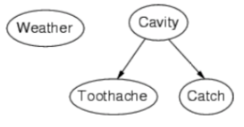

+++
title = "Probability and Uncertainty"
template = 'page-math.html'
+++
# Probability and Uncertainty
one often has to deal with info that is underspecified, incomplete, vague, etc.

logic by itself is not sufficient for these problems.

## Vagueness: Fuzzy Set Theory
model theory often based on set theory

fuzzy set theory allows something to be _to some degree_ an element of a set

dominant approach to vagueness (mostly because wtf else can you do)

### Fuzzy sets
  * universe U, object x ∈ U
  * membership function for fuzzy set A is defined to be function $f_A$ from U to [0,1]:
    * $f_A(x)=y$: x is a member of A to degree y
    * $f_A(x)=1$: x is certainly member of A
    * $f_A(x)=0$: x is certainly not a member of A
    * ${x | f_A(x)>0}$: support of A

modifiers (hedges)

operations on fuzzy sets:
  * complement: $f_{\sim{A}}(x)=1-f_A(x)$
  * union: $f_{A\cup B}(x)=\max(f_A(x),f_B(x))$
  * intersection: $f_{A\cap B}(x)=\min(f_A(x), f_B(x))$
  * subset: $A\subset B \iff \forall{x}(f_A(x)\leq f_B(x))$

semantics -- multivalued fuzzy logic
  * v(¬ A) = 1-v(A)
  * v(A ∨ B) = max(v(A), v(B))
  * v(A ∧ B) = min(v(A), v(B))
  * v(A → B) = min(1, 1 - v(A) + v(B))

### Fuzzy relations
fuzzy sets can denote fuzzy relations between objects. e.g. approximately equal, close to, much larger than, etc.

fuzzy composition:

$f_{R \circ S} (\langle x,z\rangle ) = \max_{y \in Y} \min(f_R (\langle x,y\rangle ), f_S (\langle y,z\rangle ))$

hands-on example:

### Evaluation
  * good -- flexible, coincides with classical set theory, sever successful applications of fuzzy control
  * bad -- requires many arbitrary choices, tends to blur differences between probabilistic uncertainty/ambiguity/vagueness

## Uncertainties: Probability Theory
### General
main interpretations of probability theory:
  * optivist (frequentist) probability
    * frequentism: probability is only property of repeated experiments
    * probability of event: limit of _relative frequency_ of occurrence of event, as number of repetitions goes to infinity
  * subjective probability
    * Bayesianism: probability is an expression of our uncertainty and beliefs
    * probability of event: _degree of belief_ of idealized rational individual

sample space Ω: set of single outcomes of experiment

event space E: things that have probability (subsets of sample space). if sample space is finite, event space is usually power set.

### Axioms of probability
for any event A, B:
  * $0 \leq P(A) \leq 1$
  * $P(\Omega) = 1$
  * $P(A \cup B) = P(A) + P(B) - P(A \cap B)$

can derive:
  * $P({}) = 0$
  * $P(\Omega) = 1$
  * $\text{if} A \subset B, P(A) \leq P(B)$

conditional probability ("A given B"):

$P(A|B) = \frac{P(A \cap B)}{P(B)}$

### Joint probability distributions
for a set of random variables, it gives probability of every atomic even on those random variables.

e.g. P(Toothache, Catch, Cavity):

|          | toothache | >       | ¬ toothache | >       |
|----------|-----------|---------|-------------|---------|
|          | catch     | ¬ catch | catch       | ¬ catch |
| cavity   | 0.108     | 0.012   | 0.072       | 0.008   |
| ¬ cavity | 0.015     | 0.064   | 0.144       | 0.576   |

inference by enumeration:
  * for any proposition Φ, sum atomic events where it's true -- $P(\Phi) = \sum_{\omega : \omega \models \Phi} P(\omega)$
  * compute conditional probability by selecting cells -- e.g. for P(¬ cavity | toothache), select toothache column and (¬ cavity) cells

use Bayes' rule for opposite conditionals (like finding P(disease | symptom) from P(symptom | disease))

### Bayesian networks
simple graphical notation for
  * conditional independence assertions
  * compact specification of full joint distributions

syntax:
  * set of nodes, one per variable
  * directed acyclic graph, with a link meaning "directly influences"
  * conditional distribution for each node given its parents -- $P(X_i | Parents(X_i))$

topology example:

what does it mean?
  * _weather_ is independent of other variables
  * _toothache_ and _catch_ are conditionally independent given _cavity_.

### Evaluation of probabilities
  * good -- sound theoretical basis, can be extended to decision-making, some good tools available
  * bad -- not always computationally easy, need lots of data which may be hard to get

