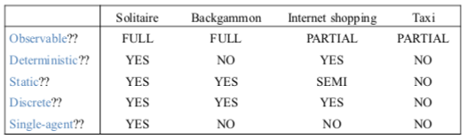

+++
title = "Rational agents"
template = 'page-math.html'
+++
# Rational agents

"A rational agent chooses whichever action maximizes the expected value of the performance measure given the percept sequence to date and prior environment knowledge."

## Agents
agent function maps percept sequence to actions ($f: P* \rightarrow A$)

function is internally represented by agent program

program runs on physical architecture to produce f

## Rationality
what is rational at a specific time depends on:
    * expected value of performance measure -- heuristics
    * actions and choices -- search
    * percept sequence to date -- learning
    * prior environment-- KR

rationality is not omniscience or perfection

## Task environments

to design rational agent, we must specify environment (PEAS):
    * performance: safety, destination, profits, legality, comfort
    * environment: streets, traffic, pedestrians, weather
    * actuators: steering, accelerating, brake, horn, speaker/display
    * sensors: video, sonar, speedometer, etc.

environment types:
    * observable: fully (can detect all relevant aspects with sensors) or partially
    * deterministic: (yes or no)
    * static: (yes, no, semi)
    * discrete: (yes or no)
    * single-agent: (yes or no)

For Schnapsen:
* observable: not fully
* deterministic: yes
* static: yes
* discrete: yes
* single-agent: no

## Agent types

### Simple Reflex
select action on basis of _only the current percept_

large reduction in possible percept/action situations

implemented using condition-action rules

only works if environment is fully observable, otherwise may result in infinite loops.

### Reflex & State
to tackle partially observable environments, maintain internal state

over time, update state using world knowledge.

### Goal-Based
agent needs a goal to know the desirable situations

future is taken into account

### Learning
teach agents instead of instructing them

very robust toward initially unknown environments.

