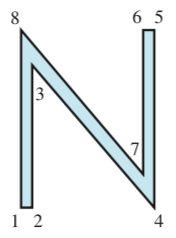
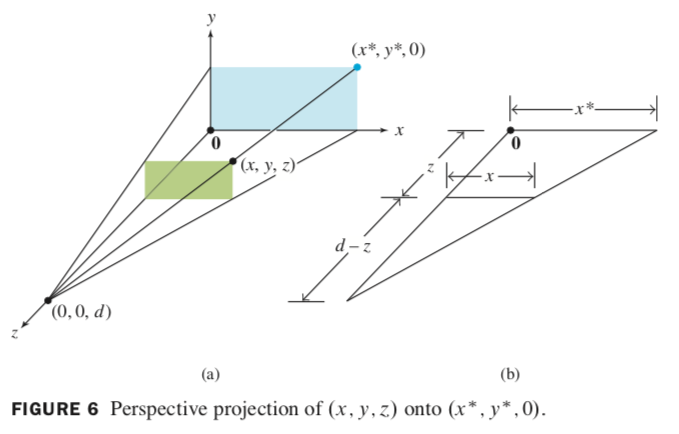

+++
title = 'Applications to computer graphics'
template = 'page-math.html'
+++

# Applications to computer graphics
graphics are stored in a matrix, such as this:

 

## Homogeneous coordinates
### 2D
each point (x, y) in 2D can be identified with point (x, y, 1) in 3D. so we say that (x, y) has homogeneous coordinates (x, y, 1).

e.g. translation is not a linear transformation. but $(x, y) \mapsto (x+h, y+k)$ can be written in homogeneous coordinates as $(x, y, 1) \mapsto (x+h, y+k, 1)$, and can be computed using matrix multiplication:

$\begin{bmatrix} 1 & 0 & h\\\\ 0 & 1 & k\\\\ 0 & 0 & 1\end{bmatrix} \begin{bmatrix} x \\\\ y \\\\ 1 \end{bmatrix} = \begin{bmatrix} x+h \\\\ y+k \\\\ 1 \end{bmatrix}$

### 3D
(X, Y, Z, H) are homogeneous coordinates for (x, y, z) if H ≠ 0 and

$x = \frac{X}{H}, \quad y = \frac{Y}{H}, \quad \text{and} \\; z = \frac{Z}{H}$

## Matrices for typical transformations

## Composite transformations
when you need two or more basic transformations, such a composite transformation is a matrix multiplication.

matrices for new transformations are "prepended" in multiplication. so if you're rotating, then translating, the calculation is `[matrix for translation][matrix for rotation]`.

## Perspective projections
maps each point (x, y, z) onto an image point (x*, y*, 0) so that two points and eye position (center of projection) are on a line.

