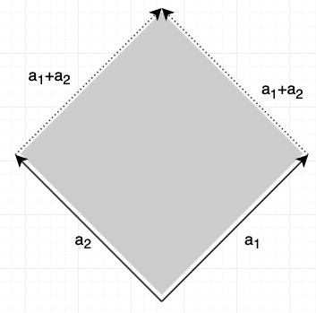

+++
title = 'Eigenvectors & eigenvalues'
template = 'page-math.html'
+++

# Eigenvectors & eigenvalues
let A be n × n, $x \in \Re^n$ is an eigenvector of A if x ≠ 0 and $\exists \lambda \in \Re$ such that $Ax = \lambda x$

x is eigenvector with corresponding eigenvalue λ.

Is a given vector $u \in \Re^n$ an eigenvector of a given A (n × n)?
* Do $Au$, check if result is a multiple of u.

Is a given λ an eigenvalue of A?
* $\exists x \ne 0$ such that $Ax - \lambda x = 0 \leftrightarrow (A-\lambda I_n)x = 0$ with nontrivial solutions.

The solution set of $(A-\lambda I_n)x = 0$ is the eigenspace corresponding to λ.

How to find a basis for the eigenspace of a given λ?
1. calculate matrix for $A-\lambda I_n$ where n is the number of rows or columns of A
2. reduce matrix to reduced echelon form
3. express solutions in parametric form (basic variables in terms of free variables)
4. basis for eigenspace is the set of the coefficients

If λ = 0, then Ax = 0 has a nontrivial solution (and A is _not_ invertible).

Eigenvectors corresponding to distinct eigenvalues are linearly independent.

## Determinant
Geometric interpretation: let $A = [a_1 \\; a_2]$. then the determinant (absolute value) is the surface area (or volume in 3D):

Let A (n × n). A ~ U without scaling and using _r_ row interchanges. then $\det A = (-1)^r u_{11} \times \dots \times u_{nn}$

A is invertible iff $\det A \ne 0$

$\det AB = (\det A)(\det B)$

λ is an eigenvalue of A iff $\det (A-\lambda I) = 0$ (the characteristic equation of A)

The eigenvalues of A (n × n) are the solutions for λ. Multiplicity is the number of solutions for λ.

## Similarity
given A and B (n × n), A is similar to B if ∃p s.t. $A = PBP^{-1}$

If A and B are similar, then they have the same characteristic polynomials (and the same eigenvalues with the same multiplicities)

## Diagonalization
A is diagonalizable if A is similar to a diagonal matrix.

Diagonalization Theorem: A (n × n) is diagonalizable iff A has n linearly independent eigenvectors (the eigenbasis for $\Re^n$)

$A = P D P^{-1} \leftrightarrow$ columns of P are linearly independent eigenvectors, and the diagonal values of D are the eigenvalues corresponding to the eigenvectors in P.

How to diagonalize a matrix:
1. Find eigenvalues of A
2. Find n = λ linearly independent eigenvectors
3. Construct $P = \begin{bmatrix} p_1 & p_2 & \ldots & p_n \end{bmatrix}$
4. Construct D from the corresponding eigenvalues on the diagonal. Order of eigenvalues must match the order for columns of P.
5. Check $A = p D p^{-1} \leftrightarrow Ap = pD$ (if p is invertible)

If A (n × n) has n distinct eigenvalues, it is diagonalizable.

