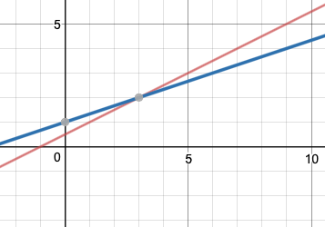

+++
title = 'Introduction'
template = 'page-math.html'
+++

# Introduction
## Linear Equations
"the study of linear equations"

a linear equation in the variables $x_1, \dots, x_n$ has the form $a_1 x_1+\dots+a_n x_n = b$, with $a_1, \dots, a_n$ being the _coefficients_

geometric interpretation:

$
\begin{alignedat}{3}
&n=1\qquad &&a_1 x_1 = b \longrightarrow x_1 = \frac{b}{a_1}\qquad &&\text{(point on a line in $\Re$)}\\\\\\\\
&n=2\qquad &&a_1 x_1 + a_2 x_2 = b \longrightarrow x_2 = \frac{b}{a_2} - \frac{a_1}{a_2}\qquad &&\text{(line in a plane in $\Re^2$)}\\\\\\\\
&n=3\qquad &&a_1 x_1 + a_2 x_2 + a_3 x_3 = b\qquad &&\text{(planes in 3D space, in $\Re^3$)}
\end{alignedat}
$

in general, $n-1$-dimensional planes in n-dimensional space

system of linear equations $x_1, \dots, x_n$ is a collection of linear equations in these variables.

$x_1 - 2x_2 = -1$

$-x_1 + 3x_2 = 3$

If you graph them, you get this:

the solution is the intersection.

a system of linear equations has:
1. no solutions (inconsistent) -- e.g. parallel lines
2. exactly 1 solution (consistent)
3. infinitely many solutions (consistent) - e.g. the same line twice

two linear systems are "equivalent" if they have the same solutions.

## Matrix notation
<table>
<tr>
<td>Equation</td>
<td>(Augmented) coefficient matrix notation</td>
</tr>
<tr>
<td>$\begin{alignedat}{6} &x_1 &&-&&2x_2 &&+&&x_3 &&= 0\\\\ & && &&2x_2 &&-&&8x_3 &&= 8\\\\ &5x_1 && && &&-&&5x_3 &&= 10\end{alignedat}$</td>
<td>$\begin{bmatrix} 1 & -2 & 1 & 0\\\\ 0 & 2 & -8 & 8\\\\ 5 & 0 & -5 & 10 \end{bmatrix}$</td>
</tr>
</table>

the strategy to solve is to replace the system with an equivalent system that is easier to solve.

elementary row operations:
1. replacement: add rows
2. scaling: multiply by constant (non-zero scalar)
3. interchange: swap two rows

all of these are reversible & don't change the solution set.

Matrices A and B are equivalent ($A \sim B$) if there is a sequence of elementary operations to transform A to B.

If augmented matrices of two systems are row-equivalent, then the systems are equivalent.

Matrix A is in echelon form if:
a) zero rows are below non-zero rows
b) the leading entry of a row is contained in a column that is to the left of the leading entry of the row below it.

A is in reduced echelon form if:
a) A is in echelon form
b) all leading entries are 1
c) the leading entry is the only non-zero entry in that column

## Reducing a matrix
The reduced echelon form of a matrix is unique.

every matrix is row-equivalent to a unique reduced echelon matrix.

the positions of the leading entries in an echelon matrix are unique

$\begin{bmatrix} \textbf{1} & * & * & *\\\\ 0 & 0 & \textbf{1} & *\\\\ 0 & 0 & 0 & 0\\\\ 0 & 0 & 0 & 0 \end{bmatrix}$

the values in bold are pivot positions. the columns containing those values are pivot columns.

Row reduction algorithm:
1. Start with leftmost non-zero column (pivot column)
2. Select a non-zero entry as pivot and move it to the pivot position.
3. Create zeros below the pivot position.
4. Ignore the row containing the pivot position & repeat steps 1-3 until solved. The matrix will be in echelon form.
5. Make pivot positions equal to 1, create zeros in all pivot columns. Start with the rightmost column. The matrix will be in reduced echelon form.

Side note: a computer chooses as pivot the entry that's smallest in absolute value to minimize the round-off error.

Basic variables correspond to pivot columns. Free variables correspond to non-pivot columns. You solve the equation by expressing basic variables in terms of free variables.

The matrix can be written in parametric form, example with $x_3$ being a free variable:

$\binom{x_1}{x_2} = \big \\{ \binom{1}{4} + \binom{5}{-1} x_3 \\;\rvert\; x_3 \in \Re \\}$

if there are any free variables, there are infinite solutions.

## Vectors
A vector is a line. If you have a vector in the form $\begin{bmatrix} a\\\\b\end{bmatrix}$, you can draw it as an arrow from the origin ending at the point $(a,b)$.

To add vectors, add the individual cells together.

A vector equation $a_1 x_1 + a_2 x_2 + \dots + a_n x_n = b$ has the same solution set as $\begin{bmatrix} a_1 & a_2 & \dots & a_n & b \end{bmatrix}$.

When asked whether $b$ is in $\text{Span} \{v_1, \dots, v_p\}$, you have to check whether the augmented matrix $\begin{bmatrix} v_1 & \dots & v_p & b \end{bmatrix}$ has a solution.

$b$ is a linear combination of $A$ if $Ax = b$ has a solution.

The span is the set of all linear combinations of the vectors.

To calculate $Ax$, if the number of columns in A is the same as the number of rows in x, you can follow the definition:

$
Ax = \begin{bmatrix} a_1 & a_2 & \dots & a_n \end{bmatrix} \begin{bmatrix} x_1 \\\\ \dots \\\\ x_n \end{bmatrix} = x_1 a_1 + x_2 a_2 + \dots + x_n a_n
$

You also have the rules (matrix A,  vectors u and v, scalar c):
* $A(u+v) = Au + Av$
* $A(cu) = c(Au)$

