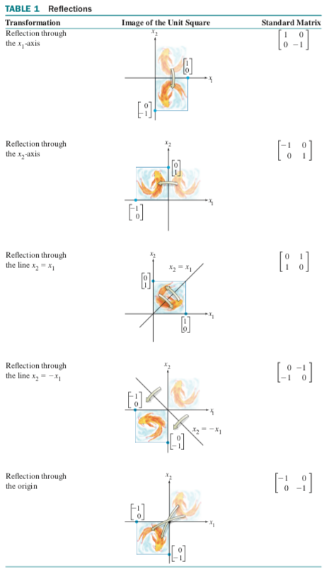
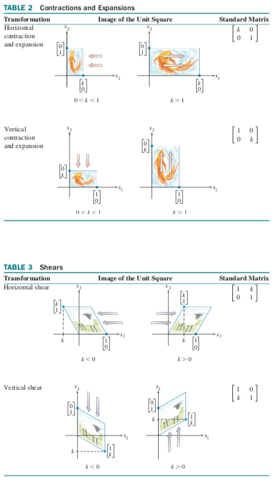
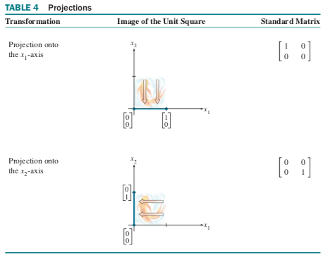

+++
title = 'Linear transformations'
template = 'page-math.html'
+++

# Linear transformations
definitions:
* transformation, function, mapping: rule assigning to each vector in $\Re^n$ a vector $T(x)$ in $\Re^m$
* domain: set $\Re^n$
* codomain: set $\Re^m$
* image: vector T(x)
* range: set of all images T(x)

a projection transformation happens if you go to a lower dimension (e.g. $x_3$ becomes 0). a shear transformation happens if a 2D square is tilted sideways into a parallelogram.

a transformation T is linear if:
i) $T(u + v) = T(u) + T(v)$ for all $u,v \in \text{Domain}(T)$
ii) $T(cu) = cT(u)$ for all scalars c and all $u \in \text{Domain}(T)$

linear transformations preserve operations of vector addition and scalar multiplication.

if T is a linear transformation, then:
* $T(0) = 0)$
* $T(cu + dv) = cT(u) + dT(v)$
* $T(c_1 v_2 + \dots + c_p v_p) = c_1 T(v_1) + \dots + c_p T(v_p)$ (superposition principle)

given scalar r, and $T: \Re^2 \rightarrow \Re^2$ by $T(x) = rx$
* contraction: when $0 \leq r \leq 1$
* dilation: when $r > 1$

every linear transformation $\Re^n \rightarrow \Re^m$ is a matrix transformation $x \mapsto Ax$.

$A = [[T(e_1) \dots T(e_n)]$, where $e_j$ is the jth column of the identity matrix in $\Re^n$

geometric linear transformations of $\Re^2$:

  

types of mappings:
* $T: \Re^n \rightarrow \Re^m$ is 'onto' $\Re^m$ if _each_ b in $\Re^m$ is the image of _at least one_ x in $\Re^n$.
* $T: \Re^n \rightarrow \Re^m$ is one-to-one if _each_ b in $\Re^m$ is the image of _max one_ x in $\Re^n$.
    * so if $T(x) = 0$ only has the trivial solution

for mapping $T: \Re^n \rightarrow \Re^m$ and standard matrix $A$:
* T maps $\Re^n$ onto $\Re^m$ iff columns of matrix span $\Re^m$
* T is one-to-one iff columns of matrix are linearly independent.

