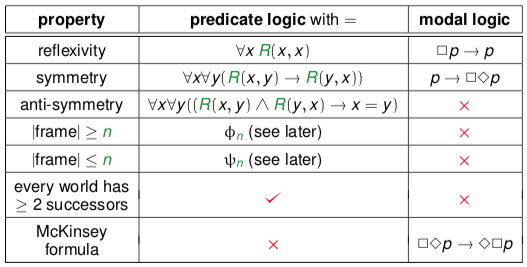
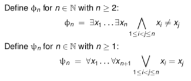

+++
template = 'page-math.html'
title = 'Definability and Undefinability results'
+++
# Definability and Undefinability results
expressible frame properties in predicate/modal logic:

## for model cardinality
model cardinality:

for all models M and all n ≥ 2 it holds that:
* M ⊨ Φn ⇔ A has at least n elements
* M ⊨ ψn ⇔ A has at most n elements
* M ⊨ Φn ∧ ψn ⇔ A has precisely n elements

model infiniteness is definable by a set of formulas Δ:
* M ⊨ Δ ⇔ M has an infinite domain

model finiteness is undefinable (single formula):
* there's no sentence ψ such that
* all M: M ⊨ ψ ⇔ M has a finite domain

model finiteness is undefinable (set of formulas):
* there's no set of formulas Γ such that
* all M: M ⊨ Γ ⇔ M has a finite domain

mode infiniteness is undefinable (single formula)
* there's no sentence ψ such that
* all M: M ⊨ ψ ⇔ M has infinite domain

## for reachability
"v is reachable via R from u". thinking of R as arrows, it means that there's a path from v to u.

search for formulas χn that express reachability in n steps:

Reachable in n steps:
1. u = v
2. R(u,v)
3. ∃x₁ (RU, x₁) ∧ R(x₁, v))
4. ∃x₁ ∃x₂ (R(u, x₁) ∧ R(x₁, x₂) ∧ R(x₂, v))
5. ....

shorthand: χ₂(c,d) denotes formula ∃x₁ (R(c, x₁) ∧ R(x₁, d))

reachability is undefinable:

Let R be a binary relation symbol.
1. In predicate logic, reachability by R-steps is
  * not definable by a sentence
  * not definable by a set of sentences
2. In predicate logic, unreachability by R-steps is
  * not definable by a single sentence
  * definable by a set of sentences

## General overview

