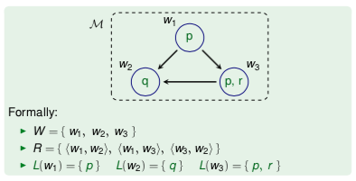

+++
template = 'page-math.html'
title = 'Modal logic'
+++
# Modal logic
modal logic allows reasoning about dynamics -- futures, knowledge, beliefs, etc.

modalities (unary connectives):
* □ (box): sure, always, has to be, knows, guaranteed (kinda like ∀)
* ◇ (diamond): possibly, sometimes, maybe, believes is possible, possible result (kinda like ∃)

Kripke model `M = (W, R, L)` consists of:
* W worlds
* R accessibility relation
* L labeling function: which propositional letters are true in which world (`w ⊩ p ↔ p ∈ L(w)`)

Kripke models define truth _per world_.

## Truth in worlds
`M, w ⊩ Φ` means formula Φ is true in world w of Kripke model M.

◇ Φ is true in world w if there exists a world w' such that R(w, w') and Φ is true in w'.

□ Φ is true in world w if Φ is true in all worlds w' with R(w, w'). special case when world has no outgoing edge, ◇ Φ never holds and □ Φ always holds.

## Truth in Kripke models
Φ is true in Kripke model `M = (W, R, L)` (i.e. M ⊨ Φ), iff x ⊩ Φ for every world x ∈ W.

all propositional tautologies also hold in modal logic.

## Semantic implication/entailment
M,w ⊨ ψ in every world w in every Kripke model where M,w ⊨ Φ₁, ..., M,w ⊨ Φn.

modal validity: ⊨ ψ if in every world w in ever Kripke model M holds M,w ⊨ ψ.

modal logical equivalence: `Φ ≡ ψ` if `M,w ⊨ Φ ↔ M,w ⊨ ψ`. in other words, Φ ≡ ψ ↔ Φ ⊨ ψ and ψ ⊨ Φ.

## Frames
frame: Kripke model without labeling. `F = (W,R)`, W worlds, R accessibility relation

Φ is valid in frame F (i.e. F ⊨ Φ) if for _every_ labeling L, Kripke model M = (W,R,L) makes Φ true.

Correspondence of formulas and frame properties
* reflexive:
  * F ⊨ □ p → p
  * F ⊨ p → ◇ p
* symmetric:
  * F ⊨ q → □ ◇ q
  * F ⊨ ◇ □ p → p
* transitive:
  * F ⊨ □ p → □ □ p
  * F ⊨ ◇ ◇ p → ◇ p
* serial:
  * F ⊨ ◇ T
  * F ⊨ □ p → ◇ p
* functional: □ p ↔ ◇ p

