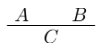
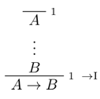
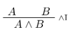
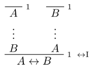
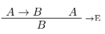
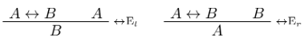
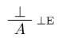
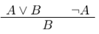

+++
template = 'page-math.html'
title = 'Propositional logic'
+++
# Propositional logic
## Notation review
* `A, B, C` -- propositions
* `A ∧ B` -- conjunction ("and")
* `A ∨ B` -- disjunction ("or")
* `A → B` -- implication ("if A then B")
* `A ↔ B` -- bi-implication ("A iff B")
* `¬ A` -- negation ("not A")
* `⊥` -- false, falsum, nonsense, bullshit, the middle finger

## Rules of inference
"C is a logical consequence of A and B":

<table>
<tr><th>Implication</th><th>Conjunction</th><th>Negation</th><th>Disjunction</th><th>Bi-implication ("if and only if")</th></tr>
<tr><td></td><td></td> <td></td><td></td><td></td></tr>
<tr><td></td><td></td><td></td><td></td><td></td></tr>
</table>

Truth and falsity: from false, you can conclude anything, and from nothing, you can conclude true.

, 

You can also derive this conjunction rule:

## Forward and backward reasoning
Backward reasoning: looking at the goal and seeing what rules need to be applied ("bottom-up")

Forward reasoning: starting at some hypotheses/assumptions

The general heuristic is to always work backwards, as much as possible. Only once you get stuck should you work from your assumptions or hypotheses.

If all else fails, try proof by contradiction.

## Proof by contradiction
Suppose a negation of a formula is true, prove that it's impossible, thereby proving the original formula.

RAA stands for _"reductio ad absurdum"_

## Vocab definitions
* derivable: a formula φ is "derivable" if we can prove φ with no global hypotheses (bottom line is φ, everything is closed). Then we write ⊢ φ.
* φ is derivable from hypotheses ψ₁..ψn if we can compute φ assuming ψ₁..ψn
* formulas φ and ψ are logically equivalent if ⊢ φ ↔ ψ

## Classical reasoning
Principles:
* Proof by contradiction: assume the contradiction, and show false, thereby proving the original.
* Double negation elimination: ¬ ¬ A ↔ A.
* Contrapositive: if A → B, then ¬ B → ¬ A

A general heuristic:
1. Work backward from the conclusion, using introduction rules.
2. When you run out of stuff to do, work forward with elimination rules.
3. If you get stuck,

(meme credit goes to Geo)

## Syntax vs Semantics
Syntax:
- derivation, proofs
- Γ ⊢ A ("A is derivable from hypotheses in Γ")

Semantics:
- truth and falsity
- truth assignment says which propositional letters are true
- valuation says which formulas are true

## Soundness and completeness
provable: if there is a formal proof of a formula (syntactic)

tautology/valid: if true under any truth assignment (semantic)

soundness: if a formula is provable, it is valid (if ⊢ A, then ⊨ A)

completeness: if a formula is valid, it is provable (if ⊨ A, then ⊢ A)

Proving soundness is easier than proving completeness.

A is a logical consequence of Γ if, given any truth assignment that makes every formula in Γ true, A is true.

