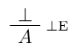
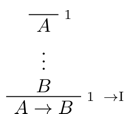
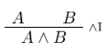
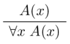

+++
title = 'Backward proofs'
+++

# Backward proofs

This is like going up the proof tree.

Tactical propositions look like this:

```lean
lemma lemma_name :
    statement :=
begin
    proof
end
```

It can also be a one-line proof, with `by`:

```lean
lemma lemma_name :
    statement :=
by tactic
```

Tactics:

- `intro h` creates assumption `h` from left-hand of implication or quantifiers (`intros` for multiple at once)
- `apply h` matches goal's conclusion with conclusion of `h` and adds `h`'s hypotheses as new goals
- `exact h` matches goal's conclusion with conclusion of `h`, closing the goal (could also use `apply`)
- `assumption` finds a hypothesis from the context that matches the goal's conclusion and applies it
- `refl` proves reflexivity (`l = r`) including unfolding definitions, β reduction, and more
- `and.intro`, `and.elim_right`, `and.elim_left`, `or.intro_right`, `or.intro_left`, `or.elim` are for logical connectives (∧, ∨)
- `eq.refl` for reflexivity, `eq.subst h` to substitute h into equality
- `rw h` applies `h` once as left-to-right rewrite rule. can apply right-to-left by writing `←h`.
- `not_def`: ¬a ↔ a → false
- `simp [h1, h2...]` applies rewrite rules and hypothesis set
- `cc` applies congruence closure
- `em` applies Law of Excluded Middle (p ∨ ¬p)
- `induction'` performs proof by induction, yields one subgoal per constructor
- `rename h1 h2` renames `h1` to `h2`
- `clear h1` removes `h1`

## Rewrite rules

This wasn't covered in the lecture, but it's useful so I'll add them here.

<table>
<tr>
<th>Implication</th>
<th>Conjunction</th>
<th>Negation</th>
<th>Disjunction</th>
<th>Bi-implication ("if and only if")</th>
<th>True & False</th>
</tr>
<tr>
<td>

</td>
<td>

</td>
<td>

</td>
<td>

</td>
<td>

</td>
<td>

</td>
</tr>
<tr>
<td>

</td>
<td>

</td>
<td>

</td>
<td>

</td>
<td>

</td>
<td>

</td>
</tr>
</table>

Quantifiers

<table>
<tr>
<th>Universal</th>
<th>Existential</th>
</tr>
<tr>
<td>

</td>
<td>

</td>
</tr>
<tr>
<td>

</td>
<td>

</td>
</tr>

Conjunction-negation:


Proof by contradiction:


Induction:


