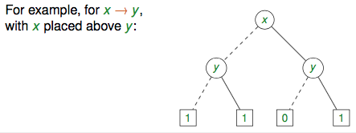
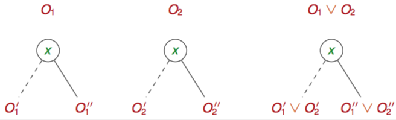

+++
title = 'Binary Decision Trees'
+++
# Binary Decision Trees
used to represent a boolean function

dashed line to left is 0, solid line to right is 1

a formula is satisfiable if there is at least 1 leaf with a 1

## Ordered Binary Decision Diagram (OBDD)
collapsing and removing nodes in a binary decision tree

rules:
1. leaves with 0 and 1 are collapsed
2. repeat:

    - if 0 and 1 edge of non-leaf n lead to same node m:
        - eliminate n
        - redirect its incoming edges to m
    - if non-leaves associated with same bool variable have 0 edge to same node and 1 edge to same node, then collapse

non-isomorphic reduced OBDDs are never semantically equivalent

sensitive to order change (which nodes are above which)

logical operations:

- negation — swap 0 and 1 in leaf nodes
- disjunction:
    - leaves: O2 if O1 is 0, otherwise O1
    - non-leaves: draw new nodes with disjunctions of previous Os

- conjunction:
    - leaves: O2 if O1 is 1, otherwise O1
    - non-leaves: same as disjunction
