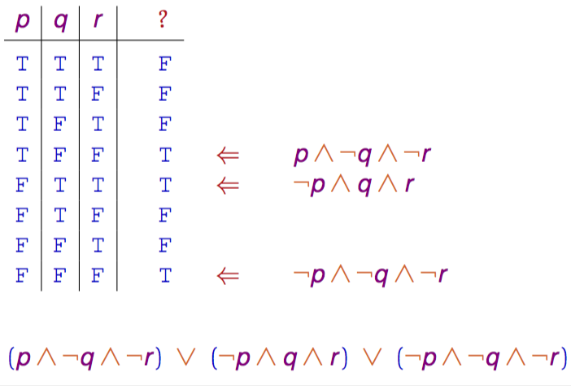
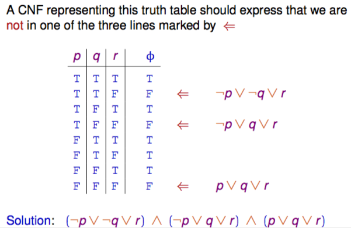

+++
title = 'Functional completeness'
+++
# Functional completeness
functionally complete — every truth table can be represented by a propositional formula (and vice versa)

## Disjunctive normal form (DNF)

this results in a disjunctive normal form (DNF, terms combined with disjunctions)

a DNF is a clause (disjunction of literals)

a DNF is of the form:

Ψ1 ∨ Ψ2 ∨ … ∨ Ψn

where Ψi is conjunctions of literals (p, ¬p, etc.)

a single letter is also a DNF

## Conjunctive normal form (CNF)

a conjunctive normal form (CNF) is conjunction Ψ1 ∧ Ψ2 ∧ … ∧ Ψn where Ψi are disjunctions of literals

disjunctions of literals are clauses (DNF), a CNF is a conjunction of clauses

Transform any ϕ to CNF using algorithm in three easy steps
1. IMPL-FREE: eliminate implications
> ϕ ➝ Ψ ≡ ¬ ϕ ∨ Ψ

1. NNF: bring occurrences of ¬ inside, until directly in front of variable (removing double nots)

> ¬ (ϕ ∧ Ψ) ≡ ¬ ϕ ∨ ¬ Ψ
> ¬ (ϕ ∨ Ψ) ≡ ¬ ϕ ∧ ¬ Ψ
> ¬ ¬ ϕ ≡ ϕ
1. DISTR: use distributivity law to rearrange conj/disj
> ϕ ∨ (Ψ ∧ Χ) ≡ (ϕ ∨ Ψ) ∧ (ϕ ∨ Χ)
> (ϕ ∧ Ψ) ∨ Χ ≡ (ϕ ∨ Χ) ∧ (Ψ ∨ Χ)

Is a CNF Ψ1 ∧ Ψ2 ∧ … ∧ Ψn a tautology?

Yes, only if in each of clauses Ψi it contains literals p and ¬p for some variable p.

## Satisfiability problem
given a propositional formula ϕ, find a valuation that applied to ϕ yields ⊤.

NP-complete — no efficient solution has been found

DPLL (Davis-Putnam-Logemann-Loveland) procedure:
checks satisfiability of formula ϕ in CNF.

⊤ — constant true

⊥ — constant false

applies reduction rules:

To check satisfiability of CNF ϕ:
1. Eliminate “unit” clauses

    - for clause p of ϕ, replace p in ϕ by ⊤
    - for clause ¬ p of ϕ, replace p in ϕ by ⊥

2. Eliminate “pure” propositional variables

    - if p only occurs positively in ϕ, replace all p in ϕ by ⊤
    - if p only occurs negatively in ϕ, replace all p in ϕ by ⊥

3. If ϕ is ⊤, it is satisfiable
4. If ϕ is ⊥, it is unsatisfiable
5. Choose a p in ϕ:

    - replace all p in ϕ by ⊤, apply DPLL
    - if outcome is “unsatisfiable, replace all p in ϕ by ⊥ and apply DPLL again
