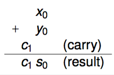
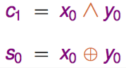
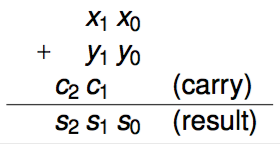
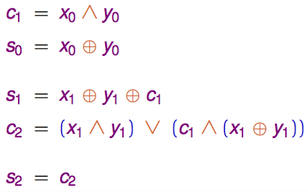
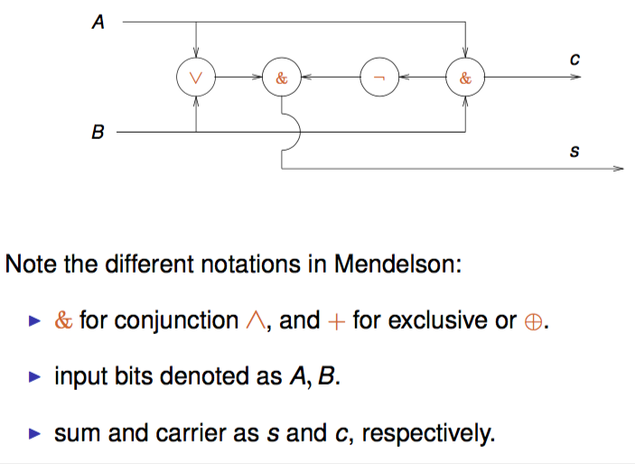
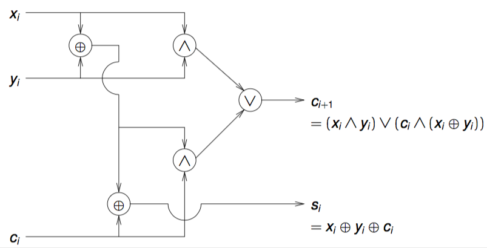

+++
title = 'Logic circuits'
+++
# Logic circuits
Adding in binary arithmetic:

<table>
<tr>
<th>Two bits</th>
<th>Two pairs of bits</th>
</tr>
<tr>
<td> </td><td> </td>
</tr>
</table>

Half adder:

Full adder:

